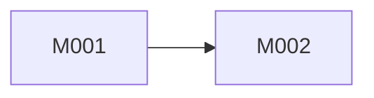

# 概要设计阶段

执行S2.1架构分析和S2.2模块概要设计。

---

## S2.1 架构分析

### 输入
- S1.2功能拆解清单

### 执行
```
1. Read .evospec/outputs/req-breakdown/list.md

2. Read现有架构（如有）
   - Glob检测架构文档
   - Read相关文件

3. 加载规则

4. 分析
   - 现有架构评估
   - 技术选型对比
   - 架构方案建议

5. Write产出
   - .evospec/outputs/arch-analysis/report.md
```

### 产出物格式
```markdown
# 架构分析报告

## 现有架构评估
| 优点 | 缺点 |
|------|------|
| {优点} | {缺点} |

## 技术选型
| 技术 | 优点 | 缺点 | 推荐度 |
|------|------|------|--------|
| {技术} | {优点} | {缺点} | ★★★★★ |

## 架构建议
{Mermaid架构图}

## 关键决策
| 决策 | 方案 | 理由 |
|------|------|------|
| {决策} | {方案} | {理由} |
```

---

## S2.2 模块概要设计

### 输入
- S2.1架构分析报告

### 执行
```
1. Read .evospec/outputs/arch-analysis/report.md

2. 定义模块
   - 模块ID
   - 模块名称
   - 职责描述

3. 定义边界
   - 对外接口
   - 依赖模块

4. 绘制关系图

5. Write产出
   - .evospec/outputs/module-outline/design.md

6. 创建模块规则文件
   - Write .evospec/rules-module/{module}.yaml
```

### 产出物格式
```markdown
# 模块概要设计

## 模块清单
| ID | 名称 | 职责 |
|----|------|------|
| M001 | {名称} | {职责} |

## 模块边界

### M001: {名称}
- 职责: {描述}
- 对外接口: {列表}
- 依赖: {列表}

## 模块关系图


## 开发顺序
1. M001 - {原因}
```

---

## 输出格式

```
📐 S2.{N} 完成

产出: .evospec/outputs/{dir}/{file}
新建规则: rules-module/{module}.yaml

下一步: S3.1
```