# Agent 使用说明

本文档是《日精需求.doc》的 Agent 可读 Markdown 版本，目标是方便代码 Agent / 需求分析 Agent / 测试用例生成 Agent 对仪表功能进行检索、拆分和追踪。

## 推荐检索方式

- 按功能名检索：如 `车速`、`骑行模式`、`TCS设置`、`快速换档QS`、`定速巡航`、`胎压/胎温显示`。
- 按通信关键词检索：如 `CAN数据帧`、`输出报文`、`UDS`、`Bootloader`、`OTA`、具体信号名。
- 按故障策略检索：如 `通信异常`、`故障代码显示`、`报警显示`、`自检动作`。
- 按 UI/页面检索：如 `页面切换`、`主/从页面切换`、`设置`、`背光设置`、`语言选择`。
- 遇到 HTML 表格时，优先把 `<td>` 内容视为同一需求单元；合并单元格代表原 Word 中的合并行/列。

## Agent 解析约定

- `AGENT_SECTION` 注释用于表示后续章节类型，字段包括：`id`、`type`、`title`、`keywords`。
- `type=indicator`：独立 LED 或 TFT 内指示/警告灯。
- `type=display_metric`：速度、里程、油量、水温、电池电压、胎压等数值显示。
- `type=vehicle_feature`：骑行模式、TCS、IMU、QS、定速巡航等车辆功能。
- `type=ui_navigation`：页面切换、设置菜单、主题、背光、单位、语言等 UI 操作。
- `type=communication`：CAN、UDS、Bootloader、BT、WiFi、OTA 等通信/升级相关需求。

## 自动章节索引

| 层级 | 章节/主题 |
| --- | --- |
| H1 | 要求 |
| H2 | 一般规定： |
| H2 | 外装规格： |
| H2 | 液晶屏 |
| H2 | 防护面板玻璃印刷 |
| H2 | 指示灯要求 |
| H2 | 接插件及端口定义 |
| H2 | 按键及其功能定义 |
| H2 | 仪表开关机自检动作 |
| H2 | 仪表输出报文 |
| H2 | 仪表诊断及保护 |
| H1 | 机能式样 |
| H2 | 独立LED指示灯 |
| H2 | TFT内显示内容 |
| H2 | 无线通信专项功能 |
| H2 | 仪表端口向外供电 |
| H1 | 页面切换 |
| H2 | 页面简介 |
| H2 | 主/从页面切换 |
| H2 | 主页面内容切换 |
| H2 | 车辆信息 |
| H2 | 投屏导航 |
| H2 | 音乐 |
| H2 | 电话 |
| H2 | 设置 |
| H2 | 智能钥匙应急模式 |
| H1 | 通信式样要求 |
| H2 | 有线通信 |
| H2 | 无线通讯 |
| H1 | App |
| H1 | 其它： |

## 自动功能索引

| 层级 | 功能/主题 | 检索关键词 |
| --- | --- | --- |
| H4 | 变更记录表 |  |
| H2 | 指示灯要求 | 指示灯 |
| H2 | 仪表诊断及保护 | 诊断 |
| H2 | 独立LED指示灯 | 指示灯 |
| H3 | 左/右转向指示灯 | 指示灯 |
| H3 | OBD指示灯 | 指示灯 |
| H3 | ABS警报指示灯 | 指示灯 |
| H3 | 光传感器 |  |
| H3 | 换档提示灯 | 换档 |
| H3 | N档指示灯 | 指示灯 |
| H3 | TCS指示灯 | 指示灯、TCS |
| H3 | 智能钥匙指示灯 | 指示灯、钥匙 |
| H3 | 车头锁警告灯（红色） |  |
| H3 | 预留指示灯 | 指示灯 |
| H3 | 车速 | 车速 |
| H3 | 平均车速 | 车速 |
| H3 | 总里程 | 里程 |
| H3 | 计程表A、B |  |
| H3 | 平均油耗A、B | 油耗 |
| H3 | 转速 | 转速 |
| H3 | 油量表 | 油量 |
| H3 | 水温表 | 水温 |
| H3 | 水温指示灯 | 指示灯、水温 |
| H3 | 档位 | 档位 |
| H3 | 时间 | 时间 |
| H3 | 电池电压 | 电池 |
| H3 | 环境温度显示 | 温度 |
| H3 | 油压指示灯 | 指示灯 |
| H3 | 位置灯 |  |
| H3 | 远光指示灯 | 指示灯 |
| H3 | 近光指示灯 | 指示灯 |
| H3 | 保养指示灯 | 指示灯、保养 |
| H3 | 换档转速提示灯&换挡转速提示功能启用符号 | 转速、换档 |
| H3 | 边撑开关指示符 |  |
| H3 | 胎压警报指示灯 | 指示灯、胎压 |
| H3 | 故障代码显示 | 故障 |
| H3 | 加热手把 | 加热 |
| H3 | 骑行模式 | 骑行 |
| H3 | 快速换档QS | 换档 |
| H3 | 定速巡航 | 定速 |
| H3 | 通用故障指示灯 | 指示灯、故障 |
| H3 | 灯具、喇叭、BCM关联故障报警显示 | 故障 |
| H3 | TCS设置 | TCS、设置 |
| H3 | 软硬件版本 |  |
| H3 | TCU预留显示 |  |
| H3 | VVL | VVL |
| H3 | 自动大灯 |  |
| H3 | IMU | IMU |
| H3 | 弹射起步 | 弹射 |
| H3 | 跑圈计时 | 跑圈 |
| H3 | 风挡玻璃 | 风挡 |
| H3 | AISS怠速启停指示灯 | 指示灯、AISS |
| H3 | 功能简介 |  |
| H3 | 电话 | 电话 |
| H3 | 投屏导航 | 导航 |
| H3 | 音乐 | 音乐 |
| H3 | 天气 | 天气 |
| H3 | 使用场景需求 |  |
| H2 | 仪表端口向外供电 | 供电 |
| H1 | 页面切换 | 页面 |
| H2 | 页面简介 | 页面 |
| H2 | 主/从页面切换 | 页面 |
| H2 | 主页面内容切换 | 页面 |
| H3 | 多功能区 |  |
| H3 | 主页面下的骑行模式切换 | 骑行、页面 |
| H3 | 快捷设置 | 设置 |
| H2 | 投屏导航 | 导航 |
| H2 | 音乐 | 音乐 |
| H2 | 电话 | 电话 |
| H2 | 设置 | 设置 |
| H3 | 设备管理 |  |
| H3 | 主题风格 |  |
| H3 | TCS设置 | TCS、设置 |
| H3 | 可选内容 |  |
| H3 | 背光设置 | 设置、背光 |
| H3 | 保养提示 | 保养 |
| H3 | 换档提示 | 换档 |
| H3 | 时间设置 | 时间、设置 |
| H3 | 自动大灯 |  |
| H3 | 弹射起步 | 弹射 |
| H3 | 单位设置 | 设置、单位 |
| H3 | 语言选择 | 语言 |
| H3 | 恢复出厂设置 | 设置 |
| H2 | 智能钥匙应急模式 | 钥匙 |
| H3 | CAN BUS | CAN |
| H3 | UDS 诊断功能 | 诊断 |
| H3 | 控制器同步休眠唤醒 |  |
| H3 | Bootloader软件升级功能 | Bootloader |
| H3 | 蓝牙BT | 蓝牙 |
| H3 | WiFi | WiFi |
| H3 | OTA升级功能 | OTA |

## 自动 CAN/数值 ID 索引

| 序号 | CAN/数值ID |
| --- | --- |
| 1 | 0x0400 |
| 2 | 0x0800 |
| 3 | 0x123400 |
| 4 | 0x12B |
| 5 | 0x12F |
| 6 | 0x134 |
| 7 | 0x135 |
| 8 | 0x136 |
| 9 | 0x137 |
| 10 | 0x160 |
| 11 | 0x180 |
| 12 | 0x1C0 |
| 13 | 0x320 |
| 14 | 0x321 |
| 15 | 0x330 |
| 16 | 0x340 |
| 17 | 0x350 |
| 18 | 0x356 |
| 19 | 0x360 |
| 20 | 0x400 |
| 21 | 0x523 |
| 22 | 0x92 |
| 23 | 0xFF |
| 24 | 0xFFFFFFFF |

## 自动报文/信号名索引

| 序号 | 报文/信号名 |
| --- | --- |
| 1 | ABS_1 |
| 2 | ABS_2 |
| 3 | ABS_3 |
| 4 | ABS_DASH_Drive_Mode_Rsp |
| 5 | ABS_Lean_Angle |
| 6 | ABS_MTC_ModeChangePermission |
| 7 | ABS_MTC_Warning_Lamp |
| 8 | ABS_Rear_Speed |
| 9 | ABS_Warning_IND |
| 10 | BCM_1 |
| 11 | BCM_2 |
| 12 | BCM_BrakeLampFail |
| 13 | BCM_HeatedHandFail |
| 14 | BCM_HeatedHandleLevel |
| 15 | BCM_HiBeamFail |
| 16 | BCM_HornFail |
| 17 | BCM_LTurnLampFail |
| 18 | BCM_LicenseLampFail |
| 19 | BCM_LowBeamFail |
| 20 | BCM_PosLampFail |
| 21 | BCM_RTurnlampFail |
| 22 | BCM_RearPosLampFail |
| 23 | BCM_SystemFail |
| 24 | Button_L |
| 25 | Button_R |
| 26 | Cc_VspWithOffset |
| 27 | DIAGMODE_Result |
| 28 | DTC_Info |
| 29 | ECM_1 |
| 30 | ECM_2 |
| 31 | ECM_3 |
| 32 | ECM_5 |
| 33 | ECM_Battery_Voltage |
| 34 | ECM_Cc_CondtionStatus |
| 35 | ECM_Cc_Master_Switch |
| 36 | ECM_Cc_RunStatus |
| 37 | ECM_Cc_Switch_Check |
| 38 | ECM_Cc_Vsp |
| 39 | ECM_DTC |
| 40 | ECM_Dash_Drive_Mode_Ack |
| 41 | ECM_EngWaTemp |
| 42 | ECM_Eng_Rpm |
| 43 | ECM_Engine |
| 44 | ECM_EngineTemp |
| 45 | ECM_Engine_Temp_IND |
| 46 | ECM_FuelConsumption |
| 47 | ECM_Fuel_Consumption |
| 48 | ECM_Gear_Position |
| 49 | ECM_Idle_Stop_Sts |
| 50 | ECM_MILLampSts |
| 51 | ECM_MIL_IND |
| 52 | ECM_MTR_TCS_Req_Ack |
| 53 | ECM_PowerModeChangePermission |
| 54 | ECM_QSUnavalb_failure |
| 55 | ECM_QickShifSts |
| 56 | ECM_Side |
| 57 | ECM_TCSWarningLamp |
| 58 | ECM_Temperature_Water |
| 59 | ECM_VBattery |
| 60 | ECM_system_unavailable_failure |
| 61 | ECM_system_unavalb_failure |
| 62 | ECU_Cc_Vsp |
| 63 | FUEL_SIG |
| 64 | Front_pressure |
| 65 | Front_pressure_warning |
| 66 | Front_t |
| 67 | Front_temperature_warning |
| 68 | HI_BEAM |
| 69 | MTR_DriveModeSet |
| 70 | MTR_DriveModeSetECM |
| 71 | MTR_EMG_REG_OP_Sts |
| 72 | MTR_FOB_ID |
| 73 | MTR_Hw_Version |
| 74 | MTR_Info |
| 75 | MTR_Out_1 |
| 76 | MTR_Out_2 |
| 77 | MTR_QickShifSet |
| 78 | MTR_Sw_Version |
| 79 | MTR_TCS_Req |
| 80 | Rear_pressure |
| 81 | Rear_sensor_lost |
| 82 | Rear_temperature |
| 83 | Rear_temperature_warnin |
| 84 | Rear_voltage_warning |
| 85 | SMRKY_1 |
| 86 | SMRKY_EMG_Input_Sts |
| 87 | SMRKY_EMG_STS |
| 88 | S_OUT_1 |
| 89 | Sensor_u |
| 90 | Stand_SW |
| 91 | TPMS_Indicator |
| 92 | TPMS_OU |
| 93 | TPMS_OUT_1 |
| 94 | TURN_L |
| 95 | TURN_R |
| 96 | Tbox_DateTime |
| 97 | Temp_IND |
| 98 | Time_Day |
| 99 | Time_Hour |
| 100 | Time_Min |
| 101 | Time_Month |
| 102 | Time_Sec |
| 103 | Time_Year |

---

# 原始文档转换正文

|--------------------------------------------------------|
| **TFT仪表通用机能式样书**                              |
| 【SC】SC2E-1、SC26-1F【BB】 P701、P701-A项目 CAN通信版 |
|                                                        |
| 5’TFT+LED 方形仪表平台、升级BT、WiFi                   |
| 四颗按键操控仪表版本                                   |
| **孙元春**                                             |
| **2025/9/17**                                          |
|                                                        |

**TFT仪表总成机能式样书**

**（ 5’TFT+LED** **方形仪表平台、升级BT、WiFi）**

|          |             |        |
|----------|-------------|--------|
| 车型名称 | 大长江图号  | 认证号 |
| SC2E-1   | 34100H7Z110 | H982   |
| SC26-1F  | 34100H98300 | H982   |
| P701     | 34100H61000 | H610   |
| P701-A   | 34100H61100 | H610   |

**编制： 孙 元 春 **

**校核： 孙 元 春 **

**审定： 林 明 达 **

**批准：**

<!-- AGENT_SECTION id="S001" type="section" title="变更记录表" keywords="" -->
##### 变更记录表

|          |          |            |            |                                        |
|----------|----------|------------|------------|----------------------------------------|
| **版本** | **阶段** | **日期**   | **编辑者** | **更改描述**                           |
|          |          |            |            |                                        |
| V0.1     | 系统制定 | 2025-07-12 | 孙元春     | 初版（项目启动用）                     |
| V0.2     | 系统制定 | 2025-09-12 | 孙元春     | 根据交流结果补充信息，请按此式样开发。 |
| V0.3     | 系统制定 | 2025-09-17 | 孙元春     | 补上P701                               |
| V0.4     | 功能样件 |            |            |                                        |
| V0.5     | 功能样件 |            |            |                                        |
| V0.6     | 功能样件 |            |            |                                        |
| V0.7     | 功能样件 |            |            |                                        |
|          |          |            |            |                                        |
|          |          |            |            |                                        |

<!-- AGENT_SECTION id="S002" type="section" title="目录" keywords="" -->
## 目录

[1 要求 9](#要求)

> [1.1 一般规定： 9](#一般规定)
>
> [1.2 外装规格： 10](#外装规格)
>
> [1.3 液晶屏 11](#液晶屏)
>
> [1.4 防护面板玻璃印刷 12](#防护面板玻璃印刷)
>
> [1.5 指示灯要求 12](#指示灯要求)
>
> [1.6 接插件及端口定义 13](#接插件及端口定义)
>
> [1.7 按键及其功能定义 14](#按键及其功能定义)
>
> [1.8 仪表开关机自检动作 15](#仪表开关机自检动作)
>
> [1.9 仪表输出报文 16](#仪表输出报文)
>
> [1.10 仪表诊断及保护 16](#仪表诊断及保护)

[2 机能式样 17](#机能式样)

> [2.1 独立LED指示灯 17](#独立led指示灯)

[2.1.1
左/右转向指示灯 18](#左右转向指示灯)

[2.1.2 OBD指示灯
19](#__RefHeading___Toc209077539)

[2.1.3
ABS警报指示灯 21](#abs警报指示灯)

[2.1.1 光传感器 22](#光传感器)

[2.1.2 换档提示灯 22](#换档提示灯)

[2.1.3 N档指示灯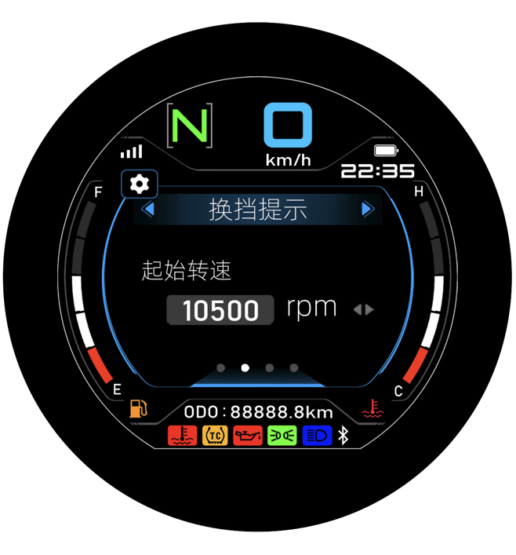 23](#n档指示灯)

[2.1.4 TCS指示灯

 24](#tcs指示灯)

[2.1.5
智能钥匙指示灯 26](#智能钥匙指示灯)

[2.1.6
车头锁警告灯（红色） 27](#车头锁警告灯红色)

[2.1.7 预留指示灯 27](#预留指示灯)

> [2.2 TFT内显示内容 28](#tft内显示内容)

[2.2.1 车速 28](#车速)

[2.2.2 平均车速 29](#平均车速)

[2.2.3 总里程 30](#总里程)

[2.2.4 计程表A、B 31](#计程表ab)

[2.2.5 平均油耗A、B 32](#平均油耗ab)

[2.2.6 转速 34](#转速)

[2.2.7 油量表 36](#油量表)

[2.2.8 水温表 38](#水温表)

[2.2.9 水温指示灯 40](#水温指示灯)

[2.2.10 档位 41](#档位)

[2.2.11 时间 42](#时间)

[2.2.12 电池电压 43](#电池电压)

[2.2.13 环境温度显示 44](#环境温度显示)

[2.2.14 油压指示灯 47](#油压指示灯)

[2.2.15 位置灯 48](#位置灯)

[2.2.16 远光指示灯 49](#远光指示灯)

[2.2.17 近光指示灯 50](#近光指示灯)

[2.2.18 保养指示灯
 51](#保养指示灯)

[2.2.19
换档转速提示灯&换挡转速提示功能启用符号
52](#换档转速提示灯换挡转速提示功能启用符号)

[2.2.20
边撑开关指示符 53](#边撑开关指示符)

[2.2.21
胎压警报指示灯 54](#胎压警报指示灯)

[2.2.22
胎压/胎温显示 55](#胎压胎温显示)

[2.2.23 故障代码显示 58](#故障代码显示)

[2.2.24 加热手把 61](#加热手把)

[2.2.25 骑行模式 62](#骑行模式)

[2.2.26 快速换档QS 73](#快速换档qs)

[2.2.27 定速巡航 77](#定速巡航)

[2.2.28
通用故障指示灯 85](#通用故障指示灯)

[2.2.29 灯具、喇叭、BCM关联故障报警显示
86](#灯具喇叭bcm关联故障报警显示)

[2.2.30 TCS设置
87](#tcs设置)

[2.2.31 软硬件版本 91](#软硬件版本)

[2.2.32 TCU预留显示 91](#tcu预留显示)

[2.2.33 VVL 92](#vvl)

[2.2.34 自动大灯  93](#自动大灯)

[2.2.35 IMU 94](#imu)

[2.2.36 弹射起步 95](#弹射起步)

[2.2.37 跑圈计时 97](#跑圈计时)

[2.2.38 风挡玻璃 99](#风挡玻璃)

[2.2.39
AISS怠速启停指示灯 100](#aiss怠速启停指示灯)

> [2.3 无线通信专项功能 101](#无线通信专项功能)

[2.3.1 功能简介 101](#功能简介)

[2.3.2 电话  103](#电话)

[2.3.3 投屏导航 104](#投屏导航)

[2.3.4 音乐 105](#音乐)

[2.3.5 天气 106](#天气)

[2.3.6 使用场景需求 106](#使用场景需求)

> [2.4 仪表端口向外供电 108](#仪表端口向外供电)

[3 页面切换 108](#页面切换)

> [3.1 页面简介 108](#页面简介)
>
> [3.2 主/从页面切换 109](#主从页面切换)
>
> [3.3 主页面内容切换 110](#主页面内容切换)

[3.3.1 多功能区 110](#多功能区)

[3.3.2 主页面下的骑行模式切换 111](#主页面下的骑行模式切换)

[3.3.3 快捷设置 112](#快捷设置)

> [3.2 车辆信息 style="width:0.22569in;height:0.21875in" /> 113](#车辆信息)
>
> [3.3 投屏导航 113](#投屏导航-1)
>
> [3.4 音乐 114](#音乐-1)
>
> [3.4 电话 115](#电话-1)
>
> [3.5 设置  style="width:0.20833in;height:0.20833in" /> 116](#设置)

[3.5.1 设备管理 117](#设备管理)

[3.5.2 主题风格 118](#主题风格)

[3.5.3 TCS设置 119](#tcs设置-1)

[3.5.4 可选内容 120](#可选内容)

[3.5.5 背光设置 121](#背光设置)

[3.5.6 保养提示 123](#保养提示)

[**3.5.7** **换档提示** 125](#换档提示)

[3.5.8 时间设置 127](#时间设置)

[3.5.9 自动大灯 128](#自动大灯-1)

[3.5.10 弹射起步 128](#弹射起步-1)

[3.5.11 单位设置 129](#单位设置)

[3.5.12 语言选择 130](#语言选择)

[**3.5.13** **恢复出厂设置** 130](#恢复出厂设置)

> [3.7 智能钥匙应急模式 131](#智能钥匙应急模式)

[**4** 133](#__RefHeading___Toc209077622)

[5 通信式样要求 136](#通信式样要求)

> [5.1 有线通信 136](#有线通信)

[5.1.1 CAN BUS 136](#can-bus)

[5.1.2 UDS 诊断功能 138](#uds-诊断功能)

[5.1.3 控制器同步休眠唤醒 138](#控制器同步休眠唤醒)

[5.1.4 Bootloader软件升级功能 138](#bootloader软件升级功能)

> [5.2 无线通讯 139](#无线通讯)

[5.2.1 蓝牙BT 139](#蓝牙bt)

[5.2.2 WiFi 139](#wifi)

[5.2.3 OTA升级功能 140](#ota升级功能)

[6 App 140](#app)

[7 其它： 140](#其它)

<!-- AGENT_SECTION id="S003" type="section" title="要求" keywords="" -->
## 要求

<!-- AGENT_SECTION id="S004" type="section" title="一般规定：" keywords="" -->
### 一般规定：

<table>
<colgroup>
<col style="width: 15%" />
<col style="width: 84%" />
</colgroup>
<tbody>
<tr class="odd">
<td>项 目</td>
<td>式 样</td>
</tr>
<tr class="even">
<td>动作温度范围</td>
<td>大气温度（为自然环境温度，非仪表内部温度）：-30℃～+65℃，仪表均需正常动作。</td>
</tr>
<tr class="odd">
<td>保存温度范围</td>
<td>大气温度（为自然环境温度，非仪表内部温度）：-40℃ ～ 85℃ 。</td>
</tr>
<tr class="even">
<td>抗震性试验</td>
<td>加速度：10G（需体现在 2D
图纸上,特殊情况开发前单独申请认可），安装姿态为实车安装角度。显示期间不可有段码发黑、LCD内部显示受共振影响异常。</td>
</tr>
<tr class="odd">
<td>重量</td>
<td>仪表单体重量目标≤600g，承制方需提出轻量化设计提案共同商定方案。</td>
</tr>
<tr class="even">
<td>可靠度要求</td>
<td>符合豪爵研发中心的<em>HES Q
H9502000b</em>电子式仪表试验规格，并明确表示在2D图内。</td>
</tr>
<tr class="odd">
<td>环保要求</td>
<td>符合HES N
2402《环境有害物质使用限制》的规定，并明确标示在2D图纸内。</td>
</tr>
<tr class="even">
<td>额定电压</td>
<td>DC 13±0.1V、正常工作电压DC 15±0.5V。</td>
</tr>
<tr class="odd">
<td>暗电流</td>
<td>
≤0.3mA (DC 13±0.1 V ， 20±5 ℃情况下）,要求尽量低。

如差异微小需单独提出与研发讨论并获得书面认可。
</td>
</tr>
<tr class="even">
<td>消费电流</td>
<td>≤1000mA （在DC 13±0.1 V ， 20±5 ℃情况下，全功率工作模式下）</td>
</tr>
<tr class="odd">
<td>零件要求</td>
<td>
要求全车规等级芯片（非车规芯片需单独提出并注明无料可选或非选原因，与研发讨论并获得书面认可）；

选型时需考虑寿命周期和供货稳定，有国产PIN to
PIN替代芯片规格优先。
</td>
</tr>
<tr class="even">
<td>语言</td>
<td>默认：中文、英文、日文、韩文，未来依不同销售国可家变更搭载语言。</td>
</tr>
<tr class="odd">
<td>UI</td>
<td>2～3种背景风格，每种风格含黑夜/白天模式</td>
</tr>
<tr class="even">
<td rowspan="2">
电源逻辑

要求
</td>
<td>BATT+ <em>ON</em> &amp; IGN+ <em>ON</em> 🡪
仪表工作于一般工作模式</td>
</tr>
<tr class="odd">
<td><ol type="1">
<li>
需要在 IGN OFF 时允许 CAN
通信报文唤醒仪表(如:智能钥匙应急模式)
</li>
<li>
手把开关要求在 IGN OFF 时也能操作(如:智能钥匙应急模式,
CAN通信报文唤醒仪表后允许手把开关操作输入密码)
，设计上要预留和注意省电。
</li>
<li>
仪表屏幕的按键不要求 IGN OFF 时操作有效。
</li>
</ol></td>
</tr>
<tr class="even">
<td>出厂默认</td>
<td>举例：显示单位：km（miles），出厂默认为km，备选项为miles</td>
</tr>
<tr class="odd">
<td>注意</td>
<td>发现此office软件有频繁将嵌入表格内的字母或数字丢失现象，承制单位如发现本机能书有错漏时，请及时提醒DCJ修正。</td>
</tr>
</tbody>
</table>

<!-- AGENT_SECTION id="S005" type="section" title="外装规格：" keywords="" -->
### 外装规格：

<table>
<colgroup>
<col style="width: 16%" />
<col style="width: 83%" />
</colgroup>
<tbody>
<tr class="odd">
<td>外观</td>
<td><ol type="1">
<li>
显示内容按照效果图、外观造型数据
</li>
<li>
LCD和指示灯关闭时观察需看起来一体黑效果
</li>
<li>
玻璃和上壳间隙不可看到明显溢胶
</li>
<li>
玻璃和间隙要均匀
</li>
<li>
上壳和下壳间隙不可看到溢胶
</li>
<li>
上壳和下壳间隙要均匀
</li>
<li>
皮纹要均匀，不可看到缩水、变形、反光问题
</li>
<li>
如对上述要求详细指标存在疑问，双方可请质量部门提早介入，针对现品进行评价或封样。
</li>
</ol></td>
</tr>
<tr class="even">
<td>精度</td>
<td>严格按照提供的面数据，3D数据偏差 ≤ 0.1mm</td>
</tr>
<tr class="odd">
<td>仪表按键</td>
<td><del>仪表防护面板（玻璃）上布置上、下、OK、返回四颗触摸按键。</del></td>
</tr>
<tr class="even">
<td>壳体结构</td>
<td>目标：仪表下壳体使用可反复拆卸结构，不能满足要求时需单独提出与研发讨论并获得书面认可。</td>
</tr>
<tr class="odd">
<td>耐候</td>
<td>外装零件（包含外观可视的所有零部件）需提供材质耐候和耐温报告，以及相同材质在市场使用三年以上实绩产品佐证，不能满足需求时需单独提出与研发讨论</td>
</tr>
</tbody>
</table>

<!-- AGENT_SECTION id="S006" type="section" title="液晶屏" keywords="" -->
### 液晶屏

<table>
<colgroup>
<col style="width: 16%" />
<col style="width: 83%" />
</colgroup>
<tbody>
<tr class="odd">
<td>液晶屏</td>
<td><ul>
<li>
视角（通用平台需满足多角度视认性要求）：
</li>
</ul>
<table>
<colgroup>
<col style="width: 28%" />
<col style="width: 71%" />
</colgroup>
<tbody>
<tr class="odd">
<td>显示图案</td>
<td>按效果图、动画文件</td>
</tr>
<tr class="even">
<td>液晶屏型式</td>
<td>TFT-LCD，彩色IPS屏</td>
</tr>
<tr class="odd">
<td>液晶屏尺寸</td>
<td>5英寸</td>
</tr>
<tr class="even">
<td>液晶屏UI范围</td>
<td>
仪表承制方需提供下图示意的.PSD文件

TFT屏全显区域

长*宽尺寸
</td>
</tr>
<tr class="odd">
<td>TFT白屏亮度</td>
<td>≥1000 cd/</td>
</tr>
<tr class="even">
<td>分辨率2</td>
<td>800 x 480</td>
</tr>
<tr class="odd">
<td>刷新频率</td>
<td>≥50 Hz</td>
</tr>
<tr class="even">
<td>可视角（U/D/R/L）</td>
<td>45°/45°</td>
</tr>
<tr class="odd">
<td>与防护面板贴合工艺45°/45°</td>
<td>OB（Optically Bonded光学胶）</td>
</tr>
<tr class="even">
<td>视角</td>
<td>待后续布置确定后提示</td>
</tr>
<tr class="odd">
<td>
液晶屏接收标准

品质要求及价格影响
</td>
<td>
请先向DCJ 质量部门、采购本部提出接收标准。

例如行业内普遍关注的坏点大小、数量及检查距离等指标、不同接收标准对应的阶梯价格。

在B2前商定完毕。
</td>
</tr>
</tbody>
</table></td>
</tr>
</tbody>
</table>

<!-- AGENT_SECTION id="S007" type="section" title="防护面板玻璃印刷" keywords="" -->
### 防护面板玻璃印刷

<table>
<colgroup>
<col style="width: 16%" />
<col style="width: 83%" />
</colgroup>
<tbody>
<tr class="odd">
<td>防护面板玻璃印刷</td>
<td>
材料要求：无机玻璃，直接裸漏在外使用；

玻璃表面：AG
雾面防镜像处理，暂定雾度值5±3%,光泽度90±10,表面粗糙度0.11±0.05um。

对应车型没有的功能外观上需不可见

指示灯布置具体依照UI图。承制方如有借用量产件降本方案可提出商讨。

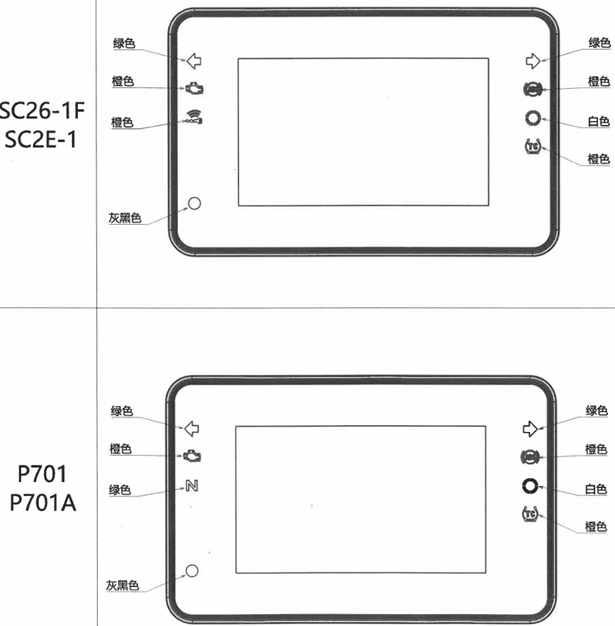

SC2E-1

SC26-1F

P701

P701-A
</td>
</tr>
</tbody>
</table>

<!-- AGENT_SECTION id="S008" type="indicator" title="指示灯要求" keywords="指示灯" -->
### 指示灯要求

<table>
<colgroup>
<col style="width: 16%" />
<col style="width: 83%" />
</colgroup>
<tbody>
<tr class="odd">
<td>指示灯</td>
<td>
按照效果图，同时厂家需具备相关法规的校核能力，发现问题及时反馈修正。

信号装置、指示器的图形符号应符合

<ol type="1">
<li>
EU 3 2014附件Ⅷ
驾驶员操纵包括操纵件、信号装置和指示器识别的适用要求
</li>
<li>
Annex VIII amended by EU 2016/1824附件Ⅰ修正(EU)No
3∕2014附件Ⅷ
</li>
<li>
布置上颜色相同的指示灯应尽量避免相邻（具体按UI）
</li>
<li>
暗室环境下指示灯均匀且不得眩目，白天阳光下指示灯需清晰可见，且照明均匀。
</li>
</ol></td>
</tr>
</tbody>
</table>

<table>
<colgroup>
<col style="width: 6%" />
<col style="width: 13%" />
<col style="width: 21%" />
<col style="width: 30%" />
<col style="width: 27%" />
</colgroup>
<tbody>
<tr class="odd">
<td colspan="3">车型</td>
<td rowspan="2"><strong>P701</strong></td>
<td rowspan="2">
<strong>SC2E-1、SC26-1F</strong>

　
</td>
</tr>
<tr class="even">
<td>序号</td>
<td>英文简写</td>
<td>端口定义</td>
</tr>
<tr class="odd">
<td>1</td>
<td>
Gear 4-

/Lock-
</td>
<td>
档位线输入 4

/<mark>车头锁警告灯</mark>
</td>
<td>←预留电路，但不贴片</td>
<td>
<mark>车头锁警告灯（红色）</mark>

<mark>Lock-</mark>,通用电路，但不贴片
</td>
</tr>
<tr class="even">
<td>2</td>
<td>Gear 3-</td>
<td>档位线输入 3</td>
<td>←预留电路，但不贴片</td>
<td>←</td>
</tr>
<tr class="odd">
<td>3</td>
<td>
Gear 2-

/Button_R-
</td>
<td>
档位线输入 2

/操作按键（右）
</td>
<td>Gear 2-/操作按键（右）, 接地信号输入,通用电路，但不贴片</td>
<td>←</td>
</tr>
<tr class="even">
<td>4</td>
<td>
Gear 1-

/Button_L-
</td>
<td>
档位线输入 1

/操作按键（左）
</td>
<td>Gear 1-/操作按键（左）,接地信号输入,通用电路，但不贴片</td>
<td>←</td>
</tr>
<tr class="odd">
<td>5</td>
<td>HI_BEAM+</td>
<td>远光指示灯</td>
<td>←</td>
<td>←</td>
</tr>
<tr class="even">
<td>6</td>
<td>NEUTRAL-</td>
<td>空档指示符</td>
<td>←预留电路，但不贴片 
(跨骑车LED为绿色)</td>
<td>
<mark>←预留电路，但不贴片</mark>

<mark>指示灯PAD兼容黄色/红色</mark>
</td>
</tr>
<tr class="odd">
<td>7</td>
<td>TURN_L+</td>
<td>左转向灯</td>
<td>←</td>
<td>←</td>
</tr>
<tr class="even">
<td>8</td>
<td>TURN_R+</td>
<td>右转向灯</td>
<td>←</td>
<td>←</td>
</tr>
<tr class="odd">
<td>9</td>
<td>GND-</td>
<td>地</td>
<td>←</td>
<td>←</td>
</tr>
<tr class="even">
<td>10</td>
<td>ILLUMI+</td>
<td>位置灯开关信号</td>
<td>←</td>
<td>←</td>
</tr>
<tr class="odd">
<td>11</td>
<td>IGN+</td>
<td>点火开关(锁)</td>
<td>←</td>
<td>←</td>
</tr>
<tr class="even">
<td>12</td>
<td>BATT+</td>
<td>蓄电池+</td>
<td>←</td>
<td>←</td>
</tr>
<tr class="odd">
<td>13</td>
<td><mark>VCC_ OUT</mark></td>
<td><mark>电源输出</mark></td>
<td>←预留电路，但不贴片</td>
<td>←预留电路，但不贴片</td>
</tr>
<tr class="even">
<td>14</td>
<td>Button4-</td>
<td>操作按键（确认ok）</td>
<td>←</td>
<td>←</td>
</tr>
<tr class="odd">
<td>15</td>
<td>Button3-</td>
<td>操作按键（返回↖）</td>
<td>操作按键（返回↖）</td>
<td>←</td>
</tr>
<tr class="even">
<td>16</td>
<td>Button2-</td>
<td>操作按键（下）</td>
<td>←</td>
<td>←</td>
</tr>
<tr class="odd">
<td>17</td>
<td>Button1-</td>
<td>操作按键（上）</td>
<td>←</td>
<td>←</td>
</tr>
<tr class="even">
<td>18</td>
<td>CAN-H</td>
<td>CAN 通信口</td>
<td>←</td>
<td>←</td>
</tr>
<tr class="odd">
<td>19</td>
<td>CAN-L</td>
<td>CAN 通信口</td>
<td>←</td>
<td>←</td>
</tr>
<tr class="even">
<td>20</td>
<td>OIL-</td>
<td>水冷线控油压警告灯</td>
<td>←</td>
<td>←预留电路，但不贴片</td>
</tr>
<tr class="odd">
<td>21</td>
<td>SMRKY -</td>
<td>智能钥匙指示灯</td>
<td>←预留电路，但不贴片</td>
<td>有</td>
</tr>
<tr class="even">
<td>22</td>
<td>FUEL_SIG</td>
<td>油量信号</td>
<td>←</td>
<td>←</td>
</tr>
<tr class="odd">
<td>23</td>
<td>Gear 6-</td>
<td>档位线输入 6</td>
<td>
<mark>←预留电路，但不贴片</mark>

<mark>可通过贴片与右侧二选一</mark>
</td>
<td><mark>环境温度 
（负性电阻型信号输入）</mark>←预留电路，但不贴片</td>
</tr>
<tr class="even">
<td>24</td>
<td>Gear 5-</td>
<td>档位线输入 5</td>
<td>
<mark>←预留电路，但不贴片</mark>

<mark>可通过贴片与右侧二选一</mark>
</td>
<td><mark>环境温度 
（负性电阻型地线输入）</mark>←预留电路，但不贴片</td>
</tr>
<tr class="odd">
<td colspan="5">
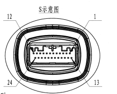JAE、型号：MX34024UF1、24端子接插件。

预留端口及相应检测电路，实物元器件默认不用贴片。
</td>
</tr>
</tbody>
</table>

<!-- AGENT_SECTION id="S009" type="section" title="接插件及端口定义" keywords="" -->
### 接插件及端口定义

<!-- AGENT_SECTION id="S010" type="section" title="按键及其功能定义" keywords="" -->
### 按键及其功能定义

<table>
<colgroup>
<col style="width: 100%" />
</colgroup>
<tbody>
<tr class="odd">
<td>
短按: &lt;0.5s ； 长按： 1-2s ； 超长按：＞2s

双击：在0.5s时间间隔内，接着完成第二次单击，判定为双击，两次点击的时间间隔在0.2s到0.5s之间。具体需考虑人机交互感觉，可提出具体参数和模拟软件讨论。

未定义的区间仪表可不响应；

达到按键操作时，即使按键未松开，相关显示内容可切换显示。

快速移动时每格的停留时间为0.2±0.1s；

遇到数值选择默认：按键长按或超长按时可快速切换（每过0.2s数值变化1），具体参照各机能；

骑行模式、TCS、快速换档需要在主页面直接操作(不用进入菜单)。
</td>
</tr>
<tr class="even">
<td><ol type="1">
<li>
整车侧手把开关按键：
</li>
</ol>

 颜色含义：

<table>
<colgroup>
<col style="width: 30%" />
<col style="width: 69%" />
</colgroup>
<tbody>
<tr class="odd">
<td>实车侧电路</td>
<td>规格</td>
</tr>
<tr class="even">
<td></td>
<td><ol type="1">
<li>
手把开关类型：微动开关
</li>
</ol>
<blockquote>

（均为点动接触ON，松开复位OFF）

</blockquote>
<ol start="2" type="1">
<li>
手把开关允许的电流： 1mA～50mA,建议检测电流≥4.5mA
</li>
</ol>

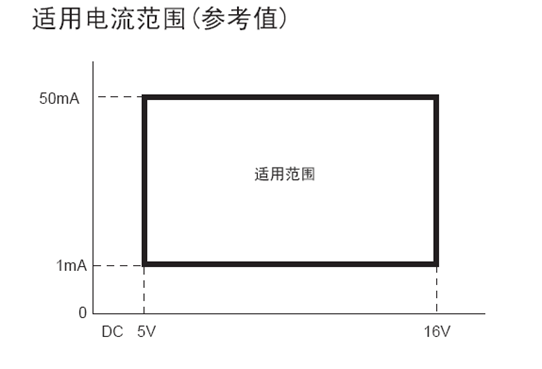

<ol start="3" type="1">
<li>
开关漏电流：无
</li>
</ol>

4、开关接触电阻：0.5Ω max（初期），5Ω max（耐久后）
</td>
</tr>
</tbody>
</table>

<strong>注：</strong>仪表要支持整车侧手把开关按键在IGN+
OFF期间工作，以支持IGN OFF期间功能操作。

<ol start="2" type="1">
<li>
仪表内部按键：仪表防护面板（玻璃）上布置上、下、OK、返回四颗触摸按键。具体功能待定
</li>
</ol>

<strong>注：</strong>仪表内部按键不需要要支持IGN+ OFF期间工作。

<blockquote>

在达到一定车速时(暂定1km/h)，需要屏蔽仪表内部按键功能，以免误触发。

</blockquote></td>
</tr>
</tbody>
</table>

<!-- AGENT_SECTION id="S011" type="section" title="仪表开关机自检动作" keywords="" -->
### 仪表开关机自检动作

<table>
<colgroup>
<col style="width: 20%" />
<col style="width: 79%" />
</colgroup>
<tbody>
<tr class="odd">
<td><strong>信号动作</strong></td>
<td><strong>仪表响应动作</strong></td>
</tr>
<tr class="even">
<td><strong>IGN+</strong>：OFF 🡪 ON</td>
<td>
IGN+ ON
后0.5秒开始，根据我司提供的自检动画（开机动画+衔接动画）显示。

开机动画长度：2-4秒，全屏显示。

IGN+ OFF后，根据我司提供的关机动画显示。

关机动画长度：2-4秒，全屏显示。

（关机动画过程中如果IGN ON，这个时候就转换为开机动画）

<ul>
<li>
附注：
</li>
</ul>
<ol type="1">
<li>
IGN+ ON
后0.5秒开始，仪表按实车接收到的信息驱动可控制的灯点亮动作自检（硬线直驱类指示灯不作要求）。
</li>
</ol>
<ul>
<li>
LED灯；
</li>
<li>
TFT内（按当前页面包含的指示灯，除实车接收到的信息驱动可控制的灯点亮外，保养提示需要亮灯）。
</li>
</ul>

待增加UI设计。承制方可依照理解提供开机动画时序-显示内容的对照图承认。

仪表可控的 LED 灯与待机实时动画时机同步。

<ol start="2" type="1">
<li>
初期动作期间，按键的操作无效。
</li>
<li>
初期动作期间，接收到IGN+ OFF信号时，仪表所有功能停止。
</li>
<li>
换挡提示灯在开机动画期间设置为开， LED
点亮时的照明亮度按仪表此灯设置的亮度进行。如换挡提示灯已设置为关闭，则按关闭前亮度点亮。
</li>
<li>
动画播放过程中有车速输入时，立即回到正常画面显示车速。暂定当显示车速&gt;5km/h（对应
3～4 之间的 mile，可以只参照km/h）时。
</li>
</ol></td>
</tr>
</tbody>
</table>

<!-- AGENT_SECTION id="S012" type="section" title="仪表输出报文" keywords="" -->
### 仪表输出报文

<table>
<colgroup>
<col style="width: 16%" />
<col style="width: 83%" />
</colgroup>
<tbody>
<tr class="odd">
<td><strong>信号动作</strong></td>
<td><strong>仪表响应动作</strong></td>
</tr>
<tr class="even">
<td>输出报文</td>
<td><table>
<colgroup>
<col style="width: 50%" />
<col style="width: 50%" />
</colgroup>
<tbody>
<tr class="odd">
<td>跨骑车</td>
<td>踏板车</td>
</tr>
<tr class="even">
<td>
MTR_Info

MTR_Out_*

发送时间：仪表被唤醒后(IGN ON)持续发送，仪表进入休眠时（IGN
OFF）停止发送。
</td>
<td>←</td>
</tr>
<tr class="odd">
<td>/</td>
<td>
IGN OFF后，

仅在应急模式才会发送NM_MTR

仅在应急模式才会发送MTR_Out_2
</td>
</tr>
</tbody>
</table></td>
</tr>
</tbody>
</table>

<!-- AGENT_SECTION id="S013" type="section" title="仪表诊断及保护" keywords="诊断" -->
### 仪表诊断及保护

<table>
<colgroup>
<col style="width: 100%" />
</colgroup>
<tbody>
<tr class="odd">
<td>
1.仪表内部过热，降低LCD背光、功耗自我保护功能。

注意过热保护的策略不能是背光直接关闭（进入黑屏模式），建议将背光调整为最低亮度。

此时LCD显示提醒：仪表进入热保护模式(预留功能)，同时记录故障代码。

注：仪表需要将LCD的监测温度值发送到CAN总线上。

2.发动机转速≦500RPM期间， LCD背光、功耗降低保护车身电瓶。

建议同上述1采取过热保护方案。

3.BT/WiFi连接工作期间，侦测到车身电压过低，LCD显示报警提示功能

同2.2.12 电池电压：增加低电压警示功能

4.遥控器丢失IGN OFF期间输入密码，LCD
BT/WiFi关闭、LCD背光依双方指定亮度降低功耗

5.按其他控制器CAN通信数据显示故障(预留，非必要功能)

(1)BCM控制关联零部件故障，以故障代码或对话弹框UI显示

(2)ABS、FI-ECU、TCU故障代码

(3)TPMS报警信息: 胎压、胎温异常，传感器丢失、低电量
</td>
</tr>
</tbody>
</table>

<!-- AGENT_SECTION id="S014" type="section" title="机能式样" keywords="" -->
## 机能式样

<!-- AGENT_SECTION id="S015" type="indicator" title="独立LED指示灯" keywords="指示灯" -->
### 独立LED指示灯

|      |                  |                            |
|------|------------------|----------------------------|
| 序号 | 显示内容         | 对应切换内容               |
| 1    | 左转向灯指示灯   | 开启-亮绿灯；关闭-熄灭     |
| 2    | 右转向灯指示灯   | 开启-亮绿灯；关闭-熄灭     |
| 3    | OBD故障指示灯    | 警报-亮黄灯；正常-熄灭     |
| 4    | ABS警报指示灯    | 警报-亮黄灯；正常-熄灭     |
| 5    | 光传感器         | /                          |
| 6    | 换档提示灯       | 开启-亮白灯；关闭-熄灭     |
| 7    | N档提示灯        | 开启-亮绿灯；关闭-熄灭     |
| 8    | TCS牵引力指示灯  | 开启-亮黄灯；关闭-熄灭     |
| 9    | 智能钥匙指示灯   | 开启-亮黄灯；关闭-熄灭     |
| 10   | ~~车头锁警告灯~~ | ~~开启-亮红灯；关闭-熄灭~~ |

<!-- AGENT_SECTION id="S016" type="indicator" title="左/右转向指示灯" keywords="指示灯" -->
#### 左/右转向指示灯

<table>
<colgroup>
<col style="width: 12%" />
<col style="width: 87%" />
</colgroup>
<thead>
<tr class="header">
<th>项目</th>
<th>式样</th>
</tr>
</thead>
<tbody>
<tr class="odd">
<td>显示内容</td>
<td>左/右转向指示灯</td>
</tr>
<tr class="even">
<td>显示方式</td>
<td>
绿色LED，左右转向灯各一个

FMVSS NO.108（尺寸规定）：发光面积应大于等于直径3/16英寸的圆
※1英寸=2.54cm
</td>
</tr>
<tr class="odd">
<td>输入信号</td>
<td>
右转(TURN_R)： PIN 8

左转(TURN_L)： PIN 7
</td>
</tr>
<tr class="even">
<td>实车侧电路</td>
<td>
输入最大电压：15V

最大工作电流（13V）：典型工作电流10mA左右。
</td>
</tr>
<tr class="odd">
<td>输入及响应</td>
<td></td>
</tr>
</tbody>
</table>

<!-- AGENT_SECTION id="S017" type="indicator" title="OBD指示灯" keywords="指示灯" -->
#### OBD指示灯

<table>
<colgroup>
<col style="width: 12%" />
<col style="width: 87%" />
</colgroup>
<thead>
<tr class="header">
<th>项目</th>
<th>式样</th>
</tr>
</thead>
<tbody>
<tr class="odd">
<td>显示方式</td>
<td><ul>
<li>
黄色LED指示灯
</li>
</ul></td>
</tr>
<tr class="even">
<td>输入信号</td>
<td>
故障代码在设置页面的显示方案不做，在主页面需要显示故障代码。但是指示灯需要根据要求指示。

<ul>
<li>
CAN数据帧-诊断
</li>
</ul>

SC：

<table>
<colgroup>
<col style="width: 24%" />
<col style="width: 24%" />
<col style="width: 25%" />
<col style="width: 25%" />
</colgroup>
<tbody>
<tr class="odd">
<td>ID</td>
<td>Msg.name</td>
<td>Signal Name</td>
<td>T/RX</td>
</tr>
<tr class="even">
<td>0x340</td>
<td>ECM_2</td>
<td>DIAGMODE</td>
<td>RX</td>
</tr>
</tbody>
</table>

BB：

<table>
<colgroup>
<col style="width: 24%" />
<col style="width: 24%" />
<col style="width: 25%" />
<col style="width: 25%" />
</colgroup>
<tbody>
<tr class="odd">
<td>ID</td>
<td>Msg.name</td>
<td>Signal Name</td>
<td>T/RX</td>
</tr>
<tr class="even">
<td>0x340</td>
<td>ECM_DTC</td>
<td>DIAGMODE</td>
<td>RX</td>
</tr>
</tbody>
</table>

0x0: User mode

0x1: Current DTC mode

0x2: History DTC mode

0x3: Learning Value clear mode

<ul>
<li>
CAN 数据帧-指示灯
</li>
</ul>
<blockquote>

SC：

</blockquote>
<table>
<colgroup>
<col style="width: 24%" />
<col style="width: 24%" />
<col style="width: 25%" />
<col style="width: 25%" />
</colgroup>
<tbody>
<tr class="odd">
<td>ID</td>
<td>Msg.name</td>
<td>Signal Name</td>
<td>T/RX</td>
</tr>
<tr class="even">
<td>0x134</td>
<td>ECM_1</td>
<td>ECM_MIL_IND</td>
<td>RX</td>
</tr>
</tbody>
</table>

BB：

<table>
<colgroup>
<col style="width: 24%" />
<col style="width: 24%" />
<col style="width: 25%" />
<col style="width: 25%" />
</colgroup>
<tbody>
<tr class="odd">
<td>ID</td>
<td>Msg.name</td>
<td>Signal Name</td>
<td>T/RX</td>
</tr>
<tr class="even">
<td>0x134</td>
<td>ECM_1</td>
<td>ECM_MILLampSts</td>
<td>RX</td>
</tr>
</tbody>
</table>

按以下方式动作：

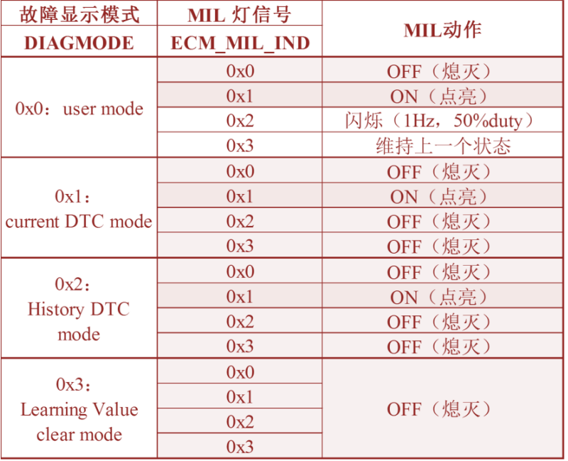
</td>
</tr>
<tr class="odd">
<td>电路</td>
<td>/</td>
</tr>
<tr class="even">
<td>
输入及

响应
</td>
<td></td>
</tr>
</tbody>
</table>

<!-- AGENT_SECTION id="S018" type="indicator" title="ABS警报指示灯" keywords="指示灯" -->
#### ABS警报指示灯

<table>
<colgroup>
<col style="width: 12%" />
<col style="width: 87%" />
</colgroup>
<thead>
<tr class="header">
<th>项目</th>
<th>式样</th>
</tr>
</thead>
<tbody>
<tr class="odd">
<td>显示内容</td>
<td>ABS警报指示灯</td>
</tr>
<tr class="even">
<td>显示方式</td>
<td><ul>
<li>
黄色LED。 FMVSS
NO.122（尺寸规定）：字高＞3/32英寸≈2.38mm
</li>
</ul></td>
</tr>
<tr class="odd">
<td>输入信号及响应</td>
<td><ul>
<li>
CAN数据帧- ABS_Warning_IND
</li>
</ul>
<table>
<colgroup>
<col style="width: 24%" />
<col style="width: 24%" />
<col style="width: 25%" />
<col style="width: 25%" />
</colgroup>
<tbody>
<tr class="odd">
<td>ID</td>
<td>Msg.name</td>
<td>Signal Name</td>
<td>T/RX</td>
</tr>
<tr class="even">
<td>0x12B</td>
<td>ABS_1</td>
<td>ABS_Warning_IND</td>
<td>RX</td>
</tr>
</tbody>
</table>
<table>
<colgroup>
<col style="width: 57%" />
<col style="width: 42%" />
</colgroup>
<tbody>
<tr class="odd">
<td><em>仪表接收到CAN信息</em></td>
<td><em>仪表ABS指示灯动作</em></td>
</tr>
<tr class="even">
<td>0x0: Off: Lamp 'off'</td>
<td>指示灯OFF</td>
</tr>
<tr class="odd">
<td>0x1: On-1 : Lamp 'on' due to ABS failure</td>
<td>指示灯ON</td>
</tr>
<tr class="even">
<td>0x2: ABS ECU in Diagnostic Mode ( Test Mode )</td>
<td>指示灯ON</td>
</tr>
<tr class="odd">
<td>0x3: ABS disabled by rider(reserved)</td>
<td>保留位，收到此值仪表滤除，维持最近一笔有效数字显示</td>
</tr>
<tr class="even">
<td>0x4: Not defined, reserved</td>
<td>↑</td>
</tr>
<tr class="odd">
<td>0x5: Lamp 'on' due self diagnostic</td>
<td>指示灯ON</td>
</tr>
<tr class="even">
<td>0x6: Not defined, reserved</td>
<td>保留位，收到此值仪表滤除，维持最近一笔有效数字显示</td>
</tr>
<tr class="odd">
<td>0x7: MSC Failure(CABS failure)</td>
<td>指示灯ON ，同时UI提示“弯道ABS/TCS失效”与“倾倒熄火功能无效”
–UI首选可同时显示。</td>
</tr>
</tbody>
</table></td>
</tr>
</tbody>
</table>

<!-- AGENT_SECTION id="S019" type="section" title="光传感器" keywords="" -->
#### 光传感器

<table>
<colgroup>
<col style="width: 11%" />
<col style="width: 88%" />
</colgroup>
<thead>
<tr class="header">
<th>项目</th>
<th>式样</th>
</tr>
</thead>
<tbody>
<tr class="odd">
<td>显示内容</td>
<td>光传感器</td>
</tr>
<tr class="even">
<td>输入信号</td>
<td>自然光线</td>
</tr>
<tr class="odd">
<td>输入及响应</td>
<td>
根据外界光强调整屏幕亮度；根据外界光强调整白天/夜晚显示模式

黑白屏切换不得有明显的人眼视觉突兀感觉，具体依主观评价结果。

参考DCJ量产仪表，要求承制方具备对标分析能力。

根据对标结果，确定防护面板玻璃印刷油墨深度、导光结构，以及感光传感器芯片选型。
</td>
</tr>
</tbody>
</table>

<!-- AGENT_SECTION id="S020" type="indicator" title="换档提示灯" keywords="换档" -->
#### 换档提示灯

<table>
<colgroup>
<col style="width: 11%" />
<col style="width: 88%" />
</colgroup>
<thead>
<tr class="header">
<th>项目</th>
<th>式样</th>
</tr>
</thead>
<tbody>
<tr class="odd">
<td>显示内容</td>
<td>换档提示灯</td>
</tr>
<tr class="even">
<td>显示方式</td>
<td><ul>
<li>
LED指示灯
</li>
<li>
指示符形式（按照效果图）
</li>
</ul></td>
</tr>
<tr class="odd">
<td>输入信号</td>
<td><ul>
<li>
换档提示灯配置数据 &amp; 转速
</li>
</ul></td>
</tr>
<tr class="even">
<td>电路</td>
<td>/</td>
</tr>
<tr class="odd">
<td>输入及响应</td>
<td><ul>
<li>
CAN数据帧-- ECM_Eng_Rpm
</li>
</ul>
<table>
<colgroup>
<col style="width: 24%" />
<col style="width: 24%" />
<col style="width: 25%" />
<col style="width: 25%" />
</colgroup>
<tbody>
<tr class="odd">
<td>ID</td>
<td>Msg.name</td>
<td>Signal Name</td>
<td>T/RX</td>
</tr>
<tr class="even">
<td>0x135</td>
<td>ECM_2</td>
<td>ECM_Eng_Rpm</td>
<td>RX</td>
</tr>
</tbody>
</table>
<ul>
<li>
换档提示灯动作流程：
</li>
</ul>
<blockquote>

当转速&gt;设定转速时，换档指示灯点亮/闪烁；

当转速≤设定转速时，换档指示灯熄灭。

</blockquote>
<ul>
<li>
换档提示灯配置功能在设置页面中，详情请参考设置页面。
</li>
</ul></td>
</tr>
</tbody>
</table>

<!-- AGENT_SECTION id="S021" type="indicator" title="N档指示灯" keywords="指示灯" -->
#### N档指示灯

<table>
<colgroup>
<col style="width: 14%" />
<col style="width: 85%" />
</colgroup>
<thead>
<tr class="header">
<th>项目</th>
<th>式样</th>
</tr>
</thead>
<tbody>
<tr class="odd">
<td>显示内容</td>
<td>N档指示灯</td>
</tr>
<tr class="even">
<td>显示方式</td>
<td><ul>
<li>
绿色LED指示灯
</li>
</ul></td>
</tr>
<tr class="odd">
<td>输入信号</td>
<td><ul>
<li>
同档位CAN通信报文，PIN 6：
</li>
</ul></td>
</tr>
<tr class="even">
<td>电路</td>
<td>电路板PAD可兼容黄色/红色LED。</td>
</tr>
<tr class="odd">
<td>输入响应</td>
<td>与TFT内“N”符号同步显示。但是在开机动画期间需要根据实车报文实时响应亮/灭。</td>
</tr>
</tbody>
</table>

<!-- AGENT_SECTION id="S022" type="indicator" title="TCS指示灯" keywords="指示灯,TCS" -->
#### TCS指示灯

<table>
<colgroup>
<col style="width: 12%" />
<col style="width: 87%" />
</colgroup>
<thead>
<tr class="header">
<th>项目</th>
<th>式样</th>
</tr>
</thead>
<tbody>
<tr class="odd">
<td>显示内容</td>
<td>TCS 指示灯</td>
</tr>
<tr class="even">
<td>显示方式</td>
<td><ul>
<li>
黄色 LED 灯
</li>
<li>
显示动画：按照效果图
</li>
</ul></td>
</tr>
<tr class="odd">
<td>输入信号</td>
<td>
SC：

<table>
<colgroup>
<col style="width: 24%" />
<col style="width: 24%" />
<col style="width: 25%" />
<col style="width: 25%" />
</colgroup>
<tbody>
<tr class="odd">
<td>ID</td>
<td>Msg.name</td>
<td>Signal Name</td>
<td>T/RX</td>
</tr>
<tr class="even">
<td>0x136</td>
<td>ECM_3</td>
<td>ECM_TCSWarningLamp</td>
<td>RX</td>
</tr>
</tbody>
</table>

BB：

<table>
<colgroup>
<col style="width: 24%" />
<col style="width: 24%" />
<col style="width: 25%" />
<col style="width: 25%" />
</colgroup>
<tbody>
<tr class="odd">
<td>ID</td>
<td>Msg.name</td>
<td>Signal Name</td>
<td>T/RX</td>
</tr>
<tr class="even">
<td>0x12F</td>
<td>ABS_2</td>
<td>ABS_MTC_Warning_Lamp</td>
<td>RX</td>
</tr>
</tbody>
</table>

0x0: Off: Lamp 'off' 指示灯关闭

0x1: On-1 : Lamp 'on' due to MTC/MSR failure
指示灯ON、TCS故障符号(有!)ON

0x2: ON，ECU in Diagnostic Mode ( Test Mode)

0x3: MTC disabled by rider 指示灯ON+TCS关闭符号ON

0x4: Not defined, reserved（维持上一个状态）

0x5: Lamp 'on' due self diagnostic or Engine
Kill指示灯ON+TCS关闭符号ON

0x6: Lamp blink due to MTC/MSR working

指示灯闪烁(320ms ON/ 320ms OFF)+TCS ON符号

0x7: MM5.10 EOL lock mode指示灯闪烁(320ms ON/ 320ms OFF)+TCS
ON符号

详见下表：

</td>
</tr>
</tbody>
</table>

<!-- AGENT_SECTION id="S023" type="indicator" title="智能钥匙指示灯" keywords="指示灯,钥匙" -->
#### 智能钥匙指示灯

<table>
<colgroup>
<col style="width: 14%" />
<col style="width: 85%" />
</colgroup>
<thead>
<tr class="header">
<th>项目</th>
<th>式样</th>
</tr>
</thead>
<tbody>
<tr class="odd">
<td>显示内容</td>
<td>智能钥匙指示灯</td>
</tr>
<tr class="even">
<td>显示方式</td>
<td><ul>
<li>
黄色LED指示灯
</li>
</ul></td>
</tr>
<tr class="odd">
<td>输入信号</td>
<td><ul>
<li>
智能钥匙信号：PIN 21
</li>
</ul></td>
</tr>
<tr class="even">
<td>电路</td>
<td><table>
<colgroup>
<col style="width: 51%" />
<col style="width: 48%" />
</colgroup>
<tbody>
<tr class="odd">
<td>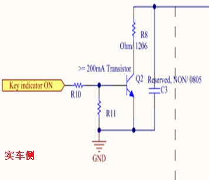</td>
<td>
VL max：0.5V

最大工作电流（15V）：≤80mA。
</td>
</tr>
</tbody>
</table></td>
</tr>
<tr class="odd">
<td>输入响应</td>
<td>
外部信号接地时：指示灯点亮

外部信号断开时：指示灯熄灭

注：该指示灯需要在IGN OFF时点灯
</td>
</tr>
</tbody>
</table>

<!-- AGENT_SECTION id="S024" type="indicator" title="车头锁警告灯（红色）" keywords="" -->
#### 车头锁警告灯（红色）

<table>
<colgroup>
<col style="width: 14%" />
<col style="width: 85%" />
</colgroup>
<thead>
<tr class="header">
<th>项目</th>
<th>式样</th>
</tr>
</thead>
<tbody>
<tr class="odd">
<td>显示内容</td>
<td>车头锁警告灯</td>
</tr>
<tr class="even">
<td>显示方式</td>
<td><ul>
<li>
红色LED指示灯
</li>
</ul></td>
</tr>
<tr class="odd">
<td>输入信号</td>
<td><ul>
<li>
智能钥匙信号：PIN 1
</li>
</ul></td>
</tr>
<tr class="even">
<td>电路</td>
<td><table>
<colgroup>
<col style="width: 51%" />
<col style="width: 48%" />
</colgroup>
<tbody>
<tr class="odd">
<td></td>
<td>
VL max：0.5V

最大工作电流（15V）：≤80mA。
</td>
</tr>
</tbody>
</table></td>
</tr>
<tr class="odd">
<td>输入响应</td>
<td>
外部信号接地时：指示灯点亮

外部信号断开时：指示灯熄灭

注：该指示灯需要在IGN OFF时点灯
</td>
</tr>
</tbody>
</table>

<!-- AGENT_SECTION id="S025" type="indicator" title="预留指示灯" keywords="指示灯" -->
#### 预留指示灯

<table>
<colgroup>
<col style="width: 11%" />
<col style="width: 88%" />
</colgroup>
<thead>
<tr class="header">
<th>项目</th>
<th>式样</th>
</tr>
</thead>
<tbody>
<tr class="odd">
<td>显示内容</td>
<td>预留提示灯</td>
</tr>
<tr class="even">
<td>显示方式</td>
<td><ul>
<li>
LED指示灯，指示符形式（按照效果图）
</li>
</ul></td>
</tr>
<tr class="odd">
<td>输入信号</td>
<td><ul>
<li>
CAN数据
</li>
</ul></td>
</tr>
<tr class="even">
<td>电路</td>
<td>/</td>
</tr>
<tr class="odd">
<td>输入及响应</td>
<td><ul>
<li>
CAN数据帧—预留，待定
</li>
</ul>
<table>
<colgroup>
<col style="width: 24%" />
<col style="width: 24%" />
<col style="width: 25%" />
<col style="width: 25%" />
</colgroup>
<tbody>
<tr class="odd">
<td>ID</td>
<td>Msg.name</td>
<td>Signal Name</td>
<td>T/RX</td>
</tr>
<tr class="even">
<td></td>
<td></td>
<td></td>
<td>RX</td>
</tr>
</tbody>
</table></td>
</tr>
</tbody>
</table>

<!-- AGENT_SECTION id="S026" type="section" title="TFT内显示内容" keywords="" -->
### TFT内显示内容

<!-- AGENT_SECTION id="S027" type="display_metric" title="车速" keywords="车速" -->
#### 车速

<table>
<colgroup>
<col style="width: 11%" />
<col style="width: 88%" />
</colgroup>
<thead>
<tr class="header">
<th>项目</th>
<th>式样</th>
</tr>
</thead>
<tbody>
<tr class="odd">
<td>显示内容</td>
<td>车速</td>
</tr>
<tr class="even">
<td>显示方式</td>
<td><ul>
<li>
TFT屏内显示。注意车速显示都不能被遮挡。
</li>
<li>
显示动画：按照效果图（数码显示/指针式显示）
</li>
<li>
显示范围： 0～199，速度表的数字高度14mm以上
</li>
</ul>
<blockquote>

0x1BC8以上(相当于400km/h以上)的CAN信号输入是无效的，仪表显示最大值199km/h

</blockquote>
<ul>
<li>
显示单位：km/h （mph），1mph = 1.6km/h
</li>
<li>
显示分辨率：1
</li>
<li>
显示保持时间：300±33.33ms
</li>
</ul></td>
</tr>
<tr class="odd">
<td>输入信号</td>
<td><ul>
<li>
CAN数据帧：ABS_Rear_Speed
</li>
</ul>
<table>
<colgroup>
<col style="width: 24%" />
<col style="width: 24%" />
<col style="width: 24%" />
<col style="width: 25%" />
</colgroup>
<tbody>
<tr class="odd">
<td>ID</td>
<td>Msg.name</td>
<td>Signal Name</td>
<td>T/RX</td>
</tr>
<tr class="even">
<td>0x12B</td>
<td>ABS_1</td>
<td>ABS_Rear_Speed</td>
<td>RX</td>
</tr>
</tbody>
</table>

ABS_Rear_Speed无效值是0xFFFE

精度Factor: 0.05625

示例：当收到ABS_Rear_Speed = 0x400时，仪表转化过程如下：

<em>Ex: 0x0400 × 0.05625 = 256 × 4 ×0.5625 = 57.6km/h🡪(显示57
km/h)</em>

<em>（显示时舍弃小数点后的数字，实际累积里程时需按照实际速度计算）</em>

<ul>
<li>
软件设定值-km/h
</li>
</ul>
<table style="width:100%;">
<colgroup>
<col style="width: 17%" />
<col style="width: 7%" />
<col style="width: 6%" />
<col style="width: 10%" />
<col style="width: 8%" />
<col style="width: 8%" />
<col style="width: 8%" />
<col style="width: 8%" />
<col style="width: 8%" />
<col style="width: 8%" />
<col style="width: 8%" />
</colgroup>
<tbody>
<tr class="odd">
<td>
标准指度

km/h
</td>
<td>20</td>
<td>30</td>
<td>40</td>
<td>60</td>
<td>80</td>
<td>100</td>
<td>120</td>
<td>140</td>
<td>160</td>
<td>180</td>
</tr>
<tr class="even">
<td>
公差

km/h
</td>
<td>
+ 3

+1
</td>
<td>
+ 4

+ 2
</td>
<td>
+ 5

+ 2
</td>
<td>
+ 7

+ 3
</td>
<td>
+ 9

+ 3
</td>
<td>
+ 11

+ 3
</td>
<td>
+ 12

+ 4
</td>
<td>
+ 14

+ 4
</td>
<td>
+ 15

+ 5
</td>
<td>
+17

+5
</td>
</tr>
<tr class="odd">
<td>软件设定中心值 km/h</td>
<td></td>
<td>
22

33
</td>
<td>44</td>
<td></td>
<td>
65

86
</td>
<td>107</td>
<td>1</td>
<td>
08

149
</td>
<td>170</td>
<td>191</td>
</tr>
</tbody>
</table>
<ul>
<li>
软件设定值mph
</li>
</ul>
<table style="width:100%;">
<colgroup>
<col style="width: 20%" />
<col style="width: 7%" />
<col style="width: 7%" />
<col style="width: 6%" />
<col style="width: 8%" />
<col style="width: 8%" />
<col style="width: 8%" />
<col style="width: 8%" />
<col style="width: 8%" />
<col style="width: 8%" />
<col style="width: 8%" />
</colgroup>
<tbody>
<tr class="odd">
<td>标准指度</td>
<td>
mph

20
</td>
<td>25</td>
<td>40</td>
<td>60</td>
<td>80</td>
<td>100</td>
<td>120</td>
<td>140</td>
<td>160</td>
<td>180</td>
</tr>
<tr class="even">
<td>公差mph</td>
<td>
+ 3

+1
</td>
<td>
+ 3

+1
</td>
<td>
+ 5

+ 2
</td>
<td>
+ 6

+ 2
</td>
<td>
+ 8

+
</td>
<td>
3

+ 9

+ 3
</td>
<td>
+ 10

+ 4
</td>
<td>
+ 12

+ 4
</td>
<td>
+ 15

+ 5
</td>
<td>
+17

+5
</td>
</tr>
<tr class="odd">
<td>软件设</td>
<td>
中心值 mph

22
</td>
<td>27</td>
<td></td>
<td>
44

64
</td>
<td>86</td>
<td>106</td>
<td>127</td>
<td>148</td>
<td>170</td>
<td>191</td>
</tr>
</tbody>
</table></td>
</tr>
<tr class="even">
<td>电路</td>
<td></td>
</tr>
<tr class="odd">
<td>
输入

及响应
</td>
<td>
需要根据实车数据波动情况，调整车速的响应软件。

车速开始输入起500msec不进行计数。

异常处理:

1、通信异常(参考CAN总线协议中关于通信异常的节点丢失loss
communication、DLC≠8、BUS
OFF等具体要求)时显示0km/h；通信异常确认前维持当前显示（异常确认的时间和条件请参考CAN总线协议）；
</td>
</tr>
</tbody>
</table>

<!-- AGENT_SECTION id="S028" type="display_metric" title="平均车速" keywords="车速" -->
#### 平均车速

|                                                                                                                                       |
|---------------------------------------------------------------------------------------------------------------------------------------|
| 平均车速：车辆处于IGN ON的总时间内，总计行驶的距离。即行驶这么长距离用了总时间是多少来计算平均车速。跟随TRIP A和B清零。~~不能清零。~~ |

<!-- AGENT_SECTION id="S029" type="display_metric" title="总里程" keywords="里程" -->
#### 总里程

<table>
<colgroup>
<col style="width: 11%" />
<col style="width: 88%" />
</colgroup>
<thead>
<tr class="header">
<th>项目</th>
<th>式样</th>
</tr>
</thead>
<tbody>
<tr class="odd">
<td>显示内容</td>
<td>总里程</td>
</tr>
<tr class="even">
<td>显示方式</td>
<td><ul>
<li>
TFT屏内显示
</li>
<li>
显示动画：按照效果图，总里程/区间里程表的数字高度4mm以上。
</li>
<li>
显示范围： 0～+999999
，前位0都要显示。例如123km时显示为000123km。
</li>
<li>
显示分辨率：1
</li>
<li>
显示单位：km（miles），其中：1 mile =1.6 km
</li>
</ul></td>
</tr>
<tr class="odd">
<td>输入信号</td>
<td><ul>
<li>
速度信号 &amp; 时间
</li>
</ul></td>
</tr>
<tr class="even">
<td>电路</td>
<td>/</td>
</tr>
<tr class="odd">
<td>输入及响应</td>
<td><ul>
<li>
依据车速输入信号积算里程Distance，显示数据Distance_Total=Distance×1.02（+2%补偿值）
</li>
<li>
公制（km）累计到999999km，但英制（miles）未达到999999miles的，英制单位下继续累计总里程。
</li>
<li>
里程累计超出最大值999999时，锁定为最大值，不再改变。
</li>
<li>
总里程不能清零和调整。
</li>
<li>
误差需求
</li>
</ul>
<ol type="1">
<li>
IGN ON⇔OFF时的显示及累计误差为±0(km or miles)。
</li>
<li>
IGN OFF→ON时，显示上一次IGN OFF前的数据。
</li>
<li>
电池更换时的显示误差为±0km，电池更换时的累计误差为±1km以内。
</li>
</ol>
<ul>
<li>
异常警报：
</li>
</ul>
<ul>
<li>
IGN ON时、如果无法取得正常数据,
按最大位数填入“-”（如果有小数点的机能，小数点也要显示），总里程表停止累计。
</li>
</ul></td>
</tr>
</tbody>
</table>

<!-- AGENT_SECTION id="S030" type="section" title="计程表A、B" keywords="" -->
#### 计程表A、B

<table>
<colgroup>
<col style="width: 11%" />
<col style="width: 88%" />
</colgroup>
<thead>
<tr class="header">
<th>项目</th>
<th>式样</th>
</tr>
</thead>
<tbody>
<tr class="odd">
<td>显示内容</td>
<td>计程表显示（TRIP A &amp; TRIP B）</td>
</tr>
<tr class="even">
<td>显示方式</td>
<td><ul>
<li>
TFT屏内显示(在固定的显示区域内显示)。
</li>
<li>
显示动画：按照效果图，总里程/区间里程表的数字高度4mm以上。
</li>
<li>
显示范围： 0 ～
+9999.9，前位0不需要显示。例如99km时显示为99km。
</li>
<li>
显示分辨率：0.1
</li>
<li>
显示单位：km（miles）,与总里程显示单位相同。
</li>
</ul></td>
</tr>
<tr class="odd">
<td>输入信号</td>
<td><ul>
<li>
速度信号&amp;对应行驶时间
</li>
</ul></td>
</tr>
<tr class="even">
<td>电路</td>
<td>/</td>
</tr>
<tr class="odd">
<td>
输入

及响应
</td>
<td><ul>
<li>
同总里程。
</li>
<li>
误差需求

<ol type="1">
<li>
IGN ON⇔OFF时的显示及累计误差为±0.1 (km or miles)。
</li>
</ol></li>
</ul>
<blockquote>

小数点第二位数据在IGN
OFF时或仪表整体断电时<del>舍弃处理</del>存储数据，精确到0.01km。需要ODO和Trip采用相同策略。

2、IGN OFF→ON时，显示上一次IGN OFF前的数据。

3、电池更换时的累计误差为±1km以内。

4、计程表需循环累积，0.0🡪9999.9🡪0.0
（km、miles显示时均需符合此要求）

</blockquote>
<ul>
<li>
异常警报：
</li>
</ul>
<ul>
<li>
IGN ON时、如果无法取得正常数据,
按最大位数填入“-”（如果有小数点的机能，小数点也要显示），计程表表停止动作，与总里程同步停止动作。
</li>
</ul></td>
</tr>
<tr class="even">
<td>关联操作</td>
<td><ul>
<li>
相关计程表清零功能在车辆信息页面，<em>详情请参考 4.5.1
里程信息</em>
</li>
</ul></td>
</tr>
</tbody>
</table>

<!-- AGENT_SECTION id="S031" type="display_metric" title="平均油耗A、B" keywords="油耗" -->
#### 平均油耗A、B

<table>
<colgroup>
<col style="width: 11%" />
<col style="width: 88%" />
</colgroup>
<thead>
<tr class="header">
<th>项目</th>
<th>式样</th>
</tr>
</thead>
<tbody>
<tr class="odd">
<td>显示内容</td>
<td>平均油耗(Avg fuel cons._A &amp; Avg fuel cons._B)</td>
</tr>
<tr class="even">
<td>显示方式</td>
<td><ul>
<li>
TFT屏内显示
</li>
<li>
显示动画：按照效果图
</li>
<li>
显示范围： 0.1～99.9
</li>
<li>
显示分辨率：0.1
</li>
<li>
显示单位：L/100km（km/L），当车速单位为km/h时；
</li>
</ul>
<blockquote>

MPG US（MPG IMP)，当车速单位为mph时；

</blockquote>
<ul>
<li>
显示更新周期： 计程表每累计达0.1（km or
miles）更新显示。
</li>
</ul></td>
</tr>
<tr class="odd">
<td>输入信号</td>
<td><ul>
<li>
CAN通信：ECM_Fuel_Consumption
</li>
</ul>
<blockquote>

SC:

</blockquote>
<table>
<colgroup>
<col style="width: 24%" />
<col style="width: 24%" />
<col style="width: 24%" />
<col style="width: 25%" />
</colgroup>
<tbody>
<tr class="odd">
<td>ID</td>
<td>Msg.name</td>
<td>Signal Name</td>
<td>T/RX</td>
</tr>
<tr class="even">
<td>0x134</td>
<td>ECM_1</td>
<td>ECM_FuelConsumption</td>
<td>RX</td>
</tr>
</tbody>
</table>

Factor: 0.015625 单位： cc/sec

Note:数据内容:过去1秒钟内喷油量(
ECM_Fuel_Consumption)cc，每200ms更新一次，ECM是每20ms发送一笔数据到CAN总线（即200ms内发送10笔相同的数据）。

<blockquote>

BB:

</blockquote>
<table>
<colgroup>
<col style="width: 25%" />
<col style="width: 24%" />
<col style="width: 26%" />
<col style="width: 23%" />
</colgroup>
<tbody>
<tr class="odd">
<td>ID</td>
<td>Msg.name</td>
<td>Signal Name</td>
<td>T/RX</td>
</tr>
<tr class="even">
<td>0x136</td>
<td>ECM</td>
<td>
3

ECM_FuelConsumption
</td>
<td>RX</td>
</tr>
</tbody>
</table>

Factor: 0.01 单位： cc/sec

Note:数据内容:过去1秒钟内喷油量(
ECM_Fuel_Consumption)cc，每200ms更新一次，ECM是每20ms发送一笔数据到CAN总线（即200ms内发送10笔相同的数据）。
</td>
</tr>
<tr class="even">
<td>电路</td>
<td>/</td>
</tr>
<tr class="odd">
<td>
输入

及响应
</td>
<td><ul>
<li>
计程表与平均油耗对应联动，其中一个重置则对应功能都重置。（同P3A5）
</li>
<li>
计程表重置后，直到检出行驶0.1（km or
mile）为止，按最大位数填入“-”（如果有小数点的机能，小数点也要显示）。
</li>
</ul>
<blockquote>

1、如果计算结果不足0.1km/L(MPG US、MPG IMP)，显示0.1。

2、如果计算结果不足0.1km/L，显示0.1。

3、如果计算结果不足0.1L/100km，显示0.1。

4、如果计算结果超过99.9(km/L、L/100km)，显示99.9。

5、如果计算结果超过99.9(MPG US、MPG IMP)，显示99.9。

</blockquote>
<ul>
<li>
IGN ON←→OFF计算值不会改变。
</li>
<li>
电池再连接时重置该数据
</li>
<li>
计算方法
</li>
</ul>
<blockquote>

(1)IGN ON后、累计收到的油耗数据。(油耗数据单位：cc/s)

(2)计算方法

</blockquote>

<ul>
<li>
显示误差： 理论值±3%以内； 
</li>
<li>
通信异常处理：
</li>
</ul>
<blockquote>

1、 IGN
ON后，ABS或ECM在通信异常(参考CAN总线协议中关于通信异常的节点丢失loss
communication、DLC≠8、BUS
OFF等具体要求)时停止积算，按最大位数填入“-”（如果有小数点的机能，小数点也要显示）,且通信异常时，停止平均油耗计算用的行驶距离和燃料消费数据的累计。

</blockquote></td>
</tr>
</tbody>
</table>

<!-- AGENT_SECTION id="S032" type="display_metric" title="转速" keywords="转速" -->
#### 转速

<table>
<colgroup>
<col style="width: 12%" />
<col style="width: 87%" />
</colgroup>
<thead>
<tr class="header">
<th>项目</th>
<th>式样</th>
</tr>
</thead>
<tbody>
<tr class="odd">
<td>显示内容</td>
<td>转速</td>
</tr>
<tr class="even">
<td>显示方式</td>
<td><ul>
<li>
TFT屏内显示(仅在固定的显示区域内显示)。
</li>
<li>
显示动画：按照效果图（数字显示/指针式显示/段码显示等）
</li>
<li>
显示范围： 0～+12000 r/min
</li>
<li>
显示分辨率：±25rpm（UI每0.5°更新一次）
</li>
<li>
显示保持时间： 33.33(0,＋33.33)ms（和动画设计有关）
</li>
</ul></td>
</tr>
<tr class="odd">
<td>输入信号</td>
<td><table>
<colgroup>
<col style="width: 100%" />
</colgroup>
<tbody>
<tr class="odd">
<td><ul>
<li>
转速数据帧
</li>
</ul>
<blockquote>

SC:

</blockquote>
<table>
<colgroup>
<col style="width: 23%" />
<col style="width: 28%" />
<col style="width: 28%" />
<col style="width: 19%" />
</colgroup>
<tbody>
<tr class="odd">
<td>ID</td>
<td>Msg.name</td>
<td>Signal Name</td>
<td>T/RX</td>
</tr>
<tr class="even">
<td>0x134</td>
<td>ECM_1</td>
<td>ECM_Eng_Rpm</td>
<td>RX</td>
</tr>
</tbody>
</table>
<blockquote>

ECM_Engine_Rpm无效值是0xFFFF。

Factor: 0.390625 Offset：0

BB:

</blockquote>
<table>
<colgroup>
<col style="width: 26%" />
<col style="width: 26%" />
<col style="width: 26%" />
<col style="width: 20%" />
</colgroup>
<tbody>
<tr class="odd">
<td>ID</td>
<td>Msg.name</td>
<td>Signal Name</td>
<td>T/RX</td>
</tr>
<tr class="even">
<td>0x135</td>
<td>ECM</td>
<td>
2

ECM_Eng_Rpm
</td>
<td>RX</td>
</tr>
</tbody>
</table>
<blockquote>

ECM_Engine_Rpm无效值是0XFFFF.

Factor: 1 Offset：0 , 最大物理值为20000 RPM

Ex:当收到ECM_Engine_RPM = 0x800时，仪表解算实车侧为2048 RPM

0x0800 x 0.25 = 256 x 8 = 2048 RPM

</blockquote>
<ul>
<li>
显示允差：
</li>
</ul>
<table style="width:100%;">
<colgroup>
<col style="width: 31%" />
<col style="width: 10%" />
<col style="width: 9%" />
<col style="width: 9%" />
<col style="width: 9%" />
<col style="width: 9%" />
<col style="width: 10%" />
<col style="width: 9%" />
</colgroup>
<tbody>
<tr class="odd">
<td>
标准指度(实际输入)

r/
</td>
<td>
in

1250
</td>
<td>2000</td>
<td>4000</td>
<td>6000</td>
<td>8000</td>
<td>10000</td>
<td>12000</td>
</tr>
<tr class="even">
<td>
仪表公差

r/m
</td>
<td>
n

+250

-250
</td>
<td>
+250

0
</td>
<td>
+500

+250
</td>
<td>
+500

+250
</td>
<td>
+750

+500
</td>
<td>
+1000

+750
</td>
<td>-</td>
</tr>
<tr class="odd">
<td>
仪表软件设定中心值

r/min
</td>
<td>1250</td>
<td>2125</td>
<td>4375</td>
<td>6375</td>
<td>8625</td>
<td>10875</td>
<td>-</td>
</tr>
</tbody>
</table></td>
</tr>
</tbody>
</table></td>
</tr>
<tr class="even">
<td>电路</td>
<td>/</td>
</tr>
<tr class="odd">
<td>输入及响应</td>
<td><ul>
<li>
转速红区警报：<strong>BB有，SC没有红区警报</strong>
</li>
</ul>

当转速显示≥设定的阈值（阈值为仪表显示的10000rpm）时动作。

对应的实际转速约为9222rpm(9111rpm～9333rpm)，具体动画根据效果图。

<ul>
<li>
怠速显示稳定性：（依照实车匹配测试结果调整）
</li>
</ul>
<blockquote>

怠速区域设定为1500rpm～2200rpm

</blockquote>
<ul>
<li>
通信异常(参考CAN总线协议中关于通信异常的节点丢失loss
communication、DLC≠8、BUS OFF等具体要求)时显示0 rpm
</li>
</ul></td>
</tr>
</tbody>
</table>

<!-- AGENT_SECTION id="S033" type="display_metric" title="油量表" keywords="油量" -->
#### 油量表

<table>
<colgroup>
<col style="width: 13%" />
<col style="width: 86%" />
</colgroup>
<thead>
<tr class="header">
<th>项目</th>
<th>式样</th>
</tr>
</thead>
<tbody>
<tr class="odd">
<td>显示内容</td>
<td>油量表显示 &amp; 燃油不足警报</td>
</tr>
<tr class="even">
<td>显示方式</td>
<td><ul>
<li>
TFT屏内显示
</li>
<li>
动画方式：按照效果图
</li>
<li>
显示范围：E🡪F (0% 🡪 100%)
</li>
</ul></td>
</tr>
<tr class="odd">
<td>输入信号</td>
<td><ul>
<li>
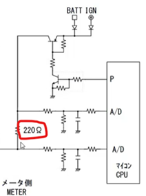油量传感器电阻信号 ：PIN
22
</li>
</ul></td>
</tr>
<tr class="even">
<td>电路</td>
<td><ul>
<li>
实车侧参考电路：
</li>
</ul>

仪表侧不需间断供电

输入电阻值范围： 10（F 点）～ 216（E 点）Ω

外部电压16V, 油量传感器输出0 Ohm给油表sensor电流&gt;=60mA。

<ul>
<li>
5格段显示式样：SC2E-1、SC26-1F、P701-A
</li>
</ul>
<table>
<colgroup>
<col style="width: 23%" />
<col style="width: 28%" />
<col style="width: 47%" />
</colgroup>
<tbody>
<tr class="odd">
<td colspan="3"><strong>指度规格</strong></td>
</tr>
<tr class="even">
<td>格段</td>
<td>切换阻值范围（Ω）</td>
<td>动画</td>
</tr>
<tr class="odd">
<td>5→</td>
<td>37.5±3.</td>
<td rowspan="4">
按UI

按UI

按UI

按UI
</td>
</tr>
<tr class="even">
<td>4→3</td>
<td>64.5±4.1</td>
</tr>
<tr class="odd">
<td>3→2</td>
<td>106.1±5.9</td>
</tr>
<tr class="even">
<td>2→1</td>
<td>153.8±8.4</td>
</tr>
<tr class="odd">
<td>1→低油量警报</td>
<td>196.0±10.9</td>
<td>按UI（油壶符号和1格段同频1Hz点灭闪烁）</td>
</tr>
</tbody>
</table>
<ul>
<li>
6格段显示式样：
</li>
</ul>
<table>
<colgroup>
<col style="width: 21%" />
<col style="width: 31%" />
<col style="width: 47%" />
</colgroup>
<tbody>
<tr class="odd">
<td colspan="3"><strong>指度规格</strong></td>
</tr>
<tr class="even">
<td>格段</td>
<td>切换阻值范围（Ω）</td>
<td>动画</td>
</tr>
<tr class="odd">
<td>6→5</td>
<td>29±3</td>
<td></td>
</tr>
<tr class="even">
<td>5→4</td>
<td>50±4</td>
<td rowspan="4">
按UI

按UI

按UI

按UI
</td>
</tr>
<tr class="odd">
<td>4→3</td>
<td>75±5</td>
</tr>
<tr class="even">
<td>3→2</td>
<td>106.1±5.9</td>
</tr>
<tr class="odd">
<td>2→1</td>
<td>153.8±8.4</td>
</tr>
<tr class="even">
<td>1→低油量警报</td>
<td>196.0±10.9</td>
<td>按UI（油壶符号和1格段同频1Hz点灭闪烁）</td>
</tr>
</tbody>
</table>

<mark></mark>
</td>
</tr>
<tr class="odd">
<td>输入及响应</td>
<td><ul>
<li>
一般动作
</li>
</ul>
<ol type="1">
<li>
IGN ON后，开机动画结束时立刻显示正确油量；
</li>
<li>
IGN ON时，油量表的更新时间为：16±0.5s /级
</li>
</ol>
<ul>
<li>
异常警报(5±0.2s间连续检出下列状态时触发警报)：
</li>
</ul>
<table>
<colgroup>
<col style="width: 15%" />
<col style="width: 24%" />
<col style="width: 59%" />
</colgroup>
<tbody>
<tr class="odd">
<td>类别</td>
<td>状态</td>
<td>动画</td>
</tr>
<tr class="even">
<td>短路检出</td>
<td>阻值&lt;2±1.5Ω</td>
<td>按UI</td>
</tr>
<tr class="odd">
<td>断路检出</td>
<td>阻值≥2k±1kΩ</td>
<td>按UI</td>
</tr>
</tbody>
</table>
<ul>
<li>
警报解除：
</li>
</ul>

5±0.2s间连续侦测到正常油量阻值，解除异常，根据输入阻值直接显示正确油量。
</td>
</tr>
</tbody>
</table>

<!-- AGENT_SECTION id="S034" type="display_metric" title="水温表" keywords="水温" -->
#### 水温表

<table>
<colgroup>
<col style="width: 11%" />
<col style="width: 88%" />
</colgroup>
<thead>
<tr class="header">
<th>项目</th>
<th>式样</th>
</tr>
</thead>
<tbody>
<tr class="odd">
<td>显示内容</td>
<td>发动机冷却液温度显示</td>
</tr>
<tr class="even">
<td>显示方式</td>
<td><ul>
<li>
显示动画：按照效果图
</li>
<li>
更新时间为：2s±33.33ms /级(后续实车评价确定)，
</li>
</ul>
<blockquote>

(数据为更新显示前上一笔的有效数据)

</blockquote></td>
</tr>
<tr class="odd">
<td>输入信号</td>
<td><ul>
<li>
CAN数据帧—ECM_EngWaTemp
</li>
</ul>
<blockquote>

SC:

</blockquote>
<table>
<colgroup>
<col style="width: 24%" />
<col style="width: 24%" />
<col style="width: 24%" />
<col style="width: 25%" />
</colgroup>
<tbody>
<tr class="odd">
<td>ID</td>
<td>Msg.name</td>
<td>Signal Name</td>
<td>T/RX</td>
</tr>
<tr class="even">
<td>0x136</td>
<td>ECM_3</td>
<td>ECM_EngineTemp</td>
<td>RX</td>
</tr>
</tbody>
</table>
<ol type="1">
<li>
偏移量offset：-40，精度factor：1，物理单位：℃
</li>
</ol>

2、范例：Ex：当收到0x50时，水温显示 = -40+5×16×1=40℃

<blockquote>

BB:

</blockquote>
<table>
<colgroup>
<col style="width: 24%" />
<col style="width: 24%" />
<col style="width: 24%" />
<col style="width: 25%" />
</colgroup>
<tbody>
<tr class="odd">
<td>ID</td>
<td>Msg.name</td>
<td>Signal Name</td>
<td>T/RX</td>
</tr>
<tr class="even">
<td>0x137</td>
<td>ECM_5</td>
<td>ECM_Temperature_Water</td>
<td>RX</td>
</tr>
</tbody>
</table>
<ol start="2" type="1">
<li>
偏移量offset：-50，精度factor：0.75，物理单位：℃
</li>
</ol>

2、范例：Ex：当收到0x50时，水温显示 = -50+5×16×0.75=10℃
</td>
</tr>
<tr class="even">
<td>电路</td>
<td>/</td>
</tr>
<tr class="odd">
<td>输入响应</td>
<td>
1、IGN ON后根据输入进行显示。

<table>
<colgroup>
<col style="width: 22%" />
<col style="width: 0%" />
<col style="width: 26%" />
<col style="width: 23%" />
<col style="width: 27%" />
</colgroup>
<tbody>
<tr class="odd">
<td></td>
<td colspan="4"><strong>指度规格</strong></td>
</tr>
<tr class="even">
<td colspan="2">格段</td>
<td>上升时温度范围（℃）</td>
<td>下降时温度范围（℃）</td>
<td>动画</td>
</tr>
<tr class="odd">
<td colspan="2">5<strong>↔︎</strong>5格闪烁</td>
<td><em>注1</em></td>
<td><em>注2</em></td>
<td rowspan="6">根据效果图</td>
</tr>
<tr class="even">
<td colspan="2">4<strong>↔︎</strong>5</td>
<td>115</td>
<td>113</td>
</tr>
<tr class="odd">
<td colspan="2">3<strong>↔︎</strong>4</td>
<td>95</td>
<td>93</td>
</tr>
<tr class="even">
<td colspan="2">2<strong>↔︎</strong>3</td>
<td>75</td>
<td>73</td>
</tr>
<tr class="odd">
<td colspan="2">1<strong>↔︎</strong>2</td>
<td>60</td>
<td>58</td>
</tr>
<tr class="even">
<td colspan="2">0<strong>↔︎</strong>1</td>
<td>40</td>
<td>38</td>
</tr>
</tbody>
</table>

注：1、当连续收到两帧<strong>ECM_Engine_Temp_IND=0x1</strong>时，发动机冷却液温度指示灯和第5格格段同步开始闪烁，闪烁频率1Hz，50Duty，具体动画以效果图为准；

2、当连续收到两帧<strong>ECM_Engine_Temp_IND=0x0</strong>时，发动机冷却液温度指示灯和第5格格段同步停止闪烁，具体动画以效果图为准。

<ul>
<li>
一般动作: IGN ON后，开机动画结束时立刻显示正确温度；
</li>
</ul>
<ul>
<li>
异常处理:
</li>
</ul>

1、通信异常(参考CAN总线协议中关于通信异常的节点丢失loss
communication、DLC≠8、BUS
OFF等具体要求)时按照效果图进行显示；通信异常确认前维持当前显示（异常确认的时间和条件请参考CAN总线协议）；
</td>
</tr>
<tr class="even">
<td>迁移画面</td>
<td>按照效果图</td>
</tr>
</tbody>
</table>

<!-- AGENT_SECTION id="S035" type="indicator" title="水温指示灯" keywords="指示灯,水温" -->
#### 水温指示灯

<table>
<colgroup>
<col style="width: 12%" />
<col style="width: 87%" />
</colgroup>
<thead>
<tr class="header">
<th>项目</th>
<th>式样</th>
</tr>
</thead>
<tbody>
<tr class="odd">
<td>显示内容</td>
<td>水温指示灯</td>
</tr>
<tr class="even">
<td>显示方式</td>
<td><ul>
<li>
TFT 指示符
</li>
<li>
指示符形式：按照效果图
</li>
</ul></td>
</tr>
<tr class="odd">
<td>输入信号</td>
<td><ul>
<li>
CAN 数据帧-- ECM_Engine_Temp_IND
</li>
</ul>

SC:

<table>
<colgroup>
<col style="width: 24%" />
<col style="width: 24%" />
<col style="width: 25%" />
<col style="width: 25%" />
</colgroup>
<tbody>
<tr class="odd">
<td>ID</td>
<td>Msg.name</td>
<td>Signal Name</td>
<td>T/RX</td>
</tr>
<tr class="even">
<td>0x134</td>
<td>ECM_1</td>
<td>ECM_Engine</td>
<td>
Temp_IND

RX
</td>
</tr>
</tbody>
</table>

BB:

<table>
<colgroup>
<col style="width: 24%" />
<col style="width: 24%" />
<col style="width: 25%" />
<col style="width: 25%" />
</colgroup>
<tbody>
<tr class="odd">
<td>ID</td>
<td>Msg.name</td>
<td>Signal Name</td>
<td>T/RX</td>
</tr>
<tr class="even">
<td>0x137</td>
<td>ECM_5</td>
<td>ECM_Engine</td>
<td>
Temp_IND

RX
</td>
</tr>
</tbody>
</table>
<ul>
<li></li>
</ul>

0x0: 指示灯 OFF

0x1: 指示灯 ON

0x2: 保留位，收到此值仪表滤除，维持最近一笔有效数字显示(0x0,0x1)

0x3:
保留位，收到此值仪表滤除，维持最近一笔有效数字显示(0x0,0x1)
</td>
</tr>
</tbody>
</table>

<!-- AGENT_SECTION id="S036" type="section" title="档位" keywords="档位" -->
#### 档位

<table>
<colgroup>
<col style="width: 11%" />
<col style="width: 88%" />
</colgroup>
<thead>
<tr class="header">
<th>项目</th>
<th>式样</th>
</tr>
</thead>
<tbody>
<tr class="odd">
<td>显示内容</td>
<td>档位表</td>
</tr>
<tr class="even">
<td>显示方式</td>
<td><ul>
<li>
TFT屏内显示
</li>
<li>
显示动画：按照效果图，N档法规要求为绿色，其它档位宜使用不同颜色区别
</li>
<li>
显示范围： N，1～6
</li>
<li>
显示分辨率：1
</li>
</ul></td>
</tr>
<tr class="odd">
<td>输入信号</td>
<td><ul>
<li>
档位数据
</li>
</ul>
<table>
<colgroup>
<col style="width: 24%" />
<col style="width: 24%" />
<col style="width: 24%" />
<col style="width: 25%" />
</colgroup>
<tbody>
<tr class="odd">
<td>ID</td>
<td>Msg.name</td>
<td>Signal Name</td>
<td>T/RX</td>
</tr>
<tr class="even">
<td>0x135</td>
<td>ECM_2</td>
<td>ECM_Gear_Position</td>
<td>RX</td>
</tr>
</tbody>
</table>

0x0: N档

0x1: 1档

0x2: 2档

0x3: 3档

0x4: 4档

0x5: 5档

0x6: 6档

0x7: 未检测到档位信号，显示空白’’

0x8：同时检测到俩个以上档位信号，显示’-’

0x9～0xE: Reserved value ，显示’-’

0xF: Invalid，显示’-’
</td>
</tr>
<tr class="even">
<td>输入及响应</td>
<td><ul>
<li>
正常动作
</li>
</ul>
<ol type="1">
<li>
LCD需显示档位对应的数字；
</li>
<li>
如收到0x7～0xF，显示“ -
”通信异常(参考CAN总线协议中关于通信异常的节点丢失loss
communication、DLC≠8、BUS OFF等具体要求)时显示 “ - ”
</li>
</ol></td>
</tr>
</tbody>
</table>

<!-- AGENT_SECTION id="S037" type="section" title="时间" keywords="时间" -->
#### 时间

<table>
<colgroup>
<col style="width: 12%" />
<col style="width: 87%" />
</colgroup>
<thead>
<tr class="header">
<th>项目</th>
<th>式样</th>
</tr>
</thead>
<tbody>
<tr class="odd">
<td>显示内容</td>
<td>时间</td>
</tr>
<tr class="even">
<td>显示方式</td>
<td>数码式/指针式</td>
</tr>
<tr class="odd">
<td>显示图案</td>
<td>按效果图</td>
</tr>
<tr class="even">
<td>显示范围</td>
<td>
00:00→23:59（24 小时制）

01:00→12:59（12 小时制），出厂默认 12 小时制。
</td>
</tr>
<tr class="odd">
<td>分辨率</td>
<td>0.1s</td>
</tr>
<tr class="even">
<td>精度</td>
<td>
± 2s/day (at 20ﾟC)

± 6s/day (at -10ﾟC ～ 60ﾟC)

承制方需出具晶振匹配报告，以及时钟精度确认结果。
</td>
</tr>
<tr class="odd">
<td>输入信号</td>
<td>
1、RTC IC

2、CAN报文（有报文时，报文时间优先。纠正时间的时候，需要1S内闪烁三次后更新显示）

<table>
<colgroup>
<col style="width: 24%" />
<col style="width: 24%" />
<col style="width: 25%" />
<col style="width: 25%" />
</colgroup>
<tbody>
<tr class="odd">
<td>ID</td>
<td>Msg.name</td>
<td>Signal Name</td>
<td>T/RX</td>
</tr>
<tr class="even">
<td>0x356</td>
<td>Tbox_DateTime</td>
<td>
Time_Year

Time_Month

Time_Hour

Time_Day

Time_Min

Time_Sec
</td>
<td>RX</td>
</tr>
</tbody>
</table>

3、手机App：根据BLE交互协议更新。

注：1、优先级：手机App＞CAN报文＞RTC IC

2、在仪表IGN ON后如果出现手工按键调整时间的情况，在IGN
OFF前应保持此手工按键调整的时间优先。
</td>
</tr>
<tr class="even">
<td>电池更换</td>
<td>
1、电池更换（BAT &amp; IGN
同时OFF）时，时钟恢复初始值1:00（恢复时间需不限定）；

2、BAT掉电后第一次上电 ,IGN
ON后时钟区块1Hz闪烁10s提示用户重新设定。
</td>
</tr>
<tr class="odd">
<td>关联操作</td>
<td>时间设置功能在设置页面中</td>
</tr>
</tbody>
</table>

<!-- AGENT_SECTION id="S038" type="display_metric" title="电池电压" keywords="电池" -->
#### 电池电压

<table>
<colgroup>
<col style="width: 12%" />
<col style="width: 87%" />
</colgroup>
<thead>
<tr class="header">
<th>项目</th>
<th>式样</th>
</tr>
</thead>
<tbody>
<tr class="odd">
<td>显示内容</td>
<td>电池电压</td>
</tr>
<tr class="even">
<td>显示方式</td>
<td><ul>
<li>
TFT屏内显示
</li>
<li>
显示内容：电池电压
</li>
<li>
显示精度：0.1V
</li>
<li>
更新时间：1s±33.33ms (数据为更新显示前上一笔的有效数据)
</li>
</ul></td>
</tr>
<tr class="odd">
<td>输入信号</td>
<td><ul>
<li>
电池电压信息- ECM_Battery_Voltage
</li>
</ul>

SC：

<table>
<colgroup>
<col style="width: 24%" />
<col style="width: 24%" />
<col style="width: 24%" />
<col style="width: 25%" />
</colgroup>
<tbody>
<tr class="odd">
<td>ID</td>
<td>Msg.name</td>
<td>Signal Name</td>
<td>T/RX</td>
</tr>
<tr class="even">
<td>0x340</td>
<td>ECM_2</td>
<td>ECM_VBattery</td>
<td>RX</td>
</tr>
</tbody>
</table>

BB：

<table>
<colgroup>
<col style="width: 24%" />
<col style="width: 24%" />
<col style="width: 24%" />
<col style="width: 25%" />
</colgroup>
<tbody>
<tr class="odd">
<td>ID</td>
<td>Msg.name</td>
<td>Signal Name</td>
<td>T/RX</td>
</tr>
<tr class="even">
<td>0x340</td>
<td>ECM_DTC</td>
<td>ECM_VBattery</td>
<td>RX</td>
</tr>
</tbody>
</table>
<blockquote>

物理单位：V

</blockquote>
<ul>
<li>
仪表要侦测电瓶电压，精度误差要求: ≦±0.2V
</li>
</ul></td>
</tr>
<tr class="even">
<td>电路</td>
<td>/</td>
</tr>
<tr class="odd">
<td>输入及响应</td>
<td>
1、IGN ON 后，根据收到的报文显示电池电压。

2、低电压提醒： 暂按如下参数设定。

<table>
<colgroup>
<col style="width: 18%" />
<col style="width: 20%" />
<col style="width: 21%" />
<col style="width: 19%" />
<col style="width: 21%" />
</colgroup>
<tbody>
<tr class="odd">
<td>发动机状态</td>
<td>判定电压（v）</td>
<td>判定时间(s)</td>
<td>复归电压（V）</td>
<td>判定时间（S）</td>
</tr>
<tr class="even">
<td>静止</td>
<td>11.8</td>
<td>20</td>
<td>12.6</td>
<td>3</td>
</tr>
<tr class="odd">
<td>运行</td>
<td>12.5</td>
<td>10</td>
<td>13.2</td>
<td>3</td>
</tr>
</tbody>
</table>

3、UI：

1）主页面的多功能区自动切换到电池电压显示画面，显示数字和“V”1Hz闪烁提醒。

2）或集成在弹窗内提醒，具体依照UI提示资料。

4、异常处理：

IGN ON
后未收到相关报文，按最大位数填入“-”（如果有小数点的机能，小数点也要显示）。
</td>
</tr>
</tbody>
</table>

<!-- AGENT_SECTION id="S039" type="display_metric" title="环境温度显示" keywords="温度" -->
#### 环境温度显示

<table>
<colgroup>
<col style="width: 18%" />
<col style="width: 81%" />
</colgroup>
<tbody>
<tr class="odd">
<td>项 目</td>
<td>式 样</td>
</tr>
<tr class="even">
<td>
显示方式

数字字体

文字字体

显示范围

显示分辨率

显示单位

转换关系

输入信号

信号处理方法

显示更新周期

显示特性

超过范围的显示

结冰提示

IGN ON时的显示

异常判定值

异常检出及解除条件
</td>
<td>
数字2位、符号（-）、 °C /°F、 线框

最前位的“0”不显示

-20 ～+50°C ; -4 ～ +122ﾟF

<table>
<colgroup>
<col style="width: 47%" />
<col style="width: 52%" />
</colgroup>
<tbody>
<tr class="odd">
<td>Lo</td>
<td>HI</td>
</tr>
<tr class="even">
<td>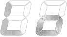</td>
<td></td>
</tr>
</tbody>
</table>

1

°C 或 °F

°F=°C*1.8+32

输入信号A：RTC电阻。

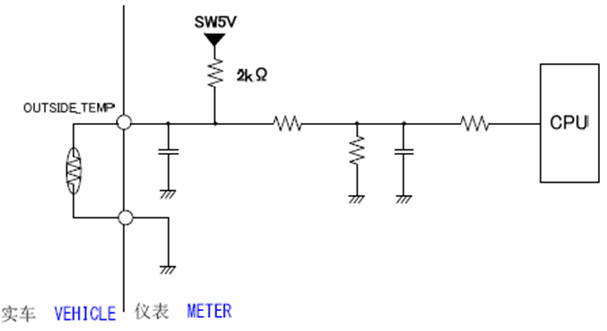

输入信号B：手机App

详见“1 DCJ豪爵 手机App &amp; 仪表 BLE数据协议V0.0”

优先级：暂定以获取到的较低的值数据值优先。

每0.5s 采样数据 (TEMPdate)，用10次的采样数据算出平均值

(TEMPave)再进行显示。

温度上升时：30 ± 0.5 s

温度下降时：5 ± 0.5 s

<del>显示值的更新按照每个分辨率进行。</del>

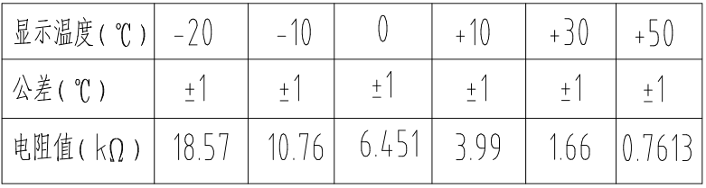

<ul>
<li>
检测到 TEMPave 未达到 -20°C时，显示“ Lo ”。
</li>
<li>
检测到 TEMPave 超过了 +50°C时，显示“ HI ”。
</li>
<li>
检测到 TEMPave 的输入达到显示范围内时，立刻开始显示。
</li>
<li>
当环境温度低于3℃时，将显示结冰警告，2Hz闪烁5秒后常显（即使达到解除条件也至少要闪烁显示完毕再解除）。
</li>
</ul>

(ISO 2575-2021)。如果出现结冰警告，表示路面湿滑危险增加。

<ul>
<li>
解除条件：当环境温度高于4℃时，将取消结冰警告显示。
</li>
</ul>

IGN ON时，显示为初次的 TEMPave 值。

IGN ON到 TEMPave 决定前显示为“- - ”。

出现下列输入时，判断为异常，显示警告。

·断线检出：33 k ± 4 k Ω以上

·短路检出：162 ± 20 Ω以下

·5±0.5 s内连续检测到断线或短路时，判断为异常。

·5±0.5 s内连续正常时解除。(结冰警告解除判定承制方可提供建议值)

·从断线/短路状态的输入开始到延迟时间结束为止，保持显示断线/短路前的状态。

·解除条件成立时，外气温显示由解除时的输入值开始显示。
</td>
</tr>
</tbody>
</table>

<!-- AGENT_SECTION id="S040" type="indicator" title="油压指示灯" keywords="指示灯" -->
#### 油压指示灯

<table>
<colgroup>
<col style="width: 11%" />
<col style="width: 88%" />
</colgroup>
<thead>
<tr class="header">
<th>项目</th>
<th>式样</th>
</tr>
</thead>
<tbody>
<tr class="odd">
<td>显示内容</td>
<td>油压指示灯</td>
</tr>
<tr class="even">
<td>显示方式</td>
<td><ul>
<li>
TFT屏内显示
</li>
<li>
显示动画：（按照效果图）
</li>
</ul></td>
</tr>
<tr class="odd">
<td>输入信号</td>
<td><ul>
<li>
油压开关：PIN 20
</li>
</ul></td>
</tr>
<tr class="even">
<td>电路</td>
<td><ul>
<li>
实车侧参考电路：
</li>
<li>
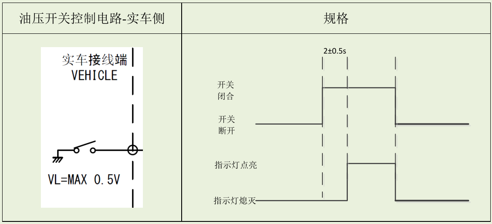
</li>
</ul>

指示灯点亮工作电流≥4.5mA。
</td>
</tr>
<tr class="odd">
<td>输入响应</td>
<td><ol type="1">
<li>
当油压开关断开时，油压指示灯立即熄灭；
</li>
<li>
当油压开关接地时，油压指示灯延迟2±0.5s后点亮；
</li>
</ol></td>
</tr>
</tbody>
</table>

<!-- AGENT_SECTION id="S041" type="indicator" title="位置灯" keywords="" -->
#### 位置灯

<table>
<colgroup>
<col style="width: 11%" />
<col style="width: 88%" />
</colgroup>
<thead>
<tr class="header">
<th>项目</th>
<th>式样</th>
</tr>
</thead>
<tbody>
<tr class="odd">
<td>显示内容</td>
<td>位置灯指示符</td>
</tr>
<tr class="even">
<td>显示方式</td>
<td><ul>
<li>
TFT屏内显示
</li>
<li>
显示动画：按照效果图
</li>
</ul></td>
</tr>
<tr class="odd">
<td>输入信号</td>
<td><ul>
<li>
位置灯开关信号：PIN 10
</li>
</ul></td>
</tr>
<tr class="even">
<td>电路</td>
<td><ul>
<li>
实车侧参考电路：
</li>
</ul>

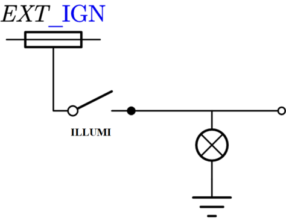
</td>
</tr>
<tr class="odd">
<td>输入及响应</td>
<td><ul>
<li>
TFT画面 根据ILLUMI SW 状态进行动作：
</li>
</ul>
<table>
<colgroup>
<col style="width: 53%" />
<col style="width: 46%" />
</colgroup>
<tbody>
<tr class="odd">
<td>位置灯开关信号</td>
<td>LCD显示</td>
</tr>
<tr class="even">
<td>OFF</td>
<td>符号熄灭</td>
</tr>
<tr class="odd">
<td>ON</td>
<td>符号点亮</td>
</tr>
</tbody>
</table>

注：当位置灯开关信号
状态为OFF时，任何时候（包含开机动画等）LCD都不能显示位置灯符号。
</td>
</tr>
</tbody>
</table>

<!-- AGENT_SECTION id="S042" type="indicator" title="远光指示灯" keywords="指示灯" -->
#### 远光指示灯

<table>
<colgroup>
<col style="width: 12%" />
<col style="width: 87%" />
</colgroup>
<thead>
<tr class="header">
<th>项目</th>
<th>式样</th>
</tr>
</thead>
<tbody>
<tr class="odd">
<td>显示内容</td>
<td>远光指示灯</td>
</tr>
<tr class="even">
<td>显示方式</td>
<td>
蓝色

FMVSS NO.108（尺寸规定）：发光面积应大于等于直径3/16英寸的圆
※1英寸=2.54cm
</td>
</tr>
<tr class="odd">
<td>输入信号</td>
<td>远光灯信号（HI_BEAM）：PIN 5</td>
</tr>
<tr class="even">
<td>实车侧电路</td>
<td>
输入最大电压：15V

最大工作电流（13V）：典型工作电流10mA左右。

如在LCD内显示，电路需承制方单独提出讨论。
</td>
</tr>
<tr class="odd">
<td>输入及响应</td>
<td></td>
</tr>
</tbody>
</table>

<!-- AGENT_SECTION id="S043" type="indicator" title="近光指示灯" keywords="指示灯" -->
#### 近光指示灯

<table>
<colgroup>
<col style="width: 11%" />
<col style="width: 88%" />
</colgroup>
<thead>
<tr class="header">
<th>项目</th>
<th>式样</th>
</tr>
</thead>
<tbody>
<tr class="odd">
<td>显示内容</td>
<td>近光指示灯</td>
</tr>
<tr class="even">
<td>显示方式</td>
<td><ul>
<li>
TFT屏内显示
</li>
<li>
显示/切换动画：按照效果图，法规要求指示灯，UI形状没有限定，颜色为绿色。
</li>
</ul></td>
</tr>
<tr class="odd">
<td>输入信号</td>
<td><ul>
<li>
CAN报文
</li>
</ul>
<table>
<colgroup>
<col style="width: 24%" />
<col style="width: 24%" />
<col style="width: 24%" />
<col style="width: 25%" />
</colgroup>
<tbody>
<tr class="odd">
<td>ID</td>
<td>Msg.name</td>
<td>Signal Name</td>
<td>T/RX</td>
</tr>
<tr class="even">
<td>0x360</td>
<td>BCM_2</td>
<td>待定</td>
<td>RX</td>
</tr>
</tbody>
</table>

0x0: OFF灭灯

0x1: 点亮
</td>
</tr>
<tr class="even">
<td>电路</td>
<td>/</td>
</tr>
<tr class="odd">
<td>输入响应</td>
<td><ol type="1">
<li>
IGN ON后，根据接收到的报文显示
</li>
<li>
如未接收到CAN通信报文，仪表默认为不显示近光指示灯
</li>
</ol></td>
</tr>
</tbody>
</table>

<!-- AGENT_SECTION id="S044" type="indicator" title="保养指示灯" keywords="指示灯,保养" -->
#### 保养指示灯

<table>
<colgroup>
<col style="width: 11%" />
<col style="width: 88%" />
</colgroup>
<thead>
<tr class="header">
<th>项目</th>
<th>式样</th>
</tr>
</thead>
<tbody>
<tr class="odd">
<td>显示内容</td>
<td>保养指示灯</td>
</tr>
<tr class="even">
<td>显示方式</td>
<td><ul>
<li>
TFT屏内显示
</li>
<li>
指示符形式（（按照效果图）
</li>
</ul></td>
</tr>
<tr class="odd">
<td>输入信号</td>
<td><ul>
<li>
总里程数据 &amp; 设定的阈值
</li>
</ul></td>
</tr>
<tr class="even">
<td>电路</td>
<td>/</td>
</tr>
<tr class="odd">
<td>输入及响应</td>
<td><ul>
<li>
动作内容：
</li>
</ul>
<blockquote>

1、当保养剩余里程≤0km 时，保养指示灯点灯。

2、保养指示灯点灯后，每次 IGN ON 开机后，保养指示灯闪烁
10S（1Hz，

50%DUTY）后保持点灯状态。 或集成在弹窗显示，具体按UI提示资料

3、可通过设置流程重置保养剩余里程，剩余里程＞0km 保养指示灯熄灭。

</blockquote></td>
</tr>
</tbody>
</table>

<!-- AGENT_SECTION id="S045" type="indicator" title="换档转速提示灯&换挡转速提示功能启用符号" keywords="转速,换档" -->
#### 换档转速提示灯&换挡转速提示功能启用符号

<table>
<colgroup>
<col style="width: 11%" />
<col style="width: 88%" />
</colgroup>
<thead>
<tr class="header">
<th>项目</th>
<th>式样</th>
</tr>
</thead>
<tbody>
<tr class="odd">
<td>显示内容</td>
<td>换档提示灯</td>
</tr>
<tr class="even">
<td>显示方式</td>
<td><ul>
<li>
LED灯:换档转速提示灯，参考为，非法规要求指示灯，UI形状和颜色没有限定。
</li>
</ul>
<ul>
<li>
TFT指示：换挡转速提示功能启用符号:非法规要求指示灯，企业习惯用表示。
</li>
</ul></td>
</tr>
<tr class="odd">
<td>输入信号</td>
<td><ul>
<li>
换档提示灯配置数据 &amp; 转速
</li>
</ul></td>
</tr>
<tr class="even">
<td>电路</td>
<td>/</td>
</tr>
<tr class="odd">
<td>输入及响应</td>
<td><ul>
<li>
CAN数据帧—同转速。
</li>
</ul>
<ul>
<li>
换档提示灯动作流程：
</li>
</ul>
<blockquote>

当转速&gt;设定转速时，换档指示灯点亮/闪烁；

当转速≤设定转速时，换档指示灯熄灭。

建议中间设置缓冲带，避免频繁闪灭，具体以实车标定为准。

</blockquote>
<ul>
<li>
换档提示灯配置功能在设置页面中。
</li>
<li>
1-6档的每个档位都可以单独设置提示的转速值。
</li>
</ul></td>
</tr>
</tbody>
</table>

<!-- AGENT_SECTION id="S046" type="section" title="边撑开关指示符" keywords="" -->
#### 边撑开关指示符

<table>
<colgroup>
<col style="width: 11%" />
<col style="width: 88%" />
</colgroup>
<thead>
<tr class="header">
<th>项目</th>
<th>式样</th>
</tr>
</thead>
<tbody>
<tr class="odd">
<td>显示内容</td>
<td>边撑开关指示符</td>
</tr>
<tr class="even">
<td>显示方式</td>
<td><ul>
<li>
TFT屏内显示（法规要求，边撑指示符不能遮档车速显示）
</li>
<li>
显示/切换动画：按照效果图，非法规要求指示灯，UI形状没有限定，颜色为黄色。
</li>
</ul></td>
</tr>
<tr class="odd">
<td>输入信号</td>
<td><ul>
<li>
CAN报文
</li>
</ul>
<table>
<colgroup>
<col style="width: 24%" />
<col style="width: 24%" />
<col style="width: 24%" />
<col style="width: 25%" />
</colgroup>
<tbody>
<tr class="odd">
<td>ID</td>
<td>Msg.name</td>
<td>Signal Name</td>
<td>T/RX</td>
</tr>
<tr class="even">
<td>0x134</td>
<td>ECM_1</td>
<td>ECM_Side</td>
<td>
Stand_SW

RX
</td>
</tr>
</tbody>
</table>

0x0:边撑收起 🡪 边撑指示符点熄灭

0x1:边撑打下 🡪 边撑指示符点亮
</td>
</tr>
<tr class="even">
<td>电路</td>
<td>/</td>
</tr>
<tr class="odd">
<td>输入响应</td>
<td><ol start="3" type="1">
<li>
IGN ON后，根据接收到的报文显示
</li>
</ol></td>
</tr>
</tbody>
</table>

<!-- AGENT_SECTION id="S047" type="indicator" title="胎压警报指示灯" keywords="指示灯,胎压" -->
#### 胎压警报指示灯

<table>
<colgroup>
<col style="width: 11%" />
<col style="width: 88%" />
</colgroup>
<thead>
<tr class="header">
<th>项目</th>
<th>式样</th>
</tr>
</thead>
<tbody>
<tr class="odd">
<td>显示内容</td>
<td>胎压警报指示灯</td>
</tr>
<tr class="even">
<td>显示方式</td>
<td><ul>
<li>
TFT屏内
</li>
<li>
指示符形式（按照效果图）
</li>
</ul></td>
</tr>
<tr class="odd">
<td>输入信号</td>
<td><ul>
<li>
CAN数据帧—TPMS_OUT_1
</li>
</ul>
<ul>
<li>
TPMS 指示灯
</li>
</ul>
<table>
<colgroup>
<col style="width: 24%" />
<col style="width: 24%" />
<col style="width: 24%" />
<col style="width: 25%" />
</colgroup>
<tbody>
<tr class="odd">
<td>ID</td>
<td>Msg.name</td>
<td>Signal Name</td>
<td>T/RX</td>
</tr>
<tr class="even">
<td>0x350</td>
<td>TPMS_OUT_1</td>
<td>TPMS_Indicator</td>
<td>RX</td>
</tr>
</tbody>
</table>

数据内容：（以下状态每次都会发送至少6s，然后才会切换至下一个状态，使仪表有充足的时间响应指示灯动作）

0x0：OFF灭灯

0x1：ON常亮

0x2：ON常亮

0x3：连续闪烁，闪烁频率：500ms ON→500ms OFF

0x4：连续闪烁，1s ON →1s OFF

0x5：闪烁ON 250ms→OFF 250ms，闪烁5次

（连续采集到2帧后，闪烁5次，然后熄灭）

0x6：连续闪烁，闪烁频率：100ms ON→100ms OFF

0x7：invalid ，收到此数据维持上一笔输入
</td>
</tr>
<tr class="even">
<td>电路</td>
<td>/</td>
</tr>
<tr class="odd">
<td>输入及响应</td>
<td>/</td>
</tr>
</tbody>
</table>

###

<table>
<colgroup>
<col style="width: 11%" />
<col style="width: 88%" />
</colgroup>
<thead>
<tr class="header">
<th>项目</th>
<th>式样</th>
</tr>
</thead>
<tbody>
<tr class="odd">
<td>显示内容</td>
<td>胎压/胎温显示</td>
</tr>
<tr class="even">
<td>显示方式</td>
<td><ul>
<li>
TFT屏内：按照效果图，各警报的显示按UI提示资料
</li>
<li>
显示单位：kPa（bar、psi）
</li>
</ul></td>
</tr>
<tr class="odd">
<td>输入信号</td>
<td><ul>
<li>
CAN数据帧—TPMS_OUT_1
</li>
</ul>
<ul>
<li>
前轮胎压
</li>
</ul>
<blockquote>

前轮胎压

</blockquote>
<table>
<colgroup>
<col style="width: 24%" />
<col style="width: 24%" />
<col style="width: 24%" />
<col style="width: 25%" />
</colgroup>
<tbody>
<tr class="odd">
<td>ID</td>
<td>Msg.name</td>
<td>Signal Name</td>
<td>T/RX</td>
</tr>
<tr class="even">
<td>0x350</td>
<td>TPMS_OUT_1</td>
<td>Front_pressure</td>
<td>RX</td>
</tr>
</tbody>
</table>

1、Offset ：0 精度：2 物理单位： kPa

0xFF
：初始值和无效值，收到该笔数据，按最大位数填入“-”（如果有小数点的机能，小数点也要显示）。

范例：收到0x7D =125 🡪 前轮胎压125×2=250kPa

<blockquote>

后轮胎压

</blockquote>
<table>
<colgroup>
<col style="width: 24%" />
<col style="width: 24%" />
<col style="width: 24%" />
<col style="width: 25%" />
</colgroup>
<tbody>
<tr class="odd">
<td>ID</td>
<td>Msg.name</td>
<td>Signal Name</td>
<td>T/RX</td>
</tr>
<tr class="even">
<td>0x350</td>
<td>TPMS_OUT_1</td>
<td>Rear_pressure</td>
<td>RX</td>
</tr>
</tbody>
</table>

1、Offset ：0 精度2 物理单位： kPa

0xFF
：初始值和无效值，收到该笔数据，按最大位数填入“-”（如果有小数点的机能，小数点也要显示）。

范例：收到0x7D =125 🡪 后轮胎压125×2=250 kPa

<ul>
<li>
胎压警报
</li>
</ul>
<blockquote>

前轮胎压警报：

</blockquote>
<table>
<colgroup>
<col style="width: 11%" />
<col style="width: 13%" />
<col style="width: 27%" />
<col style="width: 7%" />
<col style="width: 9%" />
<col style="width: 9%" />
<col style="width: 12%" />
<col style="width: 9%" />
</colgroup>
<tbody>
<tr class="odd">
<td>ID</td>
<td>Msg.name</td>
<td>Signal Name</td>
<td>T/RX</td>
<td>Period</td>
<td>Length</td>
<td>Start bit</td>
<td>Value</td>
</tr>
<tr class="even">
<td>0x350</td>
<td>TP</td>
<td>
S_OUT_1

Front_pressure_warning
</td>
<td>RX</td>
<td>200</td>
<td>
s

1 bit
</td>
<td>49</td>
<td>0～0x1</td>
</tr>
</tbody>
</table>

1、0x0：报警解除

2、0x1：报警

<blockquote>

后轮胎压警报：

</blockquote>
<table>
<colgroup>
<col style="width: 11%" />
<col style="width: 13%" />
<col style="width: 26%" />
<col style="width: 7%" />
<col style="width: 9%" />
<col style="width: 9%" />
<col style="width: 11%" />
<col style="width: 10%" />
</colgroup>
<tbody>
<tr class="odd">
<td>ID</td>
<td>Msg.name</td>
<td>Signal Name</td>
<td>T/RX</td>
<td>Period</td>
<td>Length</td>
<td>Start bit</td>
<td>Value</td>
</tr>
<tr class="even">
<td>0x350</td>
<td>TPMS_OU</td>
<td>
1

Rear_pressure
</td>
<td>
warning

RX
</td>
<td>200ms</td>
<td>1</td>
<td>
it

53
</td>
<td>0～0x1</td>
</tr>
</tbody>
</table>

1、0x0：报警解除

2、0x1：报警

<ul>
<li>
电压警报
</li>
</ul>
<blockquote>

前轮电压警报：

</blockquote>
<table>
<colgroup>
<col style="width: 11%" />
<col style="width: 13%" />
<col style="width: 24%" />
<col style="width: 7%" />
<col style="width: 9%" />
<col style="width: 11%" />
<col style="width: 13%" />
<col style="width: 9%" />
</colgroup>
<tbody>
<tr class="odd">
<td>ID</td>
<td>Msg.name</td>
<td>Signal Name</td>
<td>T/RX</td>
<td>Period</td>
<td>Length</td>
<td>Start bit</td>
<td>Value</td>
</tr>
<tr class="even">
<td>0x350</td>
<td>TPMS_OUT_1</td>
<td>Fron</td>
<td>
_voltage_warning

RX
</td>
<td>200</td>
<td>
s

1 bi
</td>
<td>50</td>
<td>0～0x1</td>
</tr>
</tbody>
</table>

1、0x0：报警解除

2、0x1：报警

<blockquote>

后轮低电压报警

</blockquote>
<table>
<colgroup>
<col style="width: 11%" />
<col style="width: 13%" />
<col style="width: 24%" />
<col style="width: 7%" />
<col style="width: 9%" />
<col style="width: 11%" />
<col style="width: 10%" />
<col style="width: 11%" />
</colgroup>
<tbody>
<tr class="odd">
<td>ID</td>
<td>Msg.name</td>
<td>Signal Name</td>
<td>T/RX</td>
<td>Period</td>
<td>Length</td>
<td>Start bit</td>
<td>Value</td>
</tr>
<tr class="even">
<td>0x</td>
<td>
50

TPMS_OUT_1
</td>
<td>Rear_voltage_warning</td>
<td>RX</td>
<td>200ms</td>
<td>1 bit</td>
<td>54</td>
<td>0～0x1</td>
</tr>
</tbody>
</table>

1、0x0：报警解除

2、0x1：报警

<ul>
<li>
传感器丢失报警
</li>
</ul>
<blockquote>

前轮传感器丢失报警：

</blockquote>
<table>
<colgroup>
<col style="width: 11%" />
<col style="width: 13%" />
<col style="width: 24%" />
<col style="width: 7%" />
<col style="width: 9%" />
<col style="width: 11%" />
<col style="width: 10%" />
<col style="width: 11%" />
</colgroup>
<tbody>
<tr class="odd">
<td>ID</td>
<td>Msg.name</td>
<td>Signal Name</td>
<td>T/RX</td>
<td>Period</td>
<td>Length</td>
<td>Start bit</td>
<td>Value</td>
</tr>
<tr class="even">
<td>0x350</td>
<td>TPMS_OUT_1</td>
<td>Fr</td>
<td>
nt_s

nsor_l

st

RX
</td>
<td>200ms</td>
<td>1 b</td>
<td>
t

51
</td>
<td>0～0x1</td>
</tr>
</tbody>
</table>

1、0x0：报警解除

2、0x1：报警

<blockquote>

后轮传感器丢失报警：

</blockquote>
<table>
<colgroup>
<col style="width: 11%" />
<col style="width: 13%" />
<col style="width: 24%" />
<col style="width: 7%" />
<col style="width: 9%" />
<col style="width: 11%" />
<col style="width: 10%" />
<col style="width: 11%" />
</colgroup>
<tbody>
<tr class="odd">
<td>ID</td>
<td>Msg.name</td>
<td>Signal Name</td>
<td>T/RX</td>
<td>Period</td>
<td>Length</td>
<td>Start bit</td>
<td>Value</td>
</tr>
<tr class="even">
<td>0x350</td>
<td>TPMS_OU</td>
<td>
_1

Rear_sensor_lost
</td>
<td>RX</td>
<td>200ms</td>
<td>1 bit</td>
<td>55</td>
<td>0～0x1</td>
</tr>
</tbody>
</table>

1、0x0：报警解除

2、0x1：报警

<ul>
<li>
传感器未配置：
</li>
</ul>
<table>
<colgroup>
<col style="width: 11%" />
<col style="width: 13%" />
<col style="width: 24%" />
<col style="width: 7%" />
<col style="width: 9%" />
<col style="width: 11%" />
<col style="width: 10%" />
<col style="width: 11%" />
</colgroup>
<tbody>
<tr class="odd">
<td>ID</td>
<td>Msg.name</td>
<td>Signal Name</td>
<td>T/RX</td>
<td>Period</td>
<td>Length</td>
<td>Start bit</td>
<td>Value</td>
</tr>
<tr class="even">
<td>0x350</td>
<td>TPM</td>
<td>
_OUT_1

Sensor_u
</td>
<td>
config_ warning

RX
</td>
<td>200ms</td>
<td>1 bit</td>
<td>60</td>
<td>0～0x1</td>
</tr>
</tbody>
</table>

1、0x0：已配置

2、0x1：未配置

<strong>以下为胎温专项：（是否显示按UI资料）</strong>

<ul>
<li>
胎温胎温
</li>
</ul>
<blockquote>

前轮胎温

</blockquote>
<table>
<colgroup>
<col style="width: 24%" />
<col style="width: 24%" />
<col style="width: 24%" />
<col style="width: 25%" />
</colgroup>
<tbody>
<tr class="odd">
<td>ID</td>
<td>Msg.name</td>
<td>Signal Name</td>
<td>T/RX</td>
</tr>
<tr class="even">
<td></td>
<td>
x350

TPMS_OUT_1
</td>
<td>Front_t</td>
<td>
mperature

RX
</td>
</tr>
</tbody>
</table>

1、Offset ：-50 精度：1 物理单位：℃

0xFF
：初始值和无效值，收到该笔数据，按最大位数填入“-”（如果有小数点的机能，小数点也要显示）。

<blockquote>

后轮胎温

</blockquote>
<table>
<colgroup>
<col style="width: 24%" />
<col style="width: 24%" />
<col style="width: 24%" />
<col style="width: 25%" />
</colgroup>
<tbody>
<tr class="odd">
<td>ID</td>
<td>Msg.name</td>
<td>Signal Name</td>
<td>T/RX</td>
</tr>
<tr class="even">
<td>0x350</td>
<td>TPMS_OUT_1</td>
<td>Rear_temperature</td>
<td>RX</td>
</tr>
</tbody>
</table>

1、Offset ：-50 精度：1 物理单位：℃

0xFF
：初始值和无效值，收到该笔数据，按最大位数填入“-”（如果有小数点的机能，小数点也要显示）。

<ul>
<li>
胎温报警
</li>
</ul>
<blockquote>

前轮胎温报警

</blockquote>
<table>
<colgroup>
<col style="width: 24%" />
<col style="width: 18%" />
<col style="width: 31%" />
<col style="width: 25%" />
</colgroup>
<tbody>
<tr class="odd">
<td>ID</td>
<td>Msg.name</td>
<td>Signal Name</td>
<td>T/RX</td>
</tr>
<tr class="even">
<td>0x350</td>
<td>TP</td>
<td>
S_OUT_1

Front_temperature_warning
</td>
<td>RX</td>
</tr>
</tbody>
</table>

1、0x0：报警解除

2、0x1：报警

<blockquote>

后轮胎温报警

</blockquote>
<table>
<colgroup>
<col style="width: 24%" />
<col style="width: 23%" />
<col style="width: 26%" />
<col style="width: 25%" />
</colgroup>
<tbody>
<tr class="odd">
<td>ID</td>
<td>Msg.name</td>
<td>Signal Name</td>
<td>T/RX</td>
</tr>
<tr class="even">
<td>0x350</td>
<td>TPMS_OUT_1</td>
<td>Rear_temperature_warnin</td>
<td>RX</td>
</tr>
</tbody>
</table>

1、0x0：报警解除

2、0x1：报警
</td>
</tr>
<tr class="even">
<td>电路</td>
<td>/</td>
</tr>
<tr class="odd">
<td>输入响应</td>
<td>IGN ON后，按照接收的报文响应（具体显示按效果图）</td>
</tr>
</tbody>
</table>

<!-- AGENT_SECTION id="S048" type="section" title="故障代码显示" keywords="故障" -->
#### 故障代码显示

<table>
<colgroup>
<col style="width: 11%" />
<col style="width: 88%" />
</colgroup>
<thead>
<tr class="header">
<th>项目</th>
<th>式样</th>
</tr>
</thead>
<tbody>
<tr class="odd">
<td>显示内容</td>
<td>故障代码</td>
</tr>
<tr class="even">
<td>显示方式</td>
<td><ul>
<li>
TFT屏内(此功能仅在主页面时需要显示)
</li>
</ul></td>
</tr>
<tr class="odd">
<td>输入信号</td>
<td><ul>
<li>
CAN 数据帧-- DTC_Info
</li>
</ul>
<blockquote>

SC:

</blockquote>
<table>
<colgroup>
<col style="width: 24%" />
<col style="width: 24%" />
<col style="width: 24%" />
<col style="width: 25%" />
</colgroup>
<tbody>
<tr class="odd">
<td>ID</td>
<td>Msg.name</td>
<td>Signal Name</td>
<td>T/RX</td>
</tr>
<tr class="even">
<td>0x340</td>
<td>ECM_2</td>
<td>DTC_Info</td>
<td>RX</td>
</tr>
<tr class="odd">
<td>0x340</td>
<td>ECM_2</td>
<td>DIAGMODE</td>
<td>RX</td>
</tr>
<tr class="even">
<td>0x340</td>
<td>ECM_2</td>
<td>DIAGMODE_Result</td>
<td>RX</td>
</tr>
</tbody>
</table>
<blockquote>

BB:

</blockquote>
<table>
<colgroup>
<col style="width: 24%" />
<col style="width: 24%" />
<col style="width: 24%" />
<col style="width: 25%" />
</colgroup>
<tbody>
<tr class="odd">
<td>ID</td>
<td>Msg.name</td>
<td>Signal Name</td>
<td>T/RX</td>
</tr>
<tr class="even">
<td>0x340</td>
<td>ECM_DTC</td>
<td>DTC_Info</td>
<td>RX</td>
</tr>
<tr class="odd">
<td>0x340</td>
<td>ECM</td>
<td>
DTC

DIAGMODE
</td>
<td>RX</td>
</tr>
<tr class="even">
<td>0x340</td>
<td>ECM_DTC</td>
<td>DIAGMODE_Result</td>
<td>RX</td>
</tr>
</tbody>
</table>
<ul>
<li>
CAN 数据帧—DIAGMODE，参考OBD 指示灯。
</li>
<li>
CAN 数据帧-- ECM_MIL_IND，参考OBD 指示灯。
</li>
</ul></td>
</tr>
<tr class="even">
<td>电路</td>
<td><ul>
<li>
故障显示模式 DIAGMODE 转化规则如下：
</li>
</ul>
<table>
<colgroup>
<col style="width: 25%" />
<col style="width: 25%" />
<col style="width: 48%" />
</colgroup>
<tbody>
<tr class="odd">
<td colspan="2">DIAGMODE</td>
<td>LCD display</td>
</tr>
<tr class="even">
<td>0</td>
<td>1</td>
<td>C</td>
</tr>
<tr class="odd">
<td>1</td>
<td>0</td>
<td>H</td>
</tr>
</tbody>
</table>
<ul>
<li>
故障代码DTC_Info 转化规则如下：
</li>
</ul>

<ul>
<li>
LCD显示示例：
</li>
</ul>
<table>
<colgroup>
<col style="width: 27%" />
<col style="width: 41%" />
<col style="width: 30%" />
</colgroup>
<tbody>
<tr class="odd">
<td>DTC_Info</td>
<td>DIAGMODE</td>
<td>LCD 显示</td>
</tr>
<tr class="even">
<td>0x123400</td>
<td>0x2</td>
<td>P123400H</td>
</tr>
<tr class="odd">
<td>0</td>
<td>
923

00

0x1
</td>
<td>B123400C</td>
</tr>
<tr class="even">
<td>0x523</td>
<td>
00

0x2
</td>
<td>C123400H</td>
</tr>
<tr class="odd">
<td></td>
<td>
xD23400

0x1
</td>
<td>U123400C</td>
</tr>
</tbody>
</table>

注：故障代码 DTC_Info 发送初始值 0X0 时代表无故障，仪表 LCD
不显示故障代码，维持正常显示。
</td>
</tr>
<tr class="odd">
<td>输入及响应</td>
<td>
IGN ON后根据输入进行显示，显示规则如下：

<table>
<colgroup>
<col style="width: 15%" />
<col style="width: 17%" />
<col style="width: 15%" />
<col style="width: 14%" />
<col style="width: 15%" />
<col style="width: 20%" />
</colgroup>
<tbody>
<tr class="odd">
<td>故障显示模式 
DIAGMODE</td>
<td>MIL灯状态 
ECM_MIL_IND</td>
<td><em><strong>MIL灯动作</strong></em></td>
<td>DIAGMODE_Result故障操作结果</td>
<td>故障代码 
DTC_Info</td>
<td><em><strong>LCD显示</strong></em></td>
</tr>
<tr class="even">
<td rowspan="3">0x0:User mode 
用户模式</td>
<td>0x0: 指示灯OFF</td>
<td>OFF</td>
<td rowspan="3">该模式下忽略此信息，不做任何处理</td>
<td rowspan="3">忽略此信息，不做任何处理</td>
<td rowspan="3">不显示故障代码</td>
</tr>
<tr class="odd">
<td>0x1: 指示灯</td>
<td>
N

常亮不闪烁
</td>
</tr>
<tr class="even">
<td>0x2: 指示灯闪烁</td>
<td>闪烁:ON 0.5s、OFF 0.5s</td>
</tr>
<tr class="odd">
<td rowspan="3">0x1:Current DTC mode 
现在故障模式</td>
<td>0x0: 指示灯OFF</td>
<td>OFF</td>
<td rowspan="3">该模式下忽略此信息，不做任何处理</td>
<td>忽略此信息，不做任何处理</td>
<td>不显示故障代码</td>
</tr>
<tr class="even">
<td>0x1: 指示灯ON</td>
<td>常亮不闪烁</td>
<td>接收ECM故障代码</td>
<td><em><strong>显示故障代码</strong></em></td>
</tr>
<tr class="odd">
<td>0x2: 指示灯闪烁</td>
<td>OFF， 
该模式下忽略此信息</td>
<td>忽略此信息，不做任何处理</td>
<td>不显示故障代码</td>
</tr>
<tr class="even">
<td rowspan="3">0x2:History DTC mode 
过去故障模式</td>
<td>0x0: 指示灯O</td>
<td>
F

OFF
</td>
<td rowspan="3">该模式下忽略此信息，不做任何处理</td>
<td>忽略此信息，不做任何处理</td>
<td>不显示故障代码</td>
</tr>
<tr class="odd">
<td>0x1: 指示灯ON</td>
<td>常亮不闪烁</td>
<td>接收ECM故障代码</td>
<td><em><strong>显示故障代码</strong></em></td>
</tr>
<tr class="even">
<td>0x2: 指示灯闪烁</td>
<td>OFF， 
该模式下忽略此信息</td>
<td>忽略此信息，不做任何处理</td>
<td>不显示故障代码</td>
</tr>
<tr class="odd">
<td rowspan="3">0x3:Learning Value clear mode 
学习值清除模式</td>
<td>0x0: 指示灯OFF</td>
<td rowspan="3">OFF</td>
<td rowspan="3">1.0x0: 初始值 
2.0x1: 清除成功</td>
<td rowspan="3">忽略此信息，不做任何处理</td>
<td rowspan="3">1. 收到DIAGMODE_Result =
0x0或0x01长里程都不显示Clr； 
 
2. 只有收到DIAGMODE_Result 0x0--&gt;0x1时，才显示"Clr" ，ON 0.5s，OFF
0.5s，只闪烁3次后恢复原显示内容</td>
</tr>
<tr class="even">
<td>0x1: 指示灯ON</td>
</tr>
<tr class="odd">
<td>0x2: 指示灯闪烁</td>
</tr>
</tbody>
</table></td>
</tr>
</tbody>
</table>

<!-- AGENT_SECTION id="S049" type="section" title="加热手把" keywords="加热" -->
#### 加热手把

<table>
<colgroup>
<col style="width: 11%" />
<col style="width: 88%" />
</colgroup>
<thead>
<tr class="header">
<th colspan="2"></th>
</tr>
<tr class="odd">
<th>项目</th>
<th>式样</th>
</tr>
</thead>
<tbody>
<tr class="odd">
<td>显示内容</td>
<td>加热手把档、故障报警</td>
</tr>
<tr class="even">
<td>显示方式</td>
<td><ul>
<li>
TFT屏内显示(按照效果图)
</li>
<li>
显示动画：按照效果图（加热手把符号/加热档/报警信息）
</li>
<li>
显示范围：1∽5加热档
</li>
</ul></td>
</tr>
<tr class="odd">
<td>输入信号</td>
<td><ul>
<li>
BCM加热手把档CAN报文
</li>
</ul>
<table>
<colgroup>
<col style="width: 25%" />
<col style="width: 24%" />
<col style="width: 24%" />
<col style="width: 25%" />
</colgroup>
<tbody>
<tr class="odd">
<td>ID</td>
<td>Msg.name</td>
<td>Signal Name</td>
<td>T/RX</td>
</tr>
<tr class="even">
<td>0x180</td>
<td>BCM_1</td>
<td>BCM_HeatedHandleLevel</td>
<td>RX</td>
</tr>
</tbody>
</table>
<table>
<colgroup>
<col style="width: 41%" />
<col style="width: 58%" />
</colgroup>
<tbody>
<tr class="odd">
<td>仪表接收到CAN信息</td>
<td>仪表指示</td>
</tr>
<tr class="even">
<td>0x0: OFF</td>
<td>不显示加热手把的任何信息</td>
</tr>
<tr class="odd">
<td>0x1: Level 1</td>
<td>显示1档</td>
</tr>
<tr class="even">
<td>0x2: Level 2</td>
<td>显示2档</td>
</tr>
<tr class="odd">
<td>0x3: Level 3</td>
<td>显示3档，例如 ，具体依照UI</td>
</tr>
<tr class="even">
<td>0x4: Level 4</td>
<td>显示4档</td>
</tr>
<tr class="odd">
<td>0x5: Level 5</td>
<td>显示5档</td>
</tr>
<tr class="even">
<td>
0x6: HeatedHandle fault

加热手把故障
</td>
<td>
加热手把符号保持1Hz点灭闪烁；

同时档位数字改为空白。
</td>
</tr>
<tr class="odd">
<td>0x7: Reserved</td>
<td>以收到最近一笔有效数据显示</td>
</tr>
</tbody>
</table></td>
</tr>
<tr class="even">
<td>电路</td>
<td>/</td>
</tr>
<tr class="odd">
<td>网路和数据异常显示</td>
<td><ol type="1">
<li>
IGN ON后，仪表根据根据接收到的报文显示
</li>
<li>
BCM_1数据能正常收到下，CAN
数据控制的加热档连续收到两帧相同的数据、加热手把故障数据可判断为有效，方可切换加热档显示（示例：仪表需连续收到两帧以上
BCM_HeatedHandleLevel: 0x1，加热手把切换为加热1档显示）
</li>
</ol>

3、通信异常(参考 CAN 总线协议中关于通信异常的节点丢失 loss
communication、DLC≠8、BUS OFF
等具体要求)时，UI通信异常（图标下的数字显示“-”）。

注意:
侦测到加热手把故障、通信异常可合并为0x6加热手把故障显示，显示方式相同
</td>
</tr>
<tr class="even">
<td>功能配置开关</td>
<td>
1、功能配置开关定义在诊断调查问券Read &amp; Write DID

2、功能配置打开可显示加热手把、加热档、故障时显示

3、功能配置关闭不显示加热手把关联功能
</td>
</tr>
</tbody>
</table>

<!-- AGENT_SECTION id="S050" type="vehicle_feature" title="骑行模式" keywords="骑行" -->
#### 骑行模式

<table>
<colgroup>
<col style="width: 11%" />
<col style="width: 88%" />
</colgroup>
<thead>
<tr class="header">
<th>项目</th>
<th>式样</th>
</tr>
</thead>
<tbody>
<tr class="odd">
<td>显示内容</td>
<td>骑行模式</td>
</tr>
<tr class="even">
<td>显示方式</td>
<td><ul>
<li>
TFT屏内
</li>
<li>
显示动画：按照效果图
</li>
<li>
显示范围：运动(Sport或A)、城市(Road或B)、雨天(Rain或C)
</li>
</ul></td>
</tr>
<tr class="odd">
<td>
输入信号

操控逻辑

其他说明

DCJ提供参考样例
</td>
<td><ul>
<li>
<strong>仪表主动切换骑行模式状态过程（用户通过手把开关操控仪表）</strong>
</li>
</ul>

在主页面下，双击按键，启用骑行模式切换功能（UI需做提示，例如原骑行模式的底色发生变化），按
或选择骑行模式（按键短按松开时，UI画面骑行模式开始切换，长按松开后骑行模式不变）
，选定后双击退出切换模式（UI需做退出模式提示）。

<blockquote>

A：运动 → B：街道 → C：雨天，此时再按下键则按以下顺序切换：

A：运动 ← B：街道 ← C：雨天，按上键按相反顺序切换

</blockquote>

注：

1、当UI显示响应超时提示时，按键操作无效。

2、仪表发送处切换数据后等待关联系统响应的330ms，如果再按一次按键，仪表不用重发数据（以避免显示慢，用户反复操作按键）。

3、为防止连按，仪表40ms内按一次按键判定。

4、进入选择模式后，按切换键后，仪表立即发出模式切换数据请求，原骑行模式保持显示，要等到ECM&amp;ABS响应执行后才能切换到按键切换想要的骑行模式。

5、进入选择模式后，按切换键后，仪表立即发出模式切换数据请求，原骑行模式保持显示，收到ECM&amp;ABS响应不能执行后，当前显示的骑行模式1s内闪烁3次。

6、进入选择模式后，即使有车速也不退出。

<ul>
<li>
手把按键输入:OK、BACK、UP▲、DOWN ▼
</li>
</ul>

1. 仪表检测到双击按键后，进入骑行模式操作启用状态。

(UI设计为当前显示的骑行模式的底色发生明显变化，例如A变为蓝底色)

2. 操作 UP▲或DOWN
▼按键后仪表输出骑行模式数据给ECM、ABS，是否允许切换由ECM、ABS判断，ECM和ABS会输出系统当前是否处于允许切换的permission数据和骑行模式反馈数据。

3. ABS接收仪表数据，ABS接收后输出：

ABS_MTC_ModeChangePermission &amp; ABS_DASH_Drive_Mode_Rsp

4.ECM接收仪表数据，ECM接收后输出：

Power Mode Change Permission &amp; ECM_Dash_Drive_Mode_Ack

5.仪表显示骑行模式切换成功条件：

ABS_MTC_ModeChangePermission = 0x1 &amp; Power Mode Change Permission
=0x1，

ABS_DASH_Drive_Mode_Rsp &amp;
ECM_Dash_Drive_Mode_Ack和仪表输出骑行模式的

数据相同，显示切换成功(UI设计)。

否则显示切换失败并保持在原来骑行模和CAN通信数据输出。（UI：当前显示模式1秒内闪烁3次后恢复当前显示）。5.切换失败仪表UI提示异常，维持在原来显示模式。

6.仪表发送请求如果ECM或
ABS任一电控单元330ms内超时不响应，仪表UI提示异常，维持在原来显示模式（UI：当前显示模式1秒内闪烁3次后恢复当前显示）。

7.IGN ON开机动画完成后，仪表监测到 ECM_Dash_Drive_Mode_Ack 或ABS
ABS_DASH_Drive_Mode_Rsp与仪表要求的不一致，当前模式保持闪烁1Hz。建议每200ms监测一次，维持5次判定成立后实施。

8.初始模式：仪表初次上电工作，默认输出为标准Road模式数据（MTR_DriveModeSet、MTR_DriveModeSetECM发送初始值（ROAD））。

9.记忆骑行模式： IGN
OFF（电门锁关闭）后仪表记忆骑行模式数据，例如

IGN ON→OFF前，仪表显示的是运动(Sport)模式，OFF后仪表记忆此模式。

当下次IGN
OFF→ON后仪表输出骑行模式为上次记忆的运动(Sport)模式报文；

10.仪表IGN OFF→ON后即发送骑行模式数据。

到开机动画完成时，如果接收到ABS和电喷ECM返回的响应与请求一致，则开机动画完成后界面显示对应的骑行模式;

否则开机动画完成后上次的显示模式提示异常后显示默认模式

(非road模式：开解动画完成后1s内闪烁3次后切换到ROAD显示；

ROAD模式：不闪烁，直接显示ROAD即可)，

MTR_DriveModeSet和MTR_DriveModeSetECM发送默认模式ROAD请求值。

11.IGN OFF→ON后仪表输出IGN
OFF关机前的骑行模式报文，但是TC等级应根据此骑行模式的应有等级来显示和输出报文。

12.开机动画期间，MODE按键不需响应。 ABS &amp;
ECM在接收到仪表输出运动(Sport)模式报文后再依仪表模式数据切换。

13.骑行模式切换成功后200ms内可以响应再一次的骑行模式切换。

14.行驶过程中，如果ECM&amp;ABS不能按照仪表发送的Mode状态执行（例如Mode系统零件有故障），那么仪表应按ECM&amp;ABS发送的报文做出相应的警告提示。

15.不同骑行模式需根据下表进行发送不同请求信号值：

<table>
<colgroup>
<col style="width: 22%" />
<col style="width: 48%" />
<col style="width: 29%" />
</colgroup>
<tbody>
<tr class="odd">
<td>骑行模式</td>
<td>MTR_DriveModeSet</td>
<td>MTR_DriveModeSetECM</td>
</tr>
<tr class="even">
<td>运动(Sport)</td>
<td>0</td>
<td>0</td>
</tr>
<tr class="odd">
<td>城市(Road)</td>
<td>1</td>
<td>1</td>
</tr>
<tr class="even">
<td>雨天(Rain)</td>
<td>2</td>
<td>2</td>
</tr>
<tr class="odd">
<td>TCS OFF</td>
<td>3</td>
<td>N/A</td>
</tr>
</tbody>
</table>

举例说明：

当需切换到城市(Road)模式时，MTR_DriveModeSet和MTR_DriveModeSetECM需同时发送值1。

当切换到TCS OFF时，MTR_DriveModeSet
发送值3，MTR_DriveModeSetECM保持不变。

<del>R</del>行模式按键时，忽略请求,不执行任何动作。 况：TCS 在IGN
OFF前设置为关闭状态时，按如下：

<ul>
<li>
DCJ提供参考样例
</li>
</ul>

各种骑行模式对应的MTR_DriveModeSet及MTR_DriveModeSetECM发送值如下,下表中的值可配置：

<table>
<colgroup>
<col style="width: 15%" />
<col style="width: 13%" />
<col style="width: 14%" />
<col style="width: 20%" />
<col style="width: 35%" />
</colgroup>
<tbody>
<tr class="odd">
<td>RMTable index</td>
<td>状态图名称</td>
<td>界面显示名称</td>
<td>MTR_DriveModeSet值</td>
<td>MTR_DriveModeSetECM值</td>
</tr>
<tr class="even">
<td>0</td>
<td>Mode0</td>
<td>SPORT</td>
<td>0</td>
<td>0</td>
</tr>
<tr class="odd">
<td>1</td>
<td>Mode1</td>
<td>Standard</td>
<td>1</td>
<td>1</td>
</tr>
<tr class="even">
<td>2</td>
<td>Mode2</td>
<td>RAIN</td>
<td>2</td>
<td>2</td>
</tr>
</tbody>
</table>

其中，界面显示名称、MTR_DriveModeSet及MTR_DriveModeSetECM会在项目开发过程中更改。

<ul>
<li>
通用需求
</li>
</ul>

骑行模式切换等待ABS和ECM响应超时时间为TwaitAck为330ms。

modeReq 默认值为0；

当检测到Up按键时，modeReq = 1(up);

当检测到down按键时，modeReq = 2 (down);

当检测到OK按键被按下时，

如果bIsModeSelected = 0，则设置bIsModeSelected =
1并界面提示骑行模式被选中；

如果bIsModeSelected = 1，则设置bIsModeSelected =
0并界面取消骑行模式被选中。

对于接收到的报文，仪表只有连续接收到相同俩帧信号值时，才判断为有效。

周期检测以下条件，如果所有条件同时满足，设置ModeChangePermission =
1；否则设置ModeChangePermission = 0：

ABS_MTC_ModeChangePermission = 1

AND ECM_PowerModeChangePermission = 1

以骑行模式任务执行周期检测，满足以下条件时设置 bECURespConsist
=1，否则设置 bECURespConsist = 0：

<table>
<colgroup>
<col style="width: 8%" />
<col style="width: 6%" />
<col style="width: 6%" />
<col style="width: 78%" />
</colgroup>
<tbody>
<tr class="odd">
<td rowspan="4">&amp;&amp;</td>
<td colspan="3">ECM_Dash_Drive_Mode_Ack == MTR_DriveModeSetECM</td>
</tr>
<tr class="even">
<td rowspan="3">||</td>
<td colspan="2">ABS_DASH_Drive_Mode_Rsp == MTR_DriveModeSet</td>
</tr>
<tr class="odd">
<td rowspan="2">&amp;&amp;</td>
<td>TCSOffFlag == 1</td>
</tr>
<tr class="even">
<td>ABS_DASH_Drive_Mode_Rsp == TCSOFFValue</td>
</tr>
</tbody>
</table>
<ul>
<li>
状态转换示意图：
</li>
</ul>
<blockquote>

</blockquote>
<table style="width:100%;">
<colgroup>
<col style="width: 14%" />
<col style="width: 30%" />
<col style="width: 31%" />
<col style="width: 11%" />
<col style="width: 12%" />
</colgroup>
<tbody>
<tr class="odd">
<td><strong>参数名称</strong></td>
<td><strong>描述</strong></td>
<td><strong>值描述</strong></td>
<td><strong>默认值</strong></td>
<td><strong>存储类型</strong></td>
</tr>
<tr class="even">
<td>RideMode</td>
<td>
设置成功的骑行模式，用于记忆上次使用的骑行模式

（默认为standard 模式）
</td>
<td>
0x0: sport mode

0x1: standard mode (default mode) 
0x2: rain mode
</td>
<td>0</td>
<td>EEPROM?</td>
</tr>
<tr class="odd">
<td>modeReq</td>
<td>骑行模式按键信号</td>
<td>
0：Not Pressed

1：Pressed
</td>
<td>0</td>
<td>RAM</td>
</tr>
<tr class="even">
<td>ModeChangePermission</td>
<td>骑行模式运行切换条件</td>
<td>
0：mode change is not allowed

1：mode change is allowed
</td>
<td>0</td>
<td>RAM</td>
</tr>
<tr class="odd">
<td>TCSOffFlag</td>
<td>TCS OFF 标志</td>
<td>
0：TCS ON is selected

1：TCS OFF is selected
</td>
<td>0</td>
<td>RAM</td>
</tr>
<tr class="even">
<td>TCSOFFValue</td>
<td>TCS OFF 时CAN信号MTR_DriveModeSet 信号值</td>
<td>3：TCS OFF</td>
<td>3</td>
<td>ROM</td>
</tr>
<tr class="odd">
<td>bECURespConsist</td>
<td>各ECU响应正确时的响应标志</td>
<td>
0：NG

1：OK
</td>
<td>0</td>
<td>RAM</td>
</tr>
</tbody>
</table>
<ul>
<li>
各详细条件请查看如下说明（参考）:
</li>
</ul>

Tr0：

条件：

IG OFF ==&gt; ON

执行：

bIsModeSelected = 0

modeReq = 0

切换至Init状态

从EEPROM中获取RideMode的值。此动作可在上电初始化等地方执行。

如果 RideMode &gt;2，则RideMode = 1。 (
RideMode异常时，恢复默认模式)

Note：IG ON后首次切换完骑行模式前，不响应按键信号。

Tr1：

条件：

IG ON

&amp;&amp;ModeChangePermission != 1

&amp;&amp;开机动画预完成

执行：

RideMode = 1（standard mode）

MTR_DriveModeSetECM = RMTable[RideMode][1]

If(TCSOffFlag == 0)

{

MTR_DriveModeSet = RMTable[RideMode][0]

}

Else

{

MTR_DriveModeSet = TCSOFFValue

}提示切换条件不满足

切换界面至Mode1模式

Tr3：

条件：

IG ON

&amp;&amp;ModeChangePermission == 1

执行：

MTR_DriveModeSetECM = RMTable[RideMode][1]

If(TCSOffFlag == 0)

{

MTR_DriveModeSet = RMTable[RideMode][0]

}

Else

{

MTR_DriveModeSet = TCSOFFValue

}

切换至WaitAck状态并开启TwaitAck定时器

Tr4：

条件：

IG ON

&amp;&amp;( (&amp;&amp; bIsModeSelected == 0

&amp;&amp; modeReq == 0 (IG ON后首次进行模式切换)

&amp;&amp; TwaitAck超时 )

)

)

执行：

RideMode = 1 (standard mode)

MTR_DriveModeSetECM = RMTable[RideMode][1]

If(TCSOffFlag == 0)

{

MTR_DriveModeSet = RMTable[RideMode][0]

}

Else

{

MTR_DriveModeSet = TCSOFFValue

}

设置错误提示

切换至Error状态

Note：IG ON后首次切换完骑行模式前，不响应按键信号。

Tr5：

条件：

IG ON

&amp;&amp; bIsModeSelected == 1

&amp;&amp; ( (modeReq == 1) || (modeReq == 2) )

&amp;&amp;TwaitAck超时（也包括切换条件不允许的情况）

执行：

按顺序执行以下判断条件：

If (modeReq == 1),则执行 RideMode = RideMode +1

Else if (modeReq == 2), 则执行 RideMode = RideMode -1

If ( (RideMode &gt; 2) || (RideMode &lt; 0) )，则执行 RideMode = 1
(异常状态，恢复默认模式)

MTR_DriveModeSetECM = RMTable[RideMode][1]

If(TCSOffFlag == 0)

{

MTR_DriveModeSet = RMTable[RideMode][0]

}

Else

{

MTR_DriveModeSet = TCSOFFValue

}

设置错误提示

切换至Error状态

Tr6：

条件：

IG ON

&amp;&amp; RideMode == 0

执行：

MTR_DriveModeSetECM = RMTable[RideMode][1]

If(TCSOffFlag == 0)

{

MTR_DriveModeSet = RMTable[RideMode][0]

}

Else

{

MTR_DriveModeSet = TCSOFFValue

}

切换界面至Mode0模式

切换至Mode0状态

modeReq = 0

Tr7：

条件：

IG ON

&amp;&amp; RideMode == 1

执行：

MTR_DriveModeSetECM = RMTable[RideMode][1]

If(TCSOffFlag == 0)

{

MTR_DriveModeSet = RMTable[RideMode][0]

}

Else

{

MTR_DriveModeSet = TCSOFFValue

}

切换界面至Mode1模式

切换至Mode1状态

modeReq = 0

Tr8：

条件：

IG ON

&amp;&amp; RideMode == 2

执行：

MTR_DriveModeSetECM = RMTable[RideMode][1]

If(TCSOffFlag == 0)

{

MTR_DriveModeSet = RMTable[RideMode][0]

}

Else

{

MTR_DriveModeSet = TCSOFFValue

}

切换界面至Mode2模式

切换至Mode2状态

modeReq = 0

Tr10：

条件：

IG ON

&amp;&amp;( bIsModeSelected == 1)

&amp;&amp; ( modeReq ==2)（检测到短按down按键）

&amp;&amp; ModeChangePermission == 1

执行：

RideMode = RideMode +1

MTR_DriveModeSetECM = RMTable[RideMode][1]

If(TCSOffFlag == 0)

{

MTR_DriveModeSet = RMTable[RideMode][0]

}

Else

{

MTR_DriveModeSet = TCSOFFValue

}

切换至WaitACK状态并开启TwaitAck定时器

Tr11：

条件：

IG ON

&amp;&amp; bECURespConsist ==1

&amp;&amp; RideMode == 0

&amp;&amp;ModeChangePermission == 1

执行：

取消TwaitAck定时器

切换界面至Mode0模式

切换至Mode0状态

modeReq = 0

Tr12：

条件：

IG ON

&amp;&amp;(bIsModeSelected ==1)

&amp;&amp;(( modeReq ==1) ||( modeReq ==2))（检测到短按up or
down按键）

&amp;&amp;ModeChangePermission != 1

执行：

modeReq = 0

提示切换条件不满足

Tr13：

条件：

IG ON

&amp;&amp;(bIsModeSelected ==1)

&amp;&amp;(( modeReq ==1) ||( modeReq ==2))（检测到短按up or
down按键）

&amp;&amp;ModeChangePermission == 1

执行：

if(modeReq == 1) RideMode = RideMode -1

if(modeReq == 2) RideMode = RideMode +1

MTR_DriveModeSetECM = RMTable[RideMode][1]

If(TCSOffFlag == 0)

{

MTR_DriveModeSet = RMTable[RideMode][0]

}

Else

{

MTR_DriveModeSet = TCSOFFValue

}

切换至WaitACK状态并开启TwaitAck定时器

Tr14：

条件：

IG ON

&amp;&amp; bECURespConsist == 1 &amp;&amp; RideMode == 1

&amp;&amp;ModeChangePermission == 1

执行：

取消TwaitAck定时器

切换界面至Mode1模式

切换至Mode1状态

modeReq = 0

Tr15：

条件：

IG ON

&amp;&amp;(bIsModeSelected ==1)

&amp;&amp;(( modeReq ==1) ||( modeReq ==2))（检测到短按up or
down按键）

&amp;&amp;ModeChangePermission != 1

执行：

提示切换条件不满足

modeReq = 0

Tr16：

条件：

IG ON

&amp;&amp;(bIsModeSelected ==1)

&amp;&amp;( modeReq ==1)（检测短按up按键）

&amp;&amp;ModeChangePermission == 1

执行：

RideMode = RideMode – 1

MTR_DriveModeSetECM = RMTable[RideMode][1]

If(TCSOffFlag == 0)

{

MTR_DriveModeSet = RMTable[RideMode][0]

}

Else

{

MTR_DriveModeSet = TCSOFFValue

}

切换至WaitACK状态并开启TwaitAck定时器

Tr17：

条件：

IG ON

&amp;&amp; bECURespConsist == 1

&amp;&amp; RideMode == 2

&amp;&amp;ModeChangePermission == 1

执行：

取消TwaitAck定时器

切换界面至Mode2模式

切换至Mode2状态

modeReq = 0

Tr18：

条件：

IG ON

&amp;&amp;(bIsModeSelected ==1)

&amp;&amp;(( modeReq ==1) ||( modeReq ==2))（检测到短按up or
down按键）

&amp;&amp;ModeChangePermission != 1

执行：

modeReq = 0

提示切换条件不满足

Tr21：

条件：

IG ON

&amp;&amp; (ECM_system_unavailable_failure ==0)

执行：

bIsModeSelected = 0

modeReq = 0

切换至Init状态

如果 RideMode &gt;2，则RideMode = 1。 (
RideMode异常时，恢复默认模式)

Tr22：

条件：

IG OFF

|| ECM_system_unavailable_failure ==1

|| ECM节点丢失

|| ABS节点丢失

|| BusOFF

执行：

取消TwaitAck定时器

切换至Deinit状态

modeReq = 0

if( (ECM_system_unavalb_failure == 1) &amp;&amp; (IG ON))

{

UI提示出现影响骑行故障（例如骑行模式和TC显示空白）；

}

注意事项：优先级为Tr11 &gt; Tr14 &gt; Tr17 &gt; Tr4 &gt; Tr5
</td>
</tr>
</tbody>
</table>

<table>
<colgroup>
<col style="width: 11%" />
<col style="width: 88%" />
</colgroup>
<tbody>
<tr class="odd">
<td>输入响应、操控逻辑</td>
<td><ol type="1">
<li>
IGN ON后根据输入进行显示。
</li>
</ol>

仪表输出CAN报文

<table>
<colgroup>
<col style="width: 24%" />
<col style="width: 24%" />
<col style="width: 24%" />
<col style="width: 25%" />
</colgroup>
<tbody>
<tr class="odd">
<td>ID</td>
<td>Msg.name</td>
<td>Signal Name</td>
<td>T/RX</td>
</tr>
<tr class="even">
<td>0x320</td>
<td>MTR_Out_1</td>
<td>MTR_DriveModeSet</td>
<td>TX</td>
</tr>
<tr class="odd">
<td>0x320</td>
<td>MTR_Out_1</td>
<td>MTR_DriveModeSetECM</td>
<td>TX</td>
</tr>
</tbody>
</table>

0x0: sport mode

0x1: road mode (default)

0x2: rain mode

0x3: OFF

0x4～0x7: Reserved

MTR_DriveModeSetECM，输出给ECM做动力等级输出

0x0: sport mode

0x1: road mode (default)

0x2: rain mode

0x3～0x7: ReservediveModeSet，输出给ABS做TCS介入程度

<blockquote>

ABS输出CAN报文

</blockquote>
<table>
<colgroup>
<col style="width: 25%" />
<col style="width: 18%" />
<col style="width: 30%" />
<col style="width: 25%" />
</colgroup>
<tbody>
<tr class="odd">
<td>ID</td>
<td>Msg.name</td>
<td>Signal Name</td>
<td>T/RX</td>
</tr>
<tr class="even">
<td>0x12F</td>
<td>ABS_2</td>
<td>ABS_DASH_Drive_Mode_Rsp</td>
<td>RX</td>
</tr>
<tr class="odd">
<td>0x12F</td>
<td>ABS_2</td>
<td>ABS_MTC_ModeChangePermission</td>
<td>RX</td>
</tr>
</tbody>
</table>

ABS_DASH_Drive_Mode_Rsp, 输出给仪表当前骑行模式

0x0: sport mode

0x1: road mode (default)

0x2: rain mode

0x3: OFF

0x4～0x7: Reserved

ABS_MTC_ModeChangePermission, 输出系统当前是否处于允许切换状态。

0x0: MTC/DTC mode change is not allowed

0x1: MTC/DTC mode change is allowed

<ul>
<li>
ECM 输出CAN报文
</li>
</ul>
<table>
<colgroup>
<col style="width: 25%" />
<col style="width: 18%" />
<col style="width: 31%" />
<col style="width: 25%" />
</colgroup>
<tbody>
<tr class="odd">
<td>ID</td>
<td>Msg.name</td>
<td>Signal Name</td>
<td>T/RX</td>
</tr>
<tr class="even">
<td>0x135</td>
<td>ECM_2</td>
<td>ECM_Dash_Drive_Mode_Ack</td>
<td>RX</td>
</tr>
<tr class="odd">
<td>0x135</td>
<td>ECM_2</td>
<td>ECM_PowerModeChangePermission</td>
<td>RX</td>
</tr>
</tbody>
</table>

ECM_Dash_Drive_Mode_Ack, 输出给仪表当前骑行模式

0x0: sport mode

0x1: road mode (default)

0x2: rain mode

0x3～0x7: Reserved

Power Mode Change Permission,输出系统当前是否处于允许切换状态。

0x0: Power mode change is not allowed

0x1: Power mode change is allowed

<ul>
<li>
异常处理:
</li>
</ul>
<ol type="1">
<li>
通信异常(参考CAN总线协议中关于通信异常的节点丢失loss
communication、DLC≠8、BUS
OFF等具体要求)时（UI要提示骑行模式变成空白或空白框，表示不能选择）
</li>
</ol>
<blockquote>

异常又恢复正常时，仪表应该恢复正常显示。

</blockquote>

2、仪表接收到ECM、ABS输出允许切换permission但模式数据和仪表不同，以骑行模式切换失败显示，之后保持原来模式
</td>
</tr>
</tbody>
</table>

<!-- AGENT_SECTION id="S051" type="vehicle_feature" title="快速换档QS" keywords="换档" -->
#### 快速换档QS

<table>
<colgroup>
<col style="width: 12%" />
<col style="width: 87%" />
</colgroup>
<thead>
<tr class="header">
<th colspan="2"></th>
</tr>
<tr class="odd">
<th>项目</th>
<th>式样</th>
</tr>
</thead>
<tbody>
<tr class="odd">
<td>显示内容</td>
<td><ul>
<li>
TFT屏内主页面显示(按照效果图)
</li>
<li>
显示动画：开启、关闭、异常提示。按照效果图
</li>
<li>
进入QS选择模式需UI提示（例如底色发生变化）
</li>
</ul></td>
</tr>
<tr class="even">
<td>输入信号</td>
<td><ul>
<li>
ECM快速换档功能打开/关闭CAN报文
</li>
</ul>
<table>
<colgroup>
<col style="width: 24%" />
<col style="width: 24%" />
<col style="width: 25%" />
<col style="width: 25%" />
</colgroup>
<tbody>
<tr class="odd">
<td>ID</td>
<td>Msg.name</td>
<td>Signal Name</td>
<td>T/RX</td>
</tr>
<tr class="even">
<td>0x135</td>
<td>ECM_2</td>
<td>ECM_QickShifSts</td>
<td>RX</td>
</tr>
</tbody>
</table>

0x0: 快速换档功能关闭OFF

0x1: 快速换档功能打开ON

<ul>
<li>
ECM快速换挡系统不可用故障报文
</li>
</ul>
<table>
<colgroup>
<col style="width: 24%" />
<col style="width: 24%" />
<col style="width: 25%" />
<col style="width: 25%" />
</colgroup>
<tbody>
<tr class="odd">
<td>ID</td>
<td>Msg.name</td>
<td>Signal Name</td>
<td>T/RX</td>
</tr>
<tr class="even">
<td>0x135</td>
<td>ECM_2</td>
<td>ECM_QSUnavalb_failure</td>
<td>RX</td>
</tr>
</tbody>
</table>

0x0: Normal

0x1: Failure

接到0x1:
Failure时仪表显示空白【如果此时恰好在执行收到ECM响应不能执行后，当前显示的状态闪烁三次（1s内）时，待执行完毕后再显示空白】。

<ul>
<li>
MTR快速换档功能打开/关闭CAN报文
</li>
</ul>
<table>
<colgroup>
<col style="width: 24%" />
<col style="width: 24%" />
<col style="width: 25%" />
<col style="width: 25%" />
</colgroup>
<tbody>
<tr class="odd">
<td>ID</td>
<td>Msg.name</td>
<td>Signal Name</td>
<td>T/RX</td>
</tr>
<tr class="even">
<td>0x321</td>
<td>MTR_Out_ 3</td>
<td>MTR_QickShifSet</td>
<td>TX</td>
</tr>
</tbody>
</table>

0x0: Disable

0x1: Enable

ECM_QickShifSts:
0x1快速换档功能打开,快速换档”QS”符号+”ON”符号显示
</td>
</tr>
<tr class="odd">
<td>操作逻辑</td>
<td><ul>
<li>
快速换档开关，进入主页面内快速换档的开启/关闭设置。
</li>
<li>
仪表不设限制条件，骑乘期间可进入
</li>
</ul>

1.仪表依手把开关输入切换打开、关闭功能，输出MTR_QickShifSet数据

<blockquote>

2.ECM收到MTR_QickShifSet切换ECM_QickShifSts数据，如ECM判断不可切换则维持原来打开/关闭数据，仪表输出MTR_QickShifSet后达330ms秒侦测到ECM_QickShifSts未切换，则闪烁显示(表示切换失败，需要设计UI)

</blockquote>
<ul>
<li>
IGN
OFF（电门锁关闭）后仪表记忆骑行请示QS开启/关闭数据，例如：
</li>
</ul>

1.IGN ON→OFF时，仪表显示的是QS关闭。

2.IGN OFF→ON后仪表输出QS关闭报文；

3.IGN OFF→ON后ECM在接收到仪表输出QS关闭报文后再依仪表数据切换。

4.仪表在330ms内收到ECM切换为QS关闭报文后，自检动画完成后，QS关闭UI。

5.仪表在330ms内收到ECM报文为非QS关闭（与仪表请求的模式不一致）报文后，自检动画完成后，仪表UI提示异常。

<ul>
<li>
行驶过程中：如果ECM不能按照仪表发送的QS状态执行（例如QS系统零件有故障），那么仪表应按ECM发送的报文做出相应的警告提示（例如警告灯报警）。
</li>
<li>
开机自检过程
</li>
</ul>

<ul>
<li>
仪表主动切换QS状态过程（用户通过手把开关操控仪表）
</li>
</ul>
<blockquote>

仪表主页面进入QS选择模式

</blockquote>

短按 Button UP▲或DOWN ▼切换ON/OFF（长按松开后QS模式不变）

注：

1、出厂默认设置为QS ON。

2、当UI显示响应超时提示时，按键操作无效。

3、仪表发送处切换数据后等待关联系统响应的330ms，如果再按一次按键，仪表不用重发数据（以避免显示慢，用户反复操作按键）。

4、为防止连按，仪表40ms内按一次按键判定。

5、进入选择模式后，按切换键后，仪表立即发出切换数据请求，原状态保持显示，要等到ECM响应执行后才能切换显示。

6、进入选择模式后，按切换键后，仪表立即发出切换数据请求，原状态保持显示，收到ECM响应不能执行后，当前显示的状态闪烁三次（1s内）。

7、进入选择模式后，即使有车速也不退出。
</td>
</tr>
<tr class="even">
<td>网路和数据异常显示</td>
<td>
1、IGN ON后，根据接收到的报文显示

2、开机动画结束后，通信异常(参考 CAN 总线协议中关于通信异常的节点丢失
loss communication、DLC≠8、BUS OFF
等具体要求)时，通信异常时<del>维持当前显示</del>

<del>“ QS” 、“
ON/OFF”不闪烁</del>。UI提示异常（建议QS字符消失不显示，底色可以更深颜色变化）
</td>
</tr>
<tr class="odd">
<td>功能配置开关</td>
<td>
1、功能配置开关定义在诊断调查问券Read &amp; Write DID

2、功能配置打开可显示快速换档功能

3、功能配置关闭不显示快速换档功能
</td>
</tr>
</tbody>
</table>

<!-- AGENT_SECTION id="S052" type="vehicle_feature" title="定速巡航" keywords="定速" -->
#### 定速巡航

<table>
<colgroup>
<col style="width: 13%" />
<col style="width: 86%" />
</colgroup>
<thead>
<tr class="header">
<th colspan="2"></th>
</tr>
<tr class="odd">
<th>项目</th>
<th>式样</th>
</tr>
</thead>
<tbody>
<tr class="odd">
<td>显示内容</td>
<td>定速巡航开关状态、巡航功能工作状态、目标巡航车速</td>
</tr>
<tr class="even">
<td>显示方式</td>
<td><ul>
<li>
TFT屏内显示
</li>
<li>
显示/切换动画
</li>
</ul></td>
</tr>
<tr class="odd">
<td>
输入信号和显示

显示逻辑

DCJ提供参考样例
</td>
<td><ul>
<li>
CAN报文
</li>
</ul>
<table>
<colgroup>
<col style="width: 24%" />
<col style="width: 25%" />
<col style="width: 25%" />
<col style="width: 25%" />
</colgroup>
<tbody>
<tr class="odd">
<td>ID</td>
<td>Msg.name</td>
<td>Signal Name</td>
<td>T/RX</td>
</tr>
<tr class="even">
<td>0x137</td>
<td>ECM_5</td>
<td>ECM_Cc_Master_Switch</td>
<td>RX</td>
</tr>
</tbody>
</table>

0x0: 定速巡航主开关OFF

0x1: 定速巡航主开关ON

<table>
<colgroup>
<col style="width: 12%" />
<col style="width: 12%" />
<col style="width: 12%" />
<col style="width: 12%" />
<col style="width: 12%" />
<col style="width: 12%" />
<col style="width: 12%" />
<col style="width: 12%" />
</colgroup>
<tbody>
<tr class="odd">
<td>ID</td>
<td>Msg.name</td>
<td>Signal Name</td>
<td>T/RX</td>
<td></td>
<td></td>
<td></td>
<td></td>
</tr>
<tr class="even">
<td>0x137</td>
<td>ECM_5</td>
<td>ECM_Cc_Switch_Check</td>
<td>RX</td>
<td></td>
<td></td>
<td></td>
<td></td>
</tr>
</tbody>
</table>

0x0: 巡航主开关有效标志位normal, 表示主开关回路正常

0x1: 巡航主开关有效标志位failure, 表示主开关回路异常

<table>
<colgroup>
<col style="width: 24%" />
<col style="width: 25%" />
<col style="width: 25%" />
<col style="width: 25%" />
</colgroup>
<tbody>
<tr class="odd">
<td>ID</td>
<td>Msg.name</td>
<td>Signal Name</td>
<td>T/RX</td>
</tr>
<tr class="even">
<td>0x137</td>
<td>ECM_5</td>
<td>ECM_Cc_CondtionStatus</td>
<td>RX</td>
</tr>
</tbody>
</table>

0x0: 巡航条件状态inactive

0x1: 巡航条件状态active and set

<table>
<colgroup>
<col style="width: 24%" />
<col style="width: 25%" />
<col style="width: 25%" />
<col style="width: 25%" />
</colgroup>
<tbody>
<tr class="odd">
<td>ID</td>
<td>Msg.name</td>
<td>Signal Name</td>
<td>T/RX</td>
</tr>
<tr class="even">
<td>0x137</td>
<td>ECM_5</td>
<td>ECM_Cc_RunStatus</td>
<td>RX</td>
</tr>
</tbody>
</table>

0x0: Closed or standby

0x1: decelerate

0x2: stable(Cruise)

0x3: accelerate

0x4: resume

0x5: step accelerate

0x6: step decelerate

0x7: Reserved

<table>
<colgroup>
<col style="width: 24%" />
<col style="width: 25%" />
<col style="width: 25%" />
<col style="width: 25%" />
</colgroup>
<tbody>
<tr class="odd">
<td>ID</td>
<td>Msg.name</td>
<td>Signal Name</td>
<td>T/RX</td>
</tr>
<tr class="even">
<td>0x137</td>
<td>ECM_5</td>
<td>ECM_Cc_Vsp</td>
<td>RX</td>
</tr>
</tbody>
</table>

目标巡航车速, 无效值0x0000

精度 Factor: 0.05625,

示例：当收到 ABS_Rear_Speed = 0x400 时，仪表转化过程如下：

Ex: 0x0400 × 0.05625 = 256 × 4 ×0.5625 = 57.6km/h

注意:
目标巡航车速、巡航车速限制范围由ECM逻辑控制，仪表依接收数据显示，ABS和ECM输出的车速和目标巡航是原始数值，仪表接收ECM的目标巡航车速后依各车速指度范围补偿(需要灌水)

显示逻辑:

<ul>
<li>
整车定速巡航模式介绍（便于理解仪表功能）：
</li>
</ul>

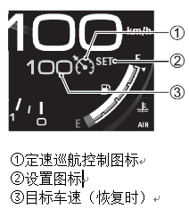 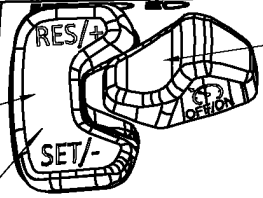

巡航主开关

手把开关：

1、按下巡航主开关时，如果不满足巡航条件，①亮黄色；

如果满足巡航条件，①亮绿色。

2、整车按SET-按键，成功设置巡航车速后，②显示绿色符号和巡航目标车速③；

整车临时退出巡航时②符号消失，巡航车速③也消失。

整车按RES+ 恢复巡航时，②符号恢复显示，巡航车速③也恢复显示。

3、按巡航主开关退出巡航模式，①消失、②消失、巡航车速③消失。

4、目标巡航需要有状态待定:UI目标巡航车速也是数字+km/h, mph单位,
挨在定速巡航符号旁边,车速和目标巡航车速会在两个地方显示,
比车速显示文字小。

5、总体上，仪表只根据从CAN通讯中得到的讯息做相应显示，不具备判定功能。

<ul>
<li>
CAN信号：
</li>
</ul>

ECM_Cc_Master_Switch

ECM_Cc_CondtionStatus

ECM_Cc_Switch_Check

ECM_Cc_RunStatus

ECM_Cc_Vsp

以下为DCJ提供参考样例：

<ul>
<li>
参数：
</li>
</ul>
<table>
<colgroup>
<col style="width: 19%" />
<col style="width: 54%" />
<col style="width: 4%" />
<col style="width: 9%" />
<col style="width: 11%" />
</colgroup>
<tbody>
<tr class="odd">
<td><strong>参数名称</strong></td>
<td><strong>描述</strong></td>
<td><strong>值</strong></td>
<td><strong>默认值</strong></td>
<td><strong>存储类型</strong></td>
</tr>
<tr class="even">
<td>Cc_VspWithOffset</td>
<td>经仪表转换后的目标巡航车速，用于显示在仪表屏上</td>
<td></td>
<td>0</td>
<td>RAM</td>
</tr>
<tr class="odd">
<td>CCspDevC</td>
<td>取消显示目标巡航车速偏差</td>
<td></td>
<td>3</td>
<td>ROM</td>
</tr>
<tr class="even">
<td>CCspDevD</td>
<td>显示目标巡航车速偏差</td>
<td></td>
<td>4</td>
<td>ROM</td>
</tr>
</tbody>
</table>
<ul>
<li>
状态转换示意图：
</li>
</ul>

Tr1：

条件：

ECM_Cc_Master_Switch == 1

&amp;&amp; ECM_Cc_Switch_Check == 0

&amp;&amp; ECM_Cc_CondtionStatus == 1

&amp;&amp; ECM_Cc_RunStatus == 0

&amp;&amp; IG ON

执行：

巡航指示图标 绿色长亮

SET符号不显示

目标巡航车速不显示

切换至ConditionOK状态

Cc_VspWithOffset = 0

Tr2：

条件：

ECM_Cc_Master_Switch == 1

&amp;&amp; ECM_Cc_Switch_Check == 0

&amp;&amp; ECM_Cc_CondtionStatus == 0

&amp;&amp; ECM_Cc_RunStatus == 0

&amp;&amp; IG ON

执行：

巡航指示图标 黄色长亮

SET符号不显示

目标巡航车速不显示

切换至ConditionNG状态

Cc_VspWithOffset = 0

Tr3：

条件：

ECM_Cc_Master_Switch == 1

&amp;&amp; ECM_Cc_Switch_Check == 0

&amp;&amp; ECM_Cc_CondtionStatus == 1

&amp;&amp; (0&lt; ECM_Cc_RunStatus &lt; 7)

&amp;&amp; IG ON

执行：

<ol type="1">
<li>
巡航指示图标 绿色长亮
</li>
<li>
SET符号 绿色长亮
</li>
<li>
显示目标巡航车速，值为Cc_VspWithOffset，并最少维持3s
</li>
<li>
进入CruisingSet状态
</li>
</ol>

CruisingSet状态时执行以下事情：

1).按照以下公式转换目标巡航车速，用于目标巡航车速显示:

<blockquote>

Cc_VspWithOffset = ECU_Cc_Vsp + offset

其中offset值请参考仪表车速显示偏移值。

</blockquote>

2).在仪表屏上更新目标巡航车速值为Cc_VspWithOffset

3).当目标巡航车速有增加或减少时，显示目标巡航车速，并最少维持3S。

目标巡航车速的是否有变化的判断标准为增加或减少值大于0.875 Km/h。

4).当实际车速在目标巡航车速±CCspDevC（TBD）内时，取消显示目标巡航车速

当实际车速在目标巡航车速±CCspDevD ( TBD) 外时，显示目标巡航车速

Tr4：

条件：

ECM_Cc_Master_Switch == 1

&amp;&amp; ECM_Cc_Switch_Check == 0

&amp;&amp; ECM_Cc_CondtionStatus == 1

&amp;&amp; ECM_Cc_RunStatus == 0

&amp;&amp; IG ON

执行：

巡航指示图标  绿色长亮

SET符号不显示

不显示目标巡航车速

切换至ConditionOk状态

Tr5：

条件：

IG OFF

OR (ECM_Cc_Master_Switch == 0 &amp;&amp; ECM_Cc_Switch_Check ==
0)

OR (ECM_Cc_Switch_Check == 1)

执行：

切换至Idle状态

Cc_VspWithOffset = 0

<ul>
<li>
IG OFF时全部不显示
</li>
<li>
(ECM_Cc_Master_Switch == 0 &amp;&amp; ECM_Cc_Switch_Check ==
0)时，原显示内容1s内闪烁3次后不显示，km/h最后也不显示。
</li>
<li>
(ECM_Cc_Switch_Check == 1)时，取消显示Set符号，取消显示巡航指示图标
</li>
</ul>

km/h一直闪烁。

Tr6：

条件：

ECM_Cc_Master_Switch == 1

&amp;&amp; ECM_Cc_Switch_Check == 0

&amp;&amp; ECM_Cc_CondtionStatus == 1

&amp;&amp; ECM_Cc_RunStatus == 0

&amp;&amp; IG ON

执行：

巡航指示图标 绿色长亮

SET符号不显示

取消显示目标巡航车速

切换至ConditionOk状态

Tr7：

条件：

ECM_Cc_Master_Switch == 1

&amp;&amp; ECM_Cc_Switch_Check == 0

&amp;&amp; ECM_Cc_CondtionStatus == 0

&amp;&amp; IG ON

执行：

巡航指示图标显示黄色长亮

取消显示Set符号

取消显示目标巡航车速

进入ConditionNG状态

Tr8：

条件：

ECM_Cc_Master_Switch == 1

&amp;&amp; ECM_Cc_Switch_Check == 0

&amp;&amp; ECM_Cc_CondtionStatus == 0

&amp;&amp; IG ON

执行：

巡航指示图标显示黄色长亮

取消显示Set符号

取消显示目标巡航车速

切换至ConditionNG状态

<ul>
<li>
关联故障
</li>
</ul></td>
</tr>
<tr class="even">
<td>电路</td>
<td>/</td>
</tr>
<tr class="odd">
<td>网路和数据异常显示</td>
<td><ol type="1">
<li>
IGN ON后，根据接收到的报文显示
</li>
</ol>

2、网路和数据异常显示逻辑:

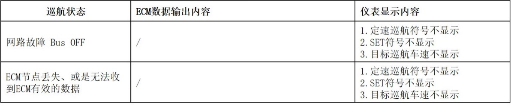

上表异常又恢复正常时，仪表应该恢复正常显示。
</td>
</tr>
</tbody>
</table>

<!-- AGENT_SECTION id="S053" type="indicator" title="通用故障指示灯" keywords="指示灯,故障" -->
#### 通用故障指示灯

<table>
<colgroup>
<col style="width: 11%" />
<col style="width: 88%" />
</colgroup>
<thead>
<tr class="header">
<th>项目</th>
<th>式样</th>
</tr>
</thead>
<tbody>
<tr class="odd">
<td>显示内容</td>
<td>通用故障指示灯</td>
</tr>
<tr class="even">
<td>显示方式</td>
<td><ul>
<li>
黄色三角符号，与需要提示的内容设计在同一个UI提示框内，尽量弹窗提醒
</li>
<li>
注意弹窗不能覆盖车速和指示灯。
</li>
</ul></td>
</tr>
<tr class="odd">
<td>输入信号</td>
<td>根据实车信号响应</td>
</tr>
<tr class="even">
<td>输入响应</td>
<td>
当仪表收到以下任意一个报警信息时，该指示灯一起点亮：

1、发动机冷却液温度指示灯

2、油压指示灯

3、胎压警报指示灯

4、BCM故障信号

注：对于部分车型，若无相关功能，应通过配置功能取消相关功能的报警功能。
</td>
</tr>
</tbody>
</table>

<!-- AGENT_SECTION id="S054" type="indicator" title="灯具、喇叭、BCM关联故障报警显示" keywords="故障" -->
#### 灯具、喇叭、BCM关联故障报警显示

<table>
<colgroup>
<col style="width: 11%" />
<col style="width: 88%" />
</colgroup>
<thead>
<tr class="header">
<th colspan="2">BCM关联故障报警显示</th>
</tr>
<tr class="odd">
<th>项目</th>
<th>式样</th>
</tr>
</thead>
<tbody>
<tr class="odd">
<td>显示内容</td>
<td>灯具、喇叭、BCM关联故障报警</td>
</tr>
<tr class="even">
<td>显示方式</td>
<td><ul>
<li>
液晶屏显示: 按照效果图
</li>
</ul></td>
</tr>
<tr class="odd">
<td>输入信号</td>
<td><ul>
<li>
CAN数据帧—灯具故障内容
</li>
</ul>
<table>
<colgroup>
<col style="width: 8%" />
<col style="width: 12%" />
<col style="width: 27%" />
<col style="width: 7%" />
<col style="width: 9%" />
<col style="width: 10%" />
<col style="width: 13%" />
<col style="width: 10%" />
</colgroup>
<tbody>
<tr class="odd">
<td>ID</td>
<td>Msg.name</td>
<td>Signal Name</td>
<td>T/RX</td>
<td>Period</td>
<td>Length</td>
<td>Start bit</td>
<td>Value</td>
</tr>
<tr class="even">
<td>0x360</td>
<td>BCM_2</td>
<td>BCM_LTurnLampFail</td>
<td>RX</td>
<td>100ms</td>
<td>1</td>
<td>0</td>
<td>0x0～0x1</td>
</tr>
<tr class="odd">
<td>0x360</td>
<td>BCM_2</td>
<td>BCM_RTurnlampFail</td>
<td>RX</td>
<td>100ms</td>
<td>1</td>
<td>1</td>
<td>0x0～0x1</td>
</tr>
<tr class="even">
<td>0x360</td>
<td>BCM_2</td>
<td>BCM_HiBeamFail</td>
<td>RX</td>
<td>100ms</td>
<td>1</td>
<td>2</td>
<td>0x0～0x1</td>
</tr>
<tr class="odd">
<td>0x360</td>
<td>BCM_2</td>
<td>BCM_LowBeamFail</td>
<td>RX</td>
<td>100ms</td>
<td>1</td>
<td>3</td>
<td>0x0～0x</td>
</tr>
<tr class="even">
<td>0x360</td>
<td>BCM_2</td>
<td>BCM_PosLampFail</td>
<td>RX</td>
<td>100ms</td>
<td>1</td>
<td>4</td>
<td>0x0～0x1</td>
</tr>
<tr class="odd">
<td>0x360</td>
<td>BC</td>
<td>
_2

BCM_BrakeLampFail
</td>
<td>RX</td>
<td>100ms</td>
<td>1</td>
<td>5</td>
<td>0x0～0x1</td>
</tr>
<tr class="even">
<td>0x360</td>
<td>BCM_2</td>
<td>BCM_HornFail</td>
<td>RX</td>
<td>100ms</td>
<td>1</td>
<td>6</td>
<td>0x0～0x1</td>
</tr>
<tr class="odd">
<td>0x360</td>
<td>BCM_2</td>
<td>BCM_RearPosLampFail</td>
<td>RX</td>
<td>100ms</td>
<td>1</td>
<td>7</td>
<td>0x0～0x1</td>
</tr>
<tr class="even">
<td>0x360</td>
<td>BCM_2</td>
<td>BCM_HeatedHandFail</td>
<td>RX</td>
<td>100ms</td>
<td>1</td>
<td>8</td>
<td>0x0～</td>
</tr>
<tr class="odd">
<td>0x360x</td>
<td>BCM_2</td>
<td>BCM_LicenseLampFail</td>
<td>RX</td>
<td>100ms</td>
<td>1</td>
<td>11</td>
<td>0x0～0x1</td>
</tr>
<tr class="even">
<td>0x360</td>
<td>BCM_2</td>
<td>BCM_SystemFail</td>
<td>RX</td>
<td>100ms</td>
<td>1</td>
<td>10</td>
<td>0x0～0x1</td>
</tr>
</tbody>
</table>

0x0: No failure正常

0x1: Malfunction有故障

故障信号定义:

BCM_LTurnLampFail: 左方向灯故障

BCM_RTurnlampFail: 右方向灯故障

BCM_HiBeamFail: 远光灯故障

BCM_LowBeamFail: 近光灯(前大灯)故障

BCM_PosLampFail: 位置灯故障

BCM_BrakeLampFail: 剎车灯故障

BCM_HornFail: 喇叭故障

BCM_RearPosLampFail: 后位置灯故障

BCM_HeatedHandFail: 加热手把故障

BCM_LicenseLampFail: 牌照灯故障

BCM_SystemFail: BCM系统异常
</td>
</tr>
</tbody>
</table>

<!-- AGENT_SECTION id="S055" type="ui_navigation" title="TCS设置" keywords="TCS,设置" -->
#### TCS设置

<table>
<colgroup>
<col style="width: 12%" />
<col style="width: 87%" />
</colgroup>
<thead>
<tr class="header">
<th>项目</th>
<th>式样</th>
</tr>
</thead>
<tbody>
<tr class="odd">
<td>显示方式</td>
<td><ul>
<li>
TFT屏内显示
</li>
<li>
可选项：ON(OFF)
</li>
</ul>
<blockquote>

TCS系统响应超时！

</blockquote>
<ul>
<li>
指示灯形式：按照效果图，注：如TC关闭，UI应有明显的颜色或画面提示，提醒驾驶者注意滑倒。
</li>
</ul>
<ul>
<li>
设定过程动画：按照效果图
</li>
</ul></td>
</tr>
<tr class="even">
<td>输入信号</td>
<td><ul>
<li>
按键信号
</li>
</ul></td>
</tr>
<tr class="odd">
<td>电路</td>
<td>/</td>
</tr>
<tr class="even">
<td>输入响应</td>
<td>/</td>
</tr>
<tr class="odd">
<td>输出</td>
<td><ul>
<li>
SC:
</li>
</ul>

仪表TCS 请求输出（配置）

<table>
<colgroup>
<col style="width: 24%" />
<col style="width: 24%" />
<col style="width: 25%" />
<col style="width: 25%" />
</colgroup>
<tbody>
<tr class="odd">
<td>ID</td>
<td>Msg.name</td>
<td>Signal Name</td>
<td>T/RX</td>
</tr>
<tr class="even">
<td>0x320</td>
<td>MTR_Out_1</td>
<td>MTR_TCS_Req</td>
<td>TX</td>
</tr>
</tbody>
</table>

0x0: TCS OFF🡪TCS 功能关闭

0x1: TCS ON🡪 TCS功能开启

TCS 响应回复报文

<table>
<colgroup>
<col style="width: 24%" />
<col style="width: 14%" />
<col style="width: 35%" />
<col style="width: 25%" />
</colgroup>
<tbody>
<tr class="odd">
<td>ID</td>
<td>Msg.name</td>
<td>Signal Name</td>
<td>T/RX</td>
</tr>
<tr class="even">
<td>0x136</td>
<td>ECM_3</td>
<td>ECM_MTR_TCS_Req_Ack</td>
<td>TX</td>
</tr>
</tbody>
</table>

0x0: TCS OFF 🡪TCS 功能关闭

0x1: TCS ON 🡪 TCS功能开启

0x2~0x6: reserved

0x7: Invald

<ul>
<li>
BB:
</li>
</ul>
<blockquote>

仪表TCS 请求输出

</blockquote>
<table>
<colgroup>
<col style="width: 19%" />
<col style="width: 25%" />
<col style="width: 35%" />
<col style="width: 19%" />
</colgroup>
<tbody>
<tr class="odd">
<td><strong>ID</strong></td>
<td><strong>Msg.name</strong></td>
<td><strong>Signal Name</strong></td>
<td><strong>T/RX</strong></td>
</tr>
<tr class="even">
<td>0x320</td>
<td>MTR_Out_1</td>
<td>MTR_DriveModeSet</td>
<td>TX</td>
</tr>
</tbody>
</table>

0x0: sport mode

0x1: standard mode (default)

0x2: rain mode

0x3: OFF

0x4～0x7: Reserved

<ul>
<li>
ABS牵引力控制功能骑行模式/关闭CAN报文
</li>
</ul>
<table>
<colgroup>
<col style="width: 10%" />
<col style="width: 14%" />
<col style="width: 62%" />
<col style="width: 12%" />
</colgroup>
<tbody>
<tr class="odd">
<td><strong>ID</strong></td>
<td><strong>Msg.name</strong></td>
<td><strong>Signal Name</strong></td>
<td><strong>T/RX</strong></td>
</tr>
<tr class="even">
<td>0x12F</td>
<td>ABS_2</td>
<td>ABS_MTC_ModeChangePermission</td>
<td>RX</td>
</tr>
<tr class="odd">
<td>0x12F</td>
<td>ABS_2</td>
<td>ABS_DASH_Drive_Mode_Rsp</td>
<td>RX</td>
</tr>
</tbody>
</table>

<strong>ABS_DASH_Drive_Mode_Rsp</strong>

0x0: sport mode

0x1: road mode (default)

0x2: rain mode

0x3: OFF

0x4～0x7: Reserved

<strong>ABS_MTC_ModeChangePermission</strong>

0x0: MTC/DTC mode change is not allowed

0x1: MTC/DTC mode change is allowed
</td>
</tr>
<tr class="even">
<td>操作逻辑</td>
<td>
详见“4.3.3快捷设置”部分。

SC：

BB:

注：

1、出厂默认设置为TCS ON。

2、每次IGN OFF后，重新IGN ON后，仪表均重置为TCS ON。

3、当UI显示响应超时提示时，按键操作无效。

4、仪表发送处切换数据后等待关联系统响应的330ms，如果再按一次按键，仪表不用重发数据（以避免显示慢，用户反复操作按键）。

5、为防止连按，仪表40ms内按一次按键判定。

6、在主页面进行TC切换时，如果切换失败，则当前显示模式1秒内闪烁3次后恢复当前显示（不需显示“TCS系统响应超时！”）。
</td>
</tr>
<tr class="odd">
<td>网路和数据异常显示</td>
<td>开机动画结束后，通信异常(参考 CAN 总线协议中关于通信异常的节点丢失
loss communication、DLC≠8、BUS OFF 等具体要求)时， 要显示。</td>
</tr>
</tbody>
</table>

<!-- AGENT_SECTION id="S056" type="section" title="软硬件版本" keywords="" -->
#### 软硬件版本

<table>
<colgroup>
<col style="width: 100%" />
</colgroup>
<tbody>
<tr class="odd">
<td><ul>
<li>
软、硬件版本：按示例格式，并输出信息至CAN总线。
</li>
</ul>

例如：软件版本 F13.2

硬件版本 A01.2

如有成熟量产规则，可与研发沟通商定修改。

<ul>
<li>
版本号变更需求：只要有变更，就一定要在版本号上有体现。
</li>
</ul>
<ul>
<li>
软件及硬件版本号输出：
</li>
</ul>
<table>
<colgroup>
<col style="width: 25%" />
<col style="width: 24%" />
<col style="width: 24%" />
<col style="width: 24%" />
</colgroup>
<tbody>
<tr class="odd">
<td>ID</td>
<td>Msg.name</td>
<td>Signal Name</td>
<td>Msg Type</td>
</tr>
<tr class="even">
<td>0x1C0</td>
<td>MTR_Info</td>
<td>MTR_Sw_Version</td>
<td>Event</td>
</tr>
<tr class="odd">
<td>0x1C0</td>
<td>MTR_Info</td>
<td>MTR_Hw_Version</td>
<td>Event</td>
</tr>
</tbody>
</table>
<ul>
<li>
发送时间：仪表在每次IGN上电后，以50ms间隔连续发送3帧CAN message
“MTR_Info”(0x1C0)。 （发送第一帧的时间在IGN ON 后5s内即可）
</li>
</ul>
<blockquote>

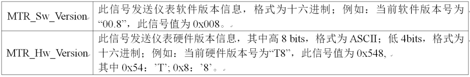

</blockquote></td>
</tr>
</tbody>
</table>

<!-- AGENT_SECTION id="S057" type="section" title="TCU预留显示" keywords="" -->
#### TCU预留显示

<table>
<colgroup>
<col style="width: 11%" />
<col style="width: 88%" />
</colgroup>
<thead>
<tr class="header">
<th>项目</th>
<th>式样</th>
</tr>
</thead>
<tbody>
<tr class="odd">
<td>显示内容</td>
<td>
TCU预留显示

<del>TCU 、</del>D、M<del>、S</del>

 (ISO 2575-2021)
</td>
</tr>
<tr class="even">
<td>显示方式</td>
<td><ul>
<li>
TFT，指示符形式（按照效果图）
</li>
</ul></td>
</tr>
<tr class="odd">
<td>输入信号</td>
<td><ul>
<li>
CAN数据
</li>
</ul></td>
</tr>
<tr class="even">
<td>输入及响应</td>
<td><ul>
<li>
CAN数据帧—预留，待定
</li>
</ul>
<table>
<colgroup>
<col style="width: 24%" />
<col style="width: 24%" />
<col style="width: 25%" />
<col style="width: 25%" />
</colgroup>
<tbody>
<tr class="odd">
<td>ID</td>
<td>Msg.name</td>
<td>Signal Name</td>
<td>T/RX</td>
</tr>
<tr class="even">
<td>待定</td>
<td>待定</td>
<td>待定</td>
<td>RX</td>
</tr>
</tbody>
</table></td>
</tr>
</tbody>
</table>

<!-- AGENT_SECTION id="S058" type="vehicle_feature" title="VVL" keywords="VVL" -->
#### VVL

<table>
<colgroup>
<col style="width: 11%" />
<col style="width: 88%" />
</colgroup>
<thead>
<tr class="header">
<th>项目</th>
<th>式样</th>
</tr>
</thead>
<tbody>
<tr class="odd">
<td>显示内容</td>
<td>VVL</td>
</tr>
<tr class="even">
<td>显示方式</td>
<td><ul>
<li>
TFT屏内显示
</li>
<li>
显示/切换动画：按照效果图，非法规要求指示灯，UI形状和颜色没有限定。
</li>
</ul></td>
</tr>
<tr class="odd">
<td>输入信号</td>
<td><ul>
<li>
CAN报文
</li>
</ul>
<table>
<colgroup>
<col style="width: 24%" />
<col style="width: 24%" />
<col style="width: 24%" />
<col style="width: 25%" />
</colgroup>
<tbody>
<tr class="odd">
<td>ID</td>
<td>Msg.name</td>
<td>Signal Name</td>
<td>T/RX</td>
</tr>
<tr class="even">
<td>待定</td>
<td>待定</td>
<td>待定</td>
<td>RX</td>
</tr>
</tbody>
</table>

0x0: OFF灭灯

0x1: 点亮
</td>
</tr>
<tr class="even">
<td>电路</td>
<td>/</td>
</tr>
<tr class="odd">
<td>输入响应</td>
<td>IGN ON后，根据接收到的报文显示</td>
</tr>
</tbody>
</table>

<!-- AGENT_SECTION id="S059" type="indicator" title="自动大灯" keywords="" -->
#### 自动大灯

<table>
<colgroup>
<col style="width: 11%" />
<col style="width: 88%" />
</colgroup>
<thead>
<tr class="header">
<th>项目</th>
<th>式样</th>
</tr>
</thead>
<tbody>
<tr class="odd">
<td>显示内容</td>
<td>自动大灯符号</td>
</tr>
<tr class="even">
<td>显示方式</td>
<td><ul>
<li>
TFT屏内显示
</li>
<li>
显示/切换动画：按照效果图，非法规要求指示灯，UI形状和颜色参考现有车辆。
</li>
</ul></td>
</tr>
<tr class="odd">
<td>输入信号</td>
<td><ul>
<li>
CAN报文
</li>
</ul>
<table>
<colgroup>
<col style="width: 24%" />
<col style="width: 24%" />
<col style="width: 24%" />
<col style="width: 25%" />
</colgroup>
<tbody>
<tr class="odd">
<td>ID</td>
<td>Msg.name</td>
<td>Signal Name</td>
<td>T/RX</td>
</tr>
<tr class="even">
<td>BCM_1</td>
<td>待定</td>
<td>待定</td>
<td>RX</td>
</tr>
</tbody>
</table>

0x0: 自动大灯功能关闭OFF

0x1: 自动大灯功能启用ON

注：当接到0x1:
自动大灯功能启用ON报文时，远光指示灯和或近光指示灯的符号内需要增加“A”,如下图示意：

 
</td>
</tr>
<tr class="even">
<td>电路</td>
<td>/</td>
</tr>
<tr class="odd">
<td>输入响应</td>
<td>
注：

1、IGN ON后，根据接收到的报文显示。

2、<del>每次IGN OFF后，仪表记忆显示状态，重新IGN
ON后，按记忆状态显示并发送报文。</del>

3、当UI显示响应超时提示时，按键操作无效。

4、仪表发送处切换数据后等待关联系统响应的330ms，如果再按一次按键，仪表不用重发数据（以避免显示慢，用户反复操作按键）。

5、为防止连按，仪表40ms内按一次按键判定。

6、在设置页面进行自动大灯功能切换时，如果切换失败，则当前显示模式1秒内闪烁3次后恢复当前显示（显示“系统响应超时！”）。
</td>
</tr>
</tbody>
</table>

<!-- AGENT_SECTION id="S060" type="vehicle_feature" title="IMU" keywords="IMU" -->
#### IMU

<table>
<colgroup>
<col style="width: 11%" />
<col style="width: 88%" />
</colgroup>
<thead>
<tr class="header">
<th>项目</th>
<th>式样</th>
</tr>
</thead>
<tbody>
<tr class="odd">
<td>显示内容</td>
<td>IMU车身倾斜角度</td>
</tr>
<tr class="even">
<td>显示方式</td>
<td><ul>
<li>
TFT屏内显示
</li>
<li>
显示/切换动画：按照效果图，非法规要求内容，UI形状和颜色可自定义。
</li>
</ul>
<blockquote>

参考图例

</blockquote></td>
</tr>
<tr class="odd">
<td>输入信号</td>
<td><ul>
<li>
CAN报文
</li>
</ul>
<table>
<colgroup>
<col style="width: 24%" />
<col style="width: 24%" />
<col style="width: 24%" />
<col style="width: 25%" />
</colgroup>
<tbody>
<tr class="odd">
<td>ID</td>
<td>Msg.name</td>
<td>Signal Name</td>
<td>T/RX</td>
</tr>
<tr class="even">
<td>0x92</td>
<td>ABS_3</td>
<td>ABS_Lean_Angle</td>
<td>RX</td>
</tr>
</tbody>
</table>

负值代表偏向左侧的角度，正值代表偏向右侧的角度。

数据精度：0.1°
</td>
</tr>
<tr class="even">
<td>电路</td>
<td>/</td>
</tr>
<tr class="odd">
<td>输入响应</td>
<td>
IGN ON后，根据接收到的报文显示。

无有效数据时，显示- -
</td>
</tr>
</tbody>
</table>

<!-- AGENT_SECTION id="S061" type="vehicle_feature" title="弹射起步" keywords="弹射" -->
#### 弹射起步

<table>
<colgroup>
<col style="width: 12%" />
<col style="width: 87%" />
</colgroup>
<thead>
<tr class="header">
<th>项目</th>
<th>式样</th>
</tr>
</thead>
<tbody>
<tr class="odd">
<td>显示方式</td>
<td><ul>
<li>
TFT屏内显示
</li>
<li>
设置菜单可选项：ON(OFF)、系统响应超时！
</li>
<li>
主页面显示：当为ON状态是，弹射起步图标（非法规图标，可自定义）的周围显示可用的启动次数。
</li>
<li>
形式：按照效果图，
</li>
<li>
设定过程动画：按照效果图
</li>
</ul></td>
</tr>
<tr class="even">
<td>输入信号</td>
<td><ul>
<li>
按键信号
</li>
</ul></td>
</tr>
<tr class="odd">
<td>电路</td>
<td>/</td>
</tr>
<tr class="even">
<td>输入响应</td>
<td>/</td>
</tr>
<tr class="odd">
<td>输出</td>
<td><ul>
<li>
SC:
</li>
</ul>
<blockquote>

无此功能。

</blockquote>
<ul>
<li>
BB:
</li>
</ul>
<blockquote>

仪表请求输出

</blockquote>
<table>
<colgroup>
<col style="width: 19%" />
<col style="width: 25%" />
<col style="width: 35%" />
<col style="width: 19%" />
</colgroup>
<tbody>
<tr class="odd">
<td><strong>ID</strong></td>
<td><strong>Msg.name</strong></td>
<td><strong>Signal Name</strong></td>
<td><strong>T/RX</strong></td>
</tr>
<tr class="even">
<td>0x320</td>
<td>MTR_Out_1</td>
<td>待定</td>
<td>TX</td>
</tr>
</tbody>
</table>

0x0:弹射起步功能关闭OFF(default)

0x1:弹射起步功能开启

0x2～0x7: Reserved

<ul>
<li>
ABS电子弹射起步功能/关闭CAN报文
</li>
</ul>
<table>
<colgroup>
<col style="width: 10%" />
<col style="width: 14%" />
<col style="width: 62%" />
<col style="width: 12%" />
</colgroup>
<tbody>
<tr class="odd">
<td><strong>ID</strong></td>
<td><strong>Msg.name</strong></td>
<td><strong>Signal Name</strong></td>
<td><strong>T/RX</strong></td>
</tr>
<tr class="even">
<td>0x12F</td>
<td>ABS_2</td>
<td>mode待定</td>
<td>RX</td>
</tr>
<tr class="odd">
<td>0x12F</td>
<td>ABS_2</td>
<td>Permission</td>
<td></td>
</tr>
<tr class="even">
<td>0x12F</td>
<td>ABS_2</td>
<td>剩余可使用次数</td>
<td>RX</td>
</tr>
</tbody>
</table>

<strong>mode待定</strong>

0x0:弹射起步功能关闭OFF(default)

0x1:弹射起步功能开启

0x2～0x7: Reserved

<strong>Permission</strong>

0x0: mode change is not
allowed，仪表设置菜单内UI提示不满足激活条件。

0x1: mode change is allowed

<strong>剩余可使用次数</strong>

0x0: 0

0x1: 1

0x2: 2

0x3: 3
</td>
</tr>
<tr class="even">
<td>操作逻辑</td>
<td>
注：

1、出厂默认设置为弹射起步功能关闭OFF。

2、每次IGN OFF后，仪表记忆显示状态，重新IGN
ON后，按记忆状态显示并发送报文。

3、当UI显示响应超时提示时，按键操作无效。

4、仪表发送处切换数据后等待关联系统响应的330ms，如果再按一次按键，仪表不用重发数据（以避免显示慢，用户反复操作按键）。

5、为防止连按，仪表40ms内按一次按键判定。

6、在设置页面进行电子弹射起步功能切换时，如果切换失败，则当前显示模式1秒内闪烁3次后恢复当前显示（显示“系统响应超时！”）。
</td>
</tr>
<tr class="odd">
<td>网路和数据异常显示</td>
<td>开机动画结束后，通信异常(参考 CAN 总线协议中关于通信异常的节点丢失
loss communication、DLC≠8、BUS OFF 等具体要求)时，
UI要显示为不可用状态（例如灰底色）。</td>
</tr>
</tbody>
</table>

<!-- AGENT_SECTION id="S062" type="section" title="跑圈计时" keywords="跑圈" -->
#### 跑圈计时

<table>
<colgroup>
<col style="width: 12%" />
<col style="width: 87%" />
</colgroup>
<thead>
<tr class="header">
<th>项目</th>
<th>式样</th>
</tr>
</thead>
<tbody>
<tr class="odd">
<td>显示方式</td>
<td><ul>
<li>
TFT屏内显示
</li>
<li>
UI：按照效果图
</li>
</ul></td>
</tr>
<tr class="even">
<td>输入信号</td>
<td><ul>
<li>
按键信号
</li>
</ul></td>
</tr>
<tr class="odd">
<td>
功能说明

操作逻辑
</td>
<td>
它的主要作用是记录摩托车通过赛道的时间和圈数，以及提供实时数据反馈，使驾驶者可以通过数据分析来调整自己的驾驶习惯和技术。

前置条件：仪表屏幕处于主界面，且已进入到跑圈计时页面（详见“多功能区”部分说明），以下为具体内容：

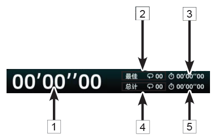

1 ：时间（显示范围0′0″00-59′59″99）

2 ：最佳圈数

3 ：最佳圈数所对应的时长

4 ：总圈数（显示范围00-30）

5 ：总圈数所对应的总时长

<table>
<colgroup>
<col style="width: 17%" />
<col style="width: 18%" />
<col style="width: 63%" />
</colgroup>
<tbody>
<tr class="odd">
<td>动作</td>
<td>计时器状态</td>
<td>动作后显示</td>
</tr>
<tr class="even">
<td rowspan="3">
短按“左键”

</td>
<td>未计时</td>
<td>开始计时</td>
</tr>
<tr class="odd">
<td>暂停</td>
<td>继续计时</td>
</tr>
<tr class="even">
<td>计时过程中</td>
<td>
序号4圈数加1，序号5加上本次所计时间。

序号1重新开始计时。（前一数值保持2S显示，2S后显示新的计时时间）。

序号2和序号3根据实际情况判断是否更新。

特殊情况：在显示上一值的2S内再次短按“左键”，序号1显示变为新时间。
</td>
</tr>
<tr class="odd">
<td>
长按“下键”

</td>
<td>/</td>
<td>清零</td>
</tr>
<tr class="even">
<td rowspan="2">
短按“下键”

</td>
<td>若在计时过程中</td>
<td>暂停</td>
</tr>
<tr class="odd">
<td>若不在计时过程中</td>
<td>进入仪表其它部分要求的相应功能</td>
</tr>
<tr class="even">
<td rowspan="3">
长按

“上键”

</td>
<td>若在计时过程中</td>
<td>无效</td>
</tr>
<tr class="odd">
<td>若不在计时过程中</td>
<td>
进入查询历史圈数及时间状态：序号4文案改变，数字闪烁。序号5显示左侧圈数对应的时间。

通过短按“△”或“▽”，序号4圈数+1或-1，序号5随之变化。短按可以循环切换。
</td>
</tr>
<tr class="even">
<td>若在查询历史圈数及时间的状态</td>
<td>退出历史查询状态。</td>
</tr>
</tbody>
</table>

跑圈计时功能下按键优先级：

1.“BACK”键：挂断来电﹥挂断通话﹥跑圈（开始/暂停）。

2.进入查询圈数及时间状态时，“△”和“▽”按键功能仅为调整圈数。
</td>
</tr>
</tbody>
</table>

<!-- AGENT_SECTION id="S063" type="section" title="风挡玻璃" keywords="风挡" -->
#### 风挡玻璃

<table>
<colgroup>
<col style="width: 12%" />
<col style="width: 87%" />
</colgroup>
<thead>
<tr class="header">
<th>项目</th>
<th>式样</th>
</tr>
</thead>
<tbody>
<tr class="odd">
<td>显示方式</td>
<td><ul>
<li>
TFT屏内显示
</li>
<li>
设置菜单可选项：上升、下降、系统响应超时！
</li>
<li>
设定过程动画：按照效果图
</li>
</ul></td>
</tr>
<tr class="even">
<td>输入信号</td>
<td>按键信号</td>
</tr>
<tr class="odd">
<td>电路</td>
<td>/</td>
</tr>
<tr class="even">
<td>输入响应</td>
<td>/</td>
</tr>
<tr class="odd">
<td>输出</td>
<td><blockquote>

仪表请求输出

</blockquote>
<table>
<colgroup>
<col style="width: 19%" />
<col style="width: 25%" />
<col style="width: 35%" />
<col style="width: 19%" />
</colgroup>
<tbody>
<tr class="odd">
<td><strong>ID</strong></td>
<td><strong>Msg.name</strong></td>
<td><strong>Signal Name</strong></td>
<td><strong>T/RX</strong></td>
</tr>
<tr class="even">
<td>0x320</td>
<td>MTR_Out_1</td>
<td>待定</td>
<td>TX</td>
</tr>
</tbody>
</table>

0x0:上升

0x1:下降

0x2～0x7: Reserved

<ul>
<li>
BCM响应
</li>
</ul>
<table>
<colgroup>
<col style="width: 10%" />
<col style="width: 14%" />
<col style="width: 62%" />
<col style="width: 12%" />
</colgroup>
<tbody>
<tr class="odd">
<td><strong>ID</strong></td>
<td><strong>Msg.name</strong></td>
<td><strong>Signal Name</strong></td>
<td><strong>T/RX</strong></td>
</tr>
<tr class="even">
<td></td>
<td>BCM</td>
<td></td>
<td>RX</td>
</tr>
<tr class="odd">
<td></td>
<td></td>
<td></td>
<td></td>
</tr>
<tr class="even">
<td></td>
<td></td>
<td></td>
<td></td>
</tr>
</tbody>
</table>

<strong>待定</strong>

0x0:

0x1:

0x2～0x7: Reserved

<strong>Permission</strong>

0x0: change is not allowed，仪表设置菜单内UI提示不满足激活条件。

0x1: change is allowed
</td>
</tr>
<tr class="even">
<td>操作逻辑</td>
<td>
注：

1、当UI显示响应超时提示时，按键操作无效。

2、在切换时，如果切换失败，则当前显示模式1秒内闪烁3次后恢复当前显示（显示“系统响应超时！”）。
</td>
</tr>
</tbody>
</table>

<!-- AGENT_SECTION id="S064" type="indicator" title="AISS怠速启停指示灯" keywords="指示灯,AISS" -->
#### AISS怠速启停指示灯

<table>
<colgroup>
<col style="width: 11%" />
<col style="width: 88%" />
</colgroup>
<thead>
<tr class="header">
<th colspan="2">AISS怠速启停指示灯</th>
</tr>
<tr class="odd">
<th>项目</th>
<th>式样</th>
</tr>
</thead>
<tbody>
<tr class="odd">
<td>显示内容</td>
<td>AISS 怠速启停指示灯</td>
</tr>
<tr class="even">
<td>显示方式</td>
<td><ul>
<li>
TFT符号显示，绿色
</li>
</ul></td>
</tr>
<tr class="odd">
<td>输入信号</td>
<td><ul>
<li>
CAN数据帧-- ECM_Idle_Stop_Sts
</li>
</ul>
<table style="width:100%;">
<colgroup>
<col style="width: 17%" />
<col style="width: 22%" />
<col style="width: 47%" />
<col style="width: 13%" />
</colgroup>
<tbody>
<tr class="odd">
<td>ID</td>
<td>Msg.name</td>
<td>Signal Name</td>
<td>T/RX</td>
</tr>
<tr class="even">
<td>0x134</td>
<td>ECM_1</td>
<td>ECM_Idle_Stop_Sts</td>
<td>RX</td>
</tr>
</tbody>
</table>

0x0: 指示灯OFF

0x1: 指示灯ON

0x2:指示灯闪烁 (1Hz, 50% Duty)

0x3:
保留位，收到此值仪表滤除，维持最近一笔有效数字显示(0x0,0x1,0x2)
</td>
</tr>
<tr class="even">
<td>电路</td>
<td>/</td>
</tr>
<tr class="odd">
<td>输入响应</td>
<td></td>
</tr>
</tbody>
</table>

<!-- AGENT_SECTION id="S065" type="communication" title="无线通信专项功能" keywords="" -->
### 无线通信专项功能

<!-- AGENT_SECTION id="S066" type="section" title="功能简介" keywords="" -->
#### 功能简介

<table style="width:100%;">
<colgroup>
<col style="width: 6%" />
<col style="width: 6%" />
<col style="width: 16%" />
<col style="width: 20%" />
<col style="width: 13%" />
<col style="width: 14%" />
<col style="width: 10%" />
<col style="width: 11%" />
</colgroup>
<tbody>
<tr class="odd">
<td>No</td>
<td colspan="2">功能分类</td>
<td>
符号、示例

（参考）
</td>
<td>
经典蓝牙

BT
</td>
<td>
低功耗蓝牙

BLE
</td>
<td>WiFi</td>
<td>
APP

支持
</td>
</tr>
<tr class="even">
<td>1</td>
<td rowspan="7">电话</td>
<td>来电号码显示</td>
<td>13422785388</td>
<td>√</td>
<td></td>
<td></td>
<td></td>
</tr>
<tr class="odd">
<td>2</td>
<td>接听/拒接</td>
<td> </td>
<td>√</td>
<td></td>
<td></td>
<td></td>
</tr>
<tr class="even">
<td>3</td>
<td>联系人</td>
<td></td>
<td>√</td>
<td></td>
<td></td>
<td></td>
</tr>
<tr class="odd">
<td></td>
<td>通信录</td>
<td></td>
<td>√</td>
<td></td>
<td></td>
<td></td>
</tr>
<tr class="even">
<td>4</td>
<td>通话记录</td>
<td></td>
<td></td>
<td></td>
<td></td>
<td></td>
</tr>
<tr class="odd">
<td>5</td>
<td>音量加减</td>
<td></td>
<td>√</td>
<td></td>
<td></td>
<td></td>
</tr>
<tr class="even">
<td></td>
<td>通话时长</td>
<td></td>
<td>√</td>
<td></td>
<td></td>
<td></td>
</tr>
<tr class="odd">
<td>6</td>
<td rowspan="7">音乐</td>
<td>音乐名称</td>
<td></td>
<td></td>
<td></td>
<td></td>
<td></td>
</tr>
<tr class="even">
<td>7</td>
<td>音乐歌词</td>
<td></td>
<td>√</td>
<td></td>
<td></td>
<td></td>
</tr>
<tr class="odd">
<td></td>
<td>上一首</td>
<td></td>
<td>√</td>
<td></td>
<td></td>
<td></td>
</tr>
<tr class="even">
<td>8</td>
<td>下一首</td>
<td></td>
<td>√</td>
<td></td>
<td></td>
<td></td>
</tr>
<tr class="odd">
<td>9</td>
<td>音量加减</td>
<td></td>
<td>√</td>
<td></td>
<td></td>
<td></td>
</tr>
<tr class="even">
<td>10</td>
<td>音乐播放</td>
<td></td>
<td>√</td>
<td></td>
<td></td>
<td></td>
</tr>
<tr class="odd">
<td></td>
<td>音乐暂停</td>
<td></td>
<td>√</td>
<td></td>
<td></td>
<td></td>
</tr>
<tr class="even">
<td>11</td>
<td rowspan="4">手机 
信息</td>
<td>蓝牙连接状态</td>
<td>或</td>
<td>√</td>
<td></td>
<td></td>
<td></td>
</tr>
<tr class="odd">
<td>12</td>
<td>信号强度</td>
<td></td>
<td>√</td>
<td></td>
<td></td>
<td></td>
</tr>
<tr class="even">
<td>13</td>
<td>手机电量</td>
<td></td>
<td>√</td>
<td></td>
<td></td>
<td></td>
</tr>
<tr class="odd">
<td>14</td>
<td>Wifi信号等级</td>
<td></td>
<td>√</td>
<td></td>
<td></td>
<td></td>
</tr>
<tr class="even">
<td></td>
<td>二维码</td>
<td>
绑定仪表二维码

(用于WiFi投屏)
</td>
<td></td>
<td></td>
<td></td>
<td>√</td>
<td>√</td>
</tr>
<tr class="odd">
<td>15</td>
<td rowspan="2">导航</td>
<td>简易导航</td>
<td></td>
<td></td>
<td>√</td>
<td></td>
<td>√</td>
</tr>
<tr class="even">
<td>16</td>
<td>全景地图</td>
<td>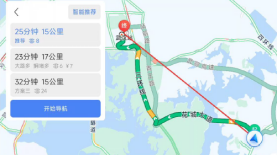</td>
<td></td>
<td></td>
<td>√</td>
<td>√</td>
</tr>
<tr class="odd">
<td>17</td>
<td>天气</td>
<td>天气图标显示</td>
<td>

35℃
</td>
<td></td>
<td>√</td>
<td></td>
<td>√</td>
</tr>
<tr class="even">
<td>18</td>
<td>App</td>
<td>显示</td>
<td>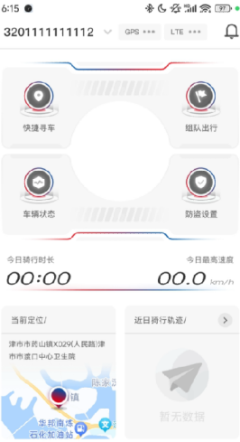</td>
<td></td>
<td>√</td>
<td></td>
<td>√</td>
</tr>
<tr class="odd">
<td>19</td>
<td>App</td>
<td>设置</td>
<td></td>
<td></td>
<td>√</td>
<td></td>
<td>√</td>
</tr>
<tr class="even">
<td colspan="8">仪表显示App功能遵循 “1-1 附录 手机App和仪表
显示信息”</td>
</tr>
</tbody>
</table>

<!-- AGENT_SECTION id="S067" type="section" title="电话" keywords="电话" -->
#### 电话

<table>
<colgroup>
<col style="width: 11%" />
<col style="width: 88%" />
</colgroup>
<thead>
<tr class="header">
<th>项目</th>
<th>式样</th>
</tr>
</thead>
<tbody>
<tr class="odd">
<td>显示内容</td>
<td>电话</td>
</tr>
<tr class="even">
<td>显示方式</td>
<td><blockquote>

见UI

</blockquote></td>
</tr>
<tr class="odd">
<td>输入信号</td>
<td>根据BT模组接收到的信号响应，及发送相关回馈信号给手机</td>
</tr>
<tr class="even">
<td>输入响应</td>
<td>
当仪表通过蓝牙连接手机且接到电话时，UI区域显示来电人信息（姓名、电话号码），并按下图示进行操作。

注：通信录、通话记录需进入菜单内操作。

挂断电话按不同状态可细分为拒接电话，通话中挂断电话。

所有音量条在无音量调整后2S自动消失。

通话结束后，挂断电话提示框3S自动消失。
</td>
</tr>
</tbody>
</table>

<!-- AGENT_SECTION id="S068" type="section" title="投屏导航" keywords="导航" -->
#### 投屏导航

<table>
<colgroup>
<col style="width: 11%" />
<col style="width: 88%" />
</colgroup>
<thead>
<tr class="header">
<th>项目</th>
<th>式样</th>
</tr>
</thead>
<tbody>
<tr class="odd">
<td>显示内容</td>
<td>手机互联</td>
</tr>
<tr class="even">
<td>显示方式</td>
<td>
二维码 

提示用户信息：打开Haojue APP ﹥ 点击开始连接﹥
扫一扫使用手机投屏
</td>
</tr>
<tr class="odd">
<td>输入信号</td>
<td>手机、APP、仪表二维码。</td>
</tr>
<tr class="even">
<td>输入响应</td>
<td>
使用手机打开APP,扫描仪表二维码，完成手机互联，连通后可使用投屏功能。

 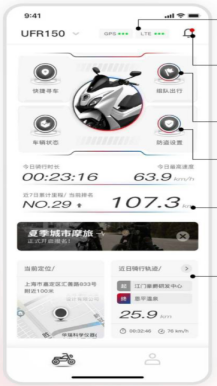 

图例展示，非实物图片

在手机互联界面中，用户可通过无感连接（仅限车主）或扫描二维码完成手机互联，连通后可使用投屏功能。

车主只需打开手机上的“我的豪爵” APP；

进入时会有两个选项：

1. 无感连接

2. 扫描二维码

车主可点击选项

1：无感连接，直接进入投屏页面；

2：其他用户需进入菜单操作连接手机互联；
扫描二维码，通过扫码进入投屏页面。

当用户关闭APP或断开互联时，此时仪表上的界面会直接返回到主界面；

当在投屏界面时，短按返回按键，界面返回至缩略图（30S
无按键操作，自动返回主界面），再次短按返回按键，界面返回至菜单，反之想返回投屏界面可重复短按两次ok键。

在互联成功的前提下，仪表在菜单或主界面时，手机APP
端发起一个导航路径，也可进入到投屏界面。

所有音量条在无音量调整后2S自动消失。
</td>
</tr>
</tbody>
</table>

<!-- AGENT_SECTION id="S069" type="section" title="音乐" keywords="音乐" -->
#### 音乐

<table>
<colgroup>
<col style="width: 11%" />
<col style="width: 88%" />
</colgroup>
<thead>
<tr class="header">
<th>项目</th>
<th>式样</th>
</tr>
</thead>
<tbody>
<tr class="odd">
<td>显示内容</td>
<td>音乐</td>
</tr>
<tr class="even">
<td>显示方式</td>
<td><blockquote>

见UI

</blockquote></td>
</tr>
<tr class="odd">
<td>输入信号</td>
<td>手机与仪表进行蓝牙连接，头盔与仪表进行蓝牙连接</td>
</tr>
<tr class="even">
<td>输入响应</td>
<td>
UI设计需进入菜单界面，找到音乐菜单。或者在主页面内集成显示音乐内容。

在音乐界面下，用户可通过蓝牙播放手机内的歌曲，配合左手把开关按键进行上一首，下一首，暂停，继续播放，音量调节等功能。

短按△或▽键选择歌曲，短按ok键进入音乐播放界面，再次短按ok键音乐暂停播放；

通过手机播放音乐。

当仪表通过蓝牙连接手机且接到电话时，UI区域显示来电。

按键优先级：电话＞音乐＞其它

所有音量条在无音量调整后2S自动消失。
</td>
</tr>
</tbody>
</table>

<!-- AGENT_SECTION id="S070" type="section" title="天气" keywords="天气" -->
#### 天气

<table>
<colgroup>
<col style="width: 11%" />
<col style="width: 88%" />
</colgroup>
<thead>
<tr class="header">
<th>项目</th>
<th>式样</th>
</tr>
</thead>
<tbody>
<tr class="odd">
<td>显示内容</td>
<td>天气</td>
</tr>
<tr class="even">
<td>显示方式</td>
<td><blockquote>

见UI（建议只显示图标和温度℃）

</blockquote></td>
</tr>
<tr class="odd">
<td>输入信号</td>
<td>
手机与仪表进行蓝牙连接，BLE数据传输

遵循 “2-1 DCJ豪爵 手机App和仪表 BLE数据协议”
</td>
</tr>
<tr class="even">
<td>输入响应</td>
<td>遵循 “2-1 DCJ豪爵 手机App和仪表 BLE数据协议”</td>
</tr>
</tbody>
</table>

<!-- AGENT_SECTION id="S071" type="section" title="使用场景需求" keywords="" -->
#### 使用场景需求

<table>
<colgroup>
<col style="width: 100%" />
</colgroup>
<tbody>
<tr class="odd">
<td>
<strong>场景一：头盔对话</strong>

前置条件：两个头盔同时连接仪表，手机连接仪表。

操作：通过按键操作，点击进入到通话模式（需要提供UI式样）。

表现：此时两个头盔之间可以相互对话，头盔播放的音频，只有两个头盔之间对话的音频，如果有多媒体或者投屏导航音的话，也不会通过头盔进行播放。

后置：通过物理按键，点击退出通话模式，此时头盔按照要求，正常播放头盔的声音。

 

<strong>场景二：蓝牙音乐</strong>

前置条件：两个头盔同时连接仪表，手机连接仪表。

操作：此时手机播放蓝牙音乐。

表现：此时两个头盔都可以听到手机的蓝牙音乐。

后置：待蓝牙音乐结束，主副驾驶头盔按照要求正常播放声音。

 

<strong>场景三：蓝牙电话</strong>

前置条件：两个头盔同时连接仪表，手机连接仪表。

操作：此时手机接听蓝牙电话。

表现：此时主驾驶，通过头盔正常进行蓝牙通话，主驾驶除了电话的通话声音以外，所有的音源禁止；副驾驶的头盔静音此时听不到任何声音。

后置：待通话结束（挂断），主副驾驶头盔按照要求正常播放声音。

<strong>场景四：地图投屏</strong>

前置条件：两个头盔同时连接仪表，手机连接仪表。

操作：此时手机投屏导航。

表现：此时主副驾驶的耳机，同时播放导航的声音。

后置：待地图导航结束，主副驾驶头盔按照要求正常播放声音。

 

<strong>场景五：手机同时音乐和导航</strong>

前置条件：两个头盔同时连接仪表，手机连接仪表。

操作：此时手机投屏导航，并且播放音乐。

表现：此种情况可以做音源仲裁，出现导航音的时候，媒体音抑制<del>或者媒体音停播</del>，但是主副驾驶的头盔播放的声音一定是一致的。

后置：导航音结束后，媒体音恢复音量。

 

<strong>场景六：对话模式下接听电话</strong>

前置条件：两个头盔同时连接仪表，手机连接仪表，并且进入到对话模式下。

操作：此时接通了手机的电话。

表现：主副驾驶不可以通过头盔进行对话，此时的主驾驶，通过头盔正常进行蓝牙通话，主驾驶除了电话的通话声音以外，所有的音源禁止；副驾驶的头盔静音此时听不到任何声音。

后置：挂断电话后，恢复到对话模式。
</td>
</tr>
</tbody>
</table>

<!-- AGENT_SECTION id="S072" type="section" title="仪表端口向外供电" keywords="供电" -->
### 仪表端口向外供电

<table>
<colgroup>
<col style="width: 100%" />
</colgroup>
<tbody>
<tr class="odd">
<td>
Pin 13

VCC_ OUT ：在IGN 13V时输出电压10.7±1.0 V ，额定工作电流15mA min。

建议电路：

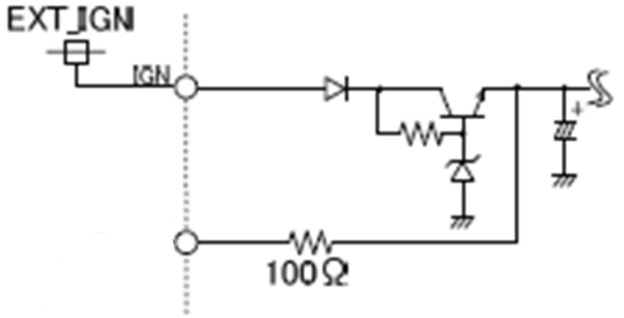
</td>
</tr>
</tbody>
</table>

<!-- AGENT_SECTION id="S073" type="ui_navigation" title="页面切换" keywords="页面" -->
## 页面切换

<!-- AGENT_SECTION id="S074" type="ui_navigation" title="页面简介" keywords="页面" -->
### 页面简介

<table>
<colgroup>
<col style="width: 100%" />
</colgroup>
<tbody>
<tr class="odd">
<td>显示内容</td>
</tr>
<tr class="even">
<td>
主页面

（硬件平台包含至少支持三种风格UI、包含电话、音乐）
</td>
</tr>
<tr class="odd">
<td>车辆信息</td>
</tr>
<tr class="even">
<td>音乐</td>
</tr>
<tr class="odd">
<td>导航</td>
</tr>
<tr class="even">
<td>电话</td>
</tr>
<tr class="odd">
<td>设置</td>
</tr>
<tr class="even">
<td>智能钥匙应急模式</td>
</tr>
</tbody>
</table>

注：在上表各页面内都必须包含行车必要的信息和警示灯，参考2 机能式样

<!-- AGENT_SECTION id="S075" type="ui_navigation" title="主/从页面切换" keywords="页面" -->
### 主/从页面切换

<table>
<colgroup>
<col style="width: 100%" />
</colgroup>
<tbody>
<tr class="odd">
<td>

注 1：

1、主页面切换至其他页面的动画按照效果图执行；

2、其他页面切换至主页面的动画按照效果图执行。

3、设置页面和车辆信息页面切换的动画按照效果图执行。

4、画面迁移未注事项参考 UI 资料。

<del>注 2：</del>

<del>1、当且仅当车速为 0 时，方可从主页面切换至其他页面；</del>

<del>2、当车速&gt;5km/h（对应 3～4 之间的
mile）时，应从其他页面自动切换回主页面。</del>
</td>
</tr>
</tbody>
</table>

<!-- AGENT_SECTION id="S076" type="ui_navigation" title="主页面内容切换" keywords="页面" -->
### 主页面内容切换

<!-- AGENT_SECTION id="S077" type="section" title="多功能区" keywords="" -->
#### 多功能区

在主页面下，切换顺序如下：

<table>
<colgroup>
<col style="width: 100%" />
</colgroup>
<tbody>
<tr class="odd">
<td>

注：

1、具体可切换显示的内容由设置页面各功能定义。

如果勾选了不显示，则切换显示时跳过该项，进入下一项的循环。

2、主页面多功能区只显示英文（没有中文显示）。

3、出厂时默认显示为ODO，且为多功能区的必选项。

4、切换至其他显示后IGN ON→OFF，应保持上一次的设定值。

5、可循环选择菜单。

6、按键优先级：电话＞音乐＞其它，即在无电话和音乐时，可进行此操作。
</td>
</tr>
</tbody>
</table>

<!-- AGENT_SECTION id="S078" type="ui_navigation" title="主页面下的骑行模式切换" keywords="骑行,页面" -->
#### 主页面下的骑行模式切换

<table>
<colgroup>
<col style="width: 100%" />
</colgroup>
<tbody>
<tr class="odd">
<td>

进入模式时、按键优先级：＞电话＞音乐＞其它。
</td>
</tr>
</tbody>
</table>

<!-- AGENT_SECTION id="S079" type="ui_navigation" title="快捷设置" keywords="设置" -->
#### 快捷设置

<table>
<colgroup>
<col style="width: 100%" />
</colgroup>
<tbody>
<tr class="odd">
<td>
允许操作单独分配的功能。

注：

1、在IGN OFF时记忆之前的快捷设置选项；

2、选中的项目有明显的UI提示，例如前面加●；

3、按键优先级：电话＞音乐＞其它。

4、3S 无操作自动退出
</td>
</tr>
</tbody>
</table>

<!-- AGENT_SECTION id="S080" type="section" title="车辆信息" keywords="" -->
### 车辆信息

<table>
<colgroup>
<col style="width: 12%" />
<col style="width: 87%" />
</colgroup>
<tbody>
<tr class="odd">
<td>显示内容</td>
<td>
应包含到“2.2 TFT内显示内容”、“2.3 无线通讯提示符”。

至少应包含总里程、计程表、平均油耗、油量、水温、档位、时间、电池电压、保养剩余里程、边撑开关指示符、胎压/胎温、软、硬件版本等内容。具体按UI提示资料。

因7’TFT显示面积较大，建议UI给出整车图形和对应显示位置的连接线以及信息。

只显示内容，不可操作。如显示的内容有报警信息，需做相应报警提示UI。

下图仅为示意图，具体参考UI。

注意：胎压、胎温为上次关机时保存的数据，行车前请确认轮胎有无异常！
</td>
</tr>
</tbody>
</table>

<!-- AGENT_SECTION id="S081" type="section" title="投屏导航" keywords="导航" -->
### 投屏导航

|          |                                                                      |
|----------|----------------------------------------------------------------------|
| 操作逻辑 | 使用手机打开APP,扫描仪表二维码，完成手机互联，连通后可使用投屏功能。 |

<!-- AGENT_SECTION id="S082" type="section" title="音乐" keywords="音乐" -->
### 音乐

<table>
<colgroup>
<col style="width: 15%" />
<col style="width: 84%" />
</colgroup>
<tbody>
<tr class="odd">
<td>操作逻辑</td>
<td>
按键选择进入音乐界面（具体参考UI）。

音乐能抓到APP提供信息待详细商议（暂定有如下内容）。

封面简图

音乐播放时如返回到主页面，主页面显示音乐简单简略信息，（具体参考UI）

</td>
</tr>
</tbody>
</table>

<!-- AGENT_SECTION id="S083" type="section" title="电话" keywords="电话" -->
### 电话

<table>
<colgroup>
<col style="width: 15%" />
<col style="width: 84%" />
</colgroup>
<tbody>
<tr class="odd">
<td>显示内容</td>
<td>包含子菜单：最近通话、联系人</td>
</tr>
<tr class="even">
<td>操作逻辑</td>
<td>
确保手机与车辆已进行蓝牙连接；

在最近通话界面中，用户可查看手机上最近通话的联系人并进行拨号。

先进入菜单界面；

短按△或▽键标记电话，短按ok键进入电话界面；

短按△或▽键标记最近通话，短按 ok键进入；

短按△或▽键选择最近通话的联系人，短按ok键拨出电话。
</td>
</tr>
</tbody>
</table>

<!-- AGENT_SECTION id="S084" type="ui_navigation" title="设置" keywords="设置" -->
### 设置

<table>
<colgroup>
<col style="width: 11%" />
<col style="width: 88%" />
</colgroup>
<tbody>
<tr class="odd">
<td>操作逻辑</td>
<td>

依据“功能配置表”中各自车型的选项显示，无此功能的空缺处由后面的选项向上递补。
</td>
</tr>
</tbody>
</table>

以下操作流程中，未特别说明的，均可循环选择菜单。（即从 1→2→3→1→2 或者
1→3→2→1） 。

<!-- AGENT_SECTION id="S085" type="ui_navigation" title="设备管理" keywords="" -->
#### 设备管理

<table>
<colgroup>
<col style="width: 11%" />
<col style="width: 88%" />
</colgroup>
<thead>
<tr class="header">
<th colspan="2"></th>
</tr>
<tr class="odd">
<th>项目</th>
<th>式样</th>
</tr>
</thead>
<tbody>
<tr class="odd">
<td>显示内容</td>
<td>我的设备 Haojue-XXXXXX、移动设备、头盔 1、头盔 2</td>
</tr>
<tr class="even">
<td>显示方式</td>
<td><ul>
<li>
TFT屏内显示
</li>
<li>
显示/切换动画：按照效果图
</li>
</ul></td>
</tr>
<tr class="odd">
<td>输入信号</td>
<td><blockquote>

蓝牙

</blockquote></td>
</tr>
<tr class="even">
<td>可设置/切换选项</td>
<td><blockquote>

移动设备

头盔 1

头盔 2

</blockquote></td>
</tr>
<tr class="odd">
<td>操作逻辑</td>
<td>
将手机头盔与仪表通过蓝牙的方式连接后方可使用电话及音乐等功能。

先进入菜单界面；

短按△或▽键标记设置，短按OK 键或进入设置界面；

按以下步骤连接手机蓝牙：

短按△或▽键标记设备连接，短按 OK 键进入；

短按△或▽键选择移动设备，短按 OK 键进入；

确保需要连接的手机蓝牙已打开；

短按△或▽键标记你的手机，短按OK 键连接；

如果手机已进行过连接，短按△或▽键选择移动设备，短按 OK
键进入，选择需要连接的手机蓝牙ID 进行连接。

按以下步骤连接头盔蓝牙：

短按△或▽键标记设备连接，短按 OK 键进入；

短按△或▽键选择头盔 1/ 头盔 2，短按 OK 键连接；

确保需要连接的头盔蓝牙已打开。

注：

具体依照UI资料提示。

实车有按键信号的，替代短按OK

实车有按键信号的，替代短按BACK
</td>
</tr>
<tr class="even">
<td>备注</td>
<td></td>
</tr>
</tbody>
</table>

<!-- AGENT_SECTION id="S086" type="ui_navigation" title="主题风格" keywords="" -->
#### 主题风格

<table>
<colgroup>
<col style="width: 11%" />
<col style="width: 88%" />
</colgroup>
<thead>
<tr class="header">
<th>项目</th>
<th>式样</th>
</tr>
</thead>
<tbody>
<tr class="odd">
<td>显示内容</td>
<td>主题风格</td>
</tr>
<tr class="even">
<td>显示方式</td>
<td><ul>
<li>
TFT屏内显示
</li>
<li>
显示/切换动画：按照效果图
</li>
</ul></td>
</tr>
<tr class="odd">
<td>输入信号</td>
<td><ul>
<li>
按键信号
</li>
</ul></td>
</tr>
<tr class="even">
<td>操作逻辑</td>
<td></td>
</tr>
</tbody>
</table>

<!-- AGENT_SECTION id="S087" type="ui_navigation" title="TCS设置" keywords="TCS,设置" -->
#### TCS设置

<table>
<colgroup>
<col style="width: 11%" />
<col style="width: 88%" />
</colgroup>
<thead>
<tr class="header">
<th>项目</th>
<th>式样</th>
</tr>
</thead>
<tbody>
<tr class="odd">
<td>显示内容</td>
<td>主题风格</td>
</tr>
<tr class="even">
<td>显示方式</td>
<td><ul>
<li>
TFT屏内显示
</li>
<li>
显示/切换动画：按照效果图
</li>
</ul></td>
</tr>
<tr class="odd">
<td>输入信号</td>
<td><ul>
<li>
按键信号
</li>
</ul></td>
</tr>
<tr class="even">
<td>操作逻辑</td>
<td></td>
</tr>
</tbody>
</table>

<!-- AGENT_SECTION id="S088" type="section" title="可选内容" keywords="" -->
#### 可选内容

<table>
<colgroup>
<col style="width: 12%" />
<col style="width: 87%" />
</colgroup>
<thead>
<tr class="header">
<th>项目</th>
<th>式样</th>
</tr>
</thead>
<tbody>
<tr class="odd">
<td>显示内容</td>
<td>可选内容</td>
</tr>
<tr class="even">
<td>显示方式</td>
<td><ul>
<li>
TFT屏内显示
</li>
</ul></td>
</tr>
<tr class="odd">
<td>输入信号</td>
<td><ul>
<li>
按键信号
</li>
</ul></td>
</tr>
<tr class="even">
<td>电路</td>
<td>/</td>
</tr>
<tr class="odd">
<td>输入响应</td>
<td>
可选择显示项目：

1、ODO（默认必须显示）、2、TRIP A、3、TRIP B、4、AVG CONS._A 、

5、AVG CONS._B、6、电池电压
、7、前轮胎压、胎温、8、后轮胎压、胎温
</td>
</tr>
<tr class="even">
<td>操作逻辑</td>
<td>

注：

如将主页面正在显示的项目在此操作中被关闭了，恢复到主页面时默认显示下一项未关闭的项目。
</td>
</tr>
</tbody>
</table>

<!-- AGENT_SECTION id="S089" type="ui_navigation" title="背光设置" keywords="设置,背光" -->
#### 背光设置

<table>
<colgroup>
<col style="width: 11%" />
<col style="width: 88%" />
</colgroup>
<thead>
<tr class="header">
<th>项目</th>
<th>式样</th>
</tr>
</thead>
<tbody>
<tr class="odd">
<td>显示内容</td>
<td>背光设置</td>
</tr>
<tr class="even">
<td>显示方式</td>
<td><ul>
<li>
TFT 屏内显示
</li>
<li>
指示符形式（动画待定）
</li>
<li>
显示动画：按照效果图
</li>
</ul></td>
</tr>
<tr class="odd">
<td>输入信号</td>
<td><ul>
<li>
按键信号
</li>
</ul></td>
</tr>
<tr class="even">
<td>电路</td>
<td>/</td>
</tr>
<tr class="odd">
<td>输入响应</td>
<td>
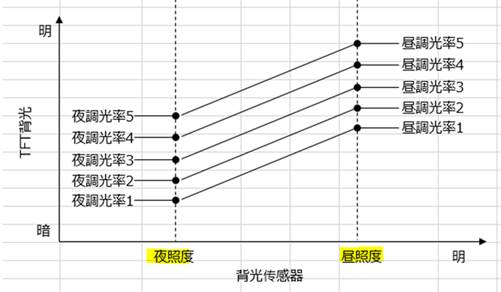

<table>
<colgroup>
<col style="width: 89%" />
<col style="width: 10%" />
</colgroup>
<tbody>
<tr class="odd">
<td></td>
<td></td>
</tr>
<tr class="even">
<td></td>
<td></td>
</tr>
</tbody>
</table>

设置：

<ol type="1">
<li>
显示模式：自动（白天、夜间）。
</li>
</ol>
<ol type="1">
<li>
自动时，白天/夜晚模式可以自动切换，切换的亮度阈值可按照各实车分别配置。
</li>
<li>
亮度调节：可选上图选择5档调光率曲线，背光会按照选定的曲线调节。
</li>
</ol>

<mark></mark>
</td>
</tr>
<tr class="even">
<td>操作逻辑</td>
<td>

设置操作进行时，LCD背光需按操作选项做出相应的展示。
</td>
</tr>
</tbody>
</table>

<!-- AGENT_SECTION id="S090" type="section" title="保养提示" keywords="保养" -->
#### 保养提示

<table>
<colgroup>
<col style="width: 11%" />
<col style="width: 88%" />
</colgroup>
<thead>
<tr class="header">
<th>项目</th>
<th>式样</th>
</tr>
</thead>
<tbody>
<tr class="odd">
<td>显示内容</td>
<td>保养提示</td>
</tr>
<tr class="even">
<td>显示方式</td>
<td><ul>
<li>
TFT屏内显示
</li>
</ul></td>
</tr>
<tr class="odd">
<td>输入信号</td>
<td><ul>
<li>
按键信号
</li>
</ul></td>
</tr>
<tr class="even">
<td>电路</td>
<td>/</td>
</tr>
<tr class="odd">
<td>输入响应</td>
<td>
设置：

<blockquote>

重置保养剩余里程的数值

设置精度：1

设置范围：0～99999

显示范围：-9999～99999（-表示已经超过了保养提示的里程数）

显示单位：km(mile)

</blockquote></td>
</tr>
<tr class="even">
<td>操作逻辑</td>
<td>

注：1、出厂默认保养剩余里程1000km。

2、保养剩余里程显示数值随着行驶的里程增加而减少（倒计提醒），如下图示意：

3、重置后默认显示保养剩余里程为1000km，可通过按键进行数值的调整（全部位数都可以调整）。
</td>
</tr>
</tbody>
</table>

<!-- AGENT_SECTION id="S091" type="section" title="换档提示" keywords="换档" -->
#### **换档提示**

<table>
<colgroup>
<col style="width: 10%" />
<col style="width: 89%" />
</colgroup>
<thead>
<tr class="header">
<th>项目</th>
<th>式样</th>
</tr>
</thead>
<tbody>
<tr class="odd">
<td>显示内容</td>
<td>换档提示</td>
</tr>
<tr class="even">
<td>显示方式</td>
<td><ul>
<li>
TFT 屏内显示：换档提示灯&amp;主页面的“换档功能开启指示符” 
</li>
<li>
指示符形式（按照效果图）
</li>
<li>
显示动画：按照效果图
</li>
</ul></td>
</tr>
<tr class="odd">
<td>输入信号</td>
<td><ul>
<li>
按键信号
</li>
</ul></td>
</tr>
<tr class="even">
<td>输入响应</td>
<td>
设置

1、换档提示：打开（关闭）， 出厂默认为关闭。

2、闪烁频率：常亮0Hz、4Hz（出厂默认）、8Hz，

3、闪烁亮度：25%亮度、50%、75%（出厂默认）、100%

（可以使用不同的辉度或颜色表达）

4、起始转速： 各档位可以分别设置升档提示转速值。

范围：4000～10500rpm

分辨率：500rpm

5、出厂默认<del>10500rpm</del> 按后续提供的各档位出厂默认值

1：     6500    rpm

2：     6500    rpm

3:      6500    rpm

4：     6500   rpm

5：     6500   rpm

6：     6500   rpm
</td>
</tr>
<tr class="odd">
<td>操作逻辑</td>
<td>

注：

1、当“换档提示”为“开”时，主页面的“换档功能开启指示符” 需点亮。

2、当“换档提示”为“关”时，其它选项不显示。

3、操作进行时，换档提示LED灯需按选项做出相应的展示，离开设定操作时灯熄灭。

4、设置过程中，如果整车骑行至退出设置页面时，换挡提示的设置为无效。
</td>
</tr>
</tbody>
</table>

<!-- AGENT_SECTION id="S092" type="ui_navigation" title="时间设置" keywords="时间,设置" -->
#### 时间设置

<table>
<colgroup>
<col style="width: 11%" />
<col style="width: 88%" />
</colgroup>
<thead>
<tr class="header">
<th>项目</th>
<th>式样</th>
</tr>
</thead>
<tbody>
<tr class="odd">
<td>显示内容</td>
<td>时间设置(与主页面时间显示联动)</td>
</tr>
<tr class="even">
<td>显示方式</td>
<td><ul>
<li>
TFT屏内显示
</li>
</ul>
<ul>
<li>
显示/切换动画：按照效果图
</li>
</ul></td>
</tr>
<tr class="odd">
<td>输入信号</td>
<td><ul>
<li>
按键信号
</li>
</ul></td>
</tr>
<tr class="even">
<td>电路</td>
<td>/</td>
</tr>
<tr class="odd">
<td>备注</td>
<td><ol type="1">
<li>
设置时钟显示格式
</li>
</ol>
<blockquote>

12小时制（默认）、24小时制

</blockquote>

2、设置内容：时、分
</td>
</tr>
<tr class="even">
<td>操作逻辑</td>
<td>

<mark></mark>
</td>
</tr>
</tbody>
</table>

<!-- AGENT_SECTION id="S093" type="indicator" title="自动大灯" keywords="" -->
#### 自动大灯

<table>
<colgroup>
<col style="width: 12%" />
<col style="width: 87%" />
</colgroup>
<thead>
<tr class="header">
<th>项目</th>
<th>式样</th>
</tr>
</thead>
<tbody>
<tr class="odd">
<td>显示内容</td>
<td>显示设置</td>
</tr>
<tr class="even">
<td>显示方式</td>
<td><ul>
<li>
TFT屏内显示
</li>
<li>
显示/切换动画：按照效果图
</li>
</ul></td>
</tr>
<tr class="odd">
<td>输入信号</td>
<td><ul>
<li>
按键信号
</li>
</ul></td>
</tr>
<tr class="even">
<td>可设置/切换选项</td>
<td>打开（关闭）</td>
</tr>
<tr class="odd">
<td>操作逻辑</td>
<td>
设置为打开后，主页面应显示符号。

当整车系统不响应，或回复不能切换时，按输入响应功能需求UI提示。
</td>
</tr>
</tbody>
</table>

<!-- AGENT_SECTION id="S094" type="vehicle_feature" title="弹射起步" keywords="弹射" -->
#### 弹射起步

<table>
<colgroup>
<col style="width: 12%" />
<col style="width: 87%" />
</colgroup>
<thead>
<tr class="header">
<th>项目</th>
<th>式样</th>
</tr>
</thead>
<tbody>
<tr class="odd">
<td>显示内容</td>
<td>显示设置</td>
</tr>
<tr class="even">
<td>显示方式</td>
<td><ul>
<li>
TFT屏内显示
</li>
<li>
显示/切换动画：按照效果图
</li>
</ul></td>
</tr>
<tr class="odd">
<td>输入信号</td>
<td><ul>
<li>
按键信号
</li>
</ul></td>
</tr>
<tr class="even">
<td>可设置/切换选项</td>
<td>打开（关闭）</td>
</tr>
<tr class="odd">
<td>操作逻辑</td>
<td>

当整车系统不响应，或回复不能切换时，按输入响应功能需求UI提示。
</td>
</tr>
</tbody>
</table>

<!-- AGENT_SECTION id="S095" type="ui_navigation" title="单位设置" keywords="设置,单位" -->
#### 单位设置

<table>
<colgroup>
<col style="width: 12%" />
<col style="width: 87%" />
</colgroup>
<thead>
<tr class="header">
<th>项目</th>
<th>式样</th>
</tr>
</thead>
<tbody>
<tr class="odd">
<td>显示内容</td>
<td>显示设置</td>
</tr>
<tr class="even">
<td>显示方式</td>
<td><ul>
<li>
TFT屏内显示
</li>
<li>
显示/切换动画：按照效果图
</li>
</ul></td>
</tr>
<tr class="odd">
<td>输入信号</td>
<td><ul>
<li>
按键信号
</li>
</ul></td>
</tr>
<tr class="even">
<td>可设置/切换选项</td>
<td><ol type="1">
<li>
速度单位：km/h、mph
</li>
<li>
油耗单位：km/L、L/100km<strong>、</strong>MPG US、MPG
IMP
</li>
<li>
胎压单位：kPa、bar、psi （1bar = 100kPa = 14.5psi）
</li>
</ol></td>
</tr>
<tr class="odd">
<td>操作逻辑</td>
<td></td>
</tr>
<tr class="even">
<td>备注</td>
<td><ol type="1">
<li>
当速度单位选择为km/h时，里程单位为km,油耗单位为km/L、L/100km

当速度单位选择为mph时，里程单位为mile,油耗单位为MPG US、MPG IMP

2、主页面和设置页面、以及设置页面的单位/显示均应一起变化。

3、依据“功能配置表”中各自车型的选项显示，无此功能的空缺处由下面的选项向上递补。
</li>
</ol></td>
</tr>
</tbody>
</table>

<!-- AGENT_SECTION id="S096" type="ui_navigation" title="语言选择" keywords="语言" -->
#### 语言选择

<table>
<colgroup>
<col style="width: 12%" />
<col style="width: 87%" />
</colgroup>
<thead>
<tr class="header">
<th>项目</th>
<th>式样</th>
</tr>
</thead>
<tbody>
<tr class="odd">
<td>显示内容</td>
<td>语言选择</td>
</tr>
<tr class="even">
<td>显示方式</td>
<td><ul>
<li>
TFT屏内显示
</li>
<li>
显示/切换动画：按照效果图
</li>
</ul></td>
</tr>
<tr class="odd">
<td>输入信号</td>
<td><ul>
<li>
按键信号
</li>
</ul></td>
</tr>
<tr class="even">
<td>可设置/切换选项</td>
<td>
显示语言：

<ul>
<li>
中文
</li>
<li>
English
</li>
<li>
日文語
</li>
<li>
韩文 P701-A、SC2E-1、SC26-1F暂无此语言选项
</li>
</ul></td>
</tr>
<tr class="odd">
<td>操作逻辑</td>
<td>

注：语言显示需使用对应的国家语言书写，例如
</td>
</tr>
</tbody>
</table>

<!-- AGENT_SECTION id="S097" type="ui_navigation" title="恢复出厂设置" keywords="设置" -->
#### **恢复出厂设置**

<table>
<colgroup>
<col style="width: 11%" />
<col style="width: 88%" />
</colgroup>
<thead>
<tr class="header">
<th colspan="2"></th>
</tr>
<tr class="odd">
<th>项目</th>
<th>式样</th>
</tr>
</thead>
<tbody>
<tr class="odd">
<td>操作逻辑</td>
<td>
将仪表所有设置恢复到出厂状态。

注意：该功能无法重置总里程及其相关功能。

进入菜单界面；

找到恢复出厂设置子菜单，短按ok键进入弹窗；

短按△或▽键选择否/ 是，短按ok确认。
</td>
</tr>
</tbody>
</table>

### 

<!-- AGENT_SECTION id="S098" type="section" title="智能钥匙应急模式" keywords="钥匙" -->
### 智能钥匙应急模式

仪表作为密码输入和结果显示的显示平台。

<table>
<colgroup>
<col style="width: 11%" />
<col style="width: 88%" />
</colgroup>
<thead>
<tr class="header">
<th colspan="2">应急模式（备用解锁功能）</th>
</tr>
<tr class="odd">
<th>项目</th>
<th>式样</th>
</tr>
</thead>
<tbody>
<tr class="odd">
<td>显示内容</td>
<td>应急模式（备用解锁功能）</td>
</tr>
<tr class="even">
<td>显示方式</td>
<td><ul>
<li>
TFT屏内显示，按照效果图
</li>
</ul>

1、收到智能钥匙控制器发送信息进入应急模式，依据IGN
ON/OFF条件和CAN总线信息显示。

2、按键输入智能钥匙遥控器的ID（即9位密码）。
</td>
</tr>
<tr class="odd">
<td>输入信号</td>
<td><ul>
<li>
CAN数据帧-智能钥匙控制器状态信息-SMRKY_EMG_STS
</li>
</ul>
<table style="width:100%;">
<colgroup>
<col style="width: 11%" />
<col style="width: 11%" />
<col style="width: 21%" />
<col style="width: 10%" />
<col style="width: 11%" />
<col style="width: 11%" />
<col style="width: 10%" />
<col style="width: 11%" />
</colgroup>
<tbody>
<tr class="odd">
<td>ID</td>
<td>Msg.name</td>
<td>Signal Name</td>
<td>T/RX</td>
<td>Period</td>
<td>Length</td>
<td>Start bit</td>
<td>Value</td>
</tr>
<tr class="even">
<td>0x160</td>
<td>SMRKY_1</td>
<td>SMRKY_EMG_STS</td>
<td>RX</td>
<td>100ms</td>
<td>2 bit</td>
<td>45</td>
<td>0x0~0x3</td>
</tr>
</tbody>
</table>

0x0: EMG coupler is not connected.(正常模式下启动状态信息)

0x1: EMG Mode（应急模式状态信息）

0x2: G-sensor setting
mode（防盗器灵敏度设置状态），仪表收到此报文不做任何处理。

0x3: Reserved，仪表收到此报文不做任何处理。

<ul>
<li>
CAN数据帧-仪表状态帧-MTR_EMG_REG_OP_Sts
</li>
</ul>
<table style="width:100%;">
<colgroup>
<col style="width: 11%" />
<col style="width: 11%" />
<col style="width: 24%" />
<col style="width: 7%" />
<col style="width: 11%" />
<col style="width: 11%" />
<col style="width: 10%" />
<col style="width: 11%" />
</colgroup>
<tbody>
<tr class="odd">
<td>ID</td>
<td>Msg.name</td>
<td>Signal Name</td>
<td>T/RX</td>
<td>Period</td>
<td>Length</td>
<td>Start bit</td>
<td>Value</td>
</tr>
<tr class="even">
<td>0x330</td>
<td>MTR_Out_2</td>
<td>MTR_EMG_REG_OP_Sts</td>
<td>TX</td>
<td>20ms</td>
<td>4 bit</td>
<td>4</td>
<td>0x0~0xF</td>
</tr>
</tbody>
</table>

注：该MTR_Out_2数据帧仅在应急模式时仪表才会发出。

0x0: 没有按键操作

0x1: 按键操作进行中

0x2: EMG按键操作完成，输出密码为有效

0x3: REG按键操作完成，输出密码为有效

0x4: 按键操作停顿超时，放弃密码输入操作

0x5~0xE: Reserved value

0xF: Fault value

<ul>
<li>
CAN数据帧-仪表输出用户输入的 ID（即9位密码）-MTR_FOB_ID
</li>
</ul>
<table>
<colgroup>
<col style="width: 10%" />
<col style="width: 11%" />
<col style="width: 17%" />
<col style="width: 8%" />
<col style="width: 9%" />
<col style="width: 9%" />
<col style="width: 13%" />
<col style="width: 19%" />
</colgroup>
<tbody>
<tr class="odd">
<td>ID</td>
<td>Msg.name</td>
<td>Signal Name</td>
<td>T/RX</td>
<td>Period</td>
<td>Length</td>
<td>Start bit</td>
<td>Value</td>
</tr>
<tr class="even">
<td>0x330</td>
<td>MTR_Out_2</td>
<td>MTR_FOB_ID</td>
<td>TX</td>
<td>20ms</td>
<td>36 bit</td>
<td>44</td>
<td>0x0~0xFFFFFFFF</td>
</tr>
</tbody>
</table>

注：该数据帧应急模式/时发送。

在钥匙丢失的情况下正确输入密码可让车辆临时启动

各bit定义如下：

<table>
<colgroup>
<col style="width: 21%" />
<col style="width: 27%" />
<col style="width: 4%" />
<col style="width: 18%" />
<col style="width: 27%" />
</colgroup>
<tbody>
<tr class="odd">
<td>Bit8~11</td>
<td>密码第2位</td>
<td rowspan="7"></td>
<td>Bit12~15</td>
<td>密码第1位</td>
</tr>
<tr class="even">
<td>Bit16~19:</td>
<td>密码第4位</td>
<td>Bit20~23:</td>
<td>密码第3位</td>
</tr>
<tr class="odd">
<td>Bit24~27:</td>
<td>密码第6位</td>
<td>Bit28~31:</td>
<td>密码第5位</td>
</tr>
<tr class="even">
<td>Bit32~35:</td>
<td>密码第8位</td>
<td>Bit36~39:</td>
<td>密码第7位</td>
</tr>
<tr class="odd">
<td>Bit40~43</td>
<td>密码第9位</td>
<td><del>0x000000000:</del></td>
<td><del>初始化期间发送值</del></td>
</tr>
<tr class="even">
<td>0xFFFFFFFFF</td>
<td>输入密码期间发送值</td>
<td></td>
<td><mark></mark></td>
</tr>
<tr class="odd">
<td colspan="2">
0x000000001~FFFFFFFFE为有效密码值

此为报文定义，仪表实际输入按下文要求
</td>
<td colspan="2">0xFFFFFFFFF为无效密码值</td>
</tr>
</tbody>
</table>
<ul>
<li>
CAN数据帧-应急模式下智能控制器状态信息-
SMRKY_EMG_Input_Sts
</li>
</ul>
<table style="width:100%;">
<colgroup>
<col style="width: 11%" />
<col style="width: 11%" />
<col style="width: 23%" />
<col style="width: 8%" />
<col style="width: 11%" />
<col style="width: 11%" />
<col style="width: 10%" />
<col style="width: 11%" />
</colgroup>
<tbody>
<tr class="odd">
<td>ID</td>
<td>Msg.name</td>
<td>Signal Name</td>
<td>T/RX</td>
<td>Period</td>
<td>Length</td>
<td>Start bit</td>
<td>Value</td>
</tr>
<tr class="even">
<td>0x160</td>
<td>SMRKY_1</td>
<td>SMRKY_EMG_Input_Sts</td>
<td>RX</td>
<td>100ms</td>
<td>4 bit</td>
<td>52</td>
<td>0x0~0xF</td>
</tr>
</tbody>
</table>

注：该数据帧仅在应急模式时有效。

0x0: 等待密码输入

0x1: 密码输入&amp;密码正确，通过应急可以发动车辆

0x2: 密码输入&amp;密码错误，需要重新操作

0x3: 超时, 密码操作无效，需要重新操作

0x4: 密码输入达到3次错误，仪表收到此报文不做任何处理。

0x5~0xD: Reserved value

0xE: 初始值

0xF: Fault value
</td>
</tr>
<tr class="even">
<td>输入响应</td>
<td><ul>
<li>
1、IGN OFF状态下，仪表收到SMRKY_EMG_STS = 0x0时：
</li>
</ul>
<blockquote>

表示应急模式未连接（已断开），无动作（仪表退出应急模式时关闭背光和LCD显示）。

</blockquote>
<ul>
<li>
2、IGN OFF状态下，仪表收到SMRKY_EMG_STS =
0x1时，进行下列动作：
</li>
</ul>

2.1、进入应急模式：LCD显示应急模式页面，启动背光保持最低亮度；

2.2、进入应急模式页面后，可通过按键填写密码（Password），具体操作流程如下：

<ol type="1">
<li>
单击上下按键 ，可以选择需要设置的第几位密码（移动光标）
</li>
<li>
选中要修改的密码，单击OK键 ，可进入该位的密码设定
</li>
<li>
单击上下按键可以切换数值，长按可快速切换（每过0.25s数值变化1）。
</li>
</ol>
<blockquote>

单击OK键，可确定并完成当前位的设定

</blockquote>
<ol start="4" type="1">
<li>
具备“显示密码”、“确认”、“清除密码”功能。
</li>
</ol>
<blockquote>

具体参考下面的 <em>操作逻辑</em> 解释： “确认”

</blockquote></td>
</tr>
<tr class="odd">
<td>操作逻辑</td>
<td>

<ol type="1">
<li>

</li>
</ol>

<strong>在IGN OFF的状态下：</strong>

<ol type="1">
<li>
当MTR 收到 SMRKY_EMG_STS=0x1，仪表开始输出MTR_Out_2(0x330)
报文
</li>
</ol>
<table>
<colgroup>
<col style="width: 100%" />
</colgroup>
<tbody>
<tr class="odd">
<td><ol type="1">
<li>
进入页面后，光标在第一个密码位并以1Hz，50%Duty的频率闪烁；仪表初始输出报文如output_1所示。
</li>
<li>
此时，操作上/下/ok
三个按键时，仪表输出报文如output_2所示，仪表动画如下：
</li>
</ol>

：每单击一次，光标向左移动一次，可循环移动，从第一个密码位移动至“显示密码”选项，再循环移动；

：每单击一次，光标向右移动一次，可循环移动；

：单击一次，进入当前密码位的密码设定，可通过按键切换密码,

密码设定范围0～9，可循环切换，再次单击，可以确定该位密码，已设定的密码会以“*”显示，
并自动跳到下一位密码位设定。此时如长按，密码位由设定模式切换为光标选择模式。

<ol start="3" type="1">
<li>
当光标在“显示密码”处时：单击按键，所有密码位会从“*”显示输入的密码，并倒计时5s后显示后自动恢复为“*”；
</li>
<li>
当全部密码输入完毕，光标在“确认”处时，单击按键，仪表输出报文如output_3所示，然后依照接收到的
SMRKY回应报文做出相应显示。
</li>
</ol>
<blockquote>

当密码位仍有“F”时， “确认”菜单为无效状态（例如灰底表示），单击按键，仪表也不输出
output_3报文。

</blockquote>
<ol start="5" type="1">
<li>
当光标在“清除密码”处时，单击按键，所有密码显示F。
</li>
<li>
如果30s内没有按键操作，仪表输出报文如output_1。
</li>
</ol>

注：

<ol type="1">
<li>
output_1 的报文内容为：
</li>
</ol>

其中, MTR_EMG_REG_OP_Sts=0x0 MTR_FOB_ID = 0xFFFFFFFFF

<ol start="2" type="1">
<li>
output_2 的报文内容为：
</li>
</ol>

其中, MTR_EMG_REG_OP_Sts=0x1 MTR_FOB_ID = 0xFFFFFFFFF

<ol start="3" type="1">
<li>
output_3 的报文内容为：
</li>
</ol>

其中, MTR_EMG_REG_OP_Sts=0x2 MTR_FOB_ID = 输入密码
</td>
</tr>
</tbody>
</table>

2、当MTR 收到 SMRKY_EMG_STS=0x1, SMRKY_EMG_Input_Sts =
0x1时，进入密码正确页面，仪表输出MTR_Out_2(0x330)
报文，仪表输出报文如output_3所示。

（注：图片仅为示意，具体按照效果图）

3、当MTR 收到 SMRKY_EMG_STS=0x1, SMRKY_EMG_Input_Sts =
0x2时，进入密码错误页面，仪表输出MTR_Out_2(0x330)
报文，仪表输出报文如output_3所示。

（注：图片仅为示意，具体按照效果图）

“请重新操作”以1Hz，50%Duty的频率闪烁

4、当MTR 收到 SMRKY_EMG_STS=0x1, SMRKY_EMG_Input_Sts =
0x3时，进入操作超时页面，仪表输出MTR_Out_2(0x330)
报文，仪表输出报文如output_3所示。

（注：图片仅为示意，具体按照效果图）

“请重新操作”以1Hz，50%Duty的频率闪烁

5、当进入应急模式后，如果MTR在30s内没有收到SMRKY_1(0x160)的任何报文，MTR进入系统异常提示页面

（注：图片仅为示意，具体按照效果图）

“请稍后重试或到4S店检查”以1Hz，50%Duty的频率闪烁6s，然后自动退出应急模式。

6、无论何时，当MTR 收到 SMRKY_EMG_STS=0x0时，退出应急模式。
</td>
</tr>
</tbody>
</table>

<!-- AGENT_SECTION id="S099" type="communication" title="通信式样要求" keywords="" -->
## 通信式样要求

<!-- AGENT_SECTION id="S100" type="communication" title="有线通信" keywords="" -->
### 有线通信

<!-- AGENT_SECTION id="S101" type="communication" title="CAN BUS" keywords="CAN" -->
#### CAN BUS

<table>
<colgroup>
<col style="width: 19%" />
<col style="width: 80%" />
</colgroup>
<tbody>
<tr class="odd">
<td>节点</td>
<td>
仪表是<strong>非</strong>终端节点

<strong>注：TFT仪表可能会在其他车型上作为终端节点（电阻阻值不同）</strong>
</td>
</tr>
<tr class="even">
<td>通讯波特率</td>
<td>500kbps±0.3％</td>
</tr>
<tr class="odd">
<td>
硬件接口

Hardware interface
</td>
<td></td>
</tr>
<tr class="even">
<td>低功耗</td>
<td>遵循ISO 11898-5中的低功耗模式</td>
</tr>
<tr class="odd">
<td>数据帧结构</td>
<td>Bit和Byte规则遵循“Motorola message format”.</td>
</tr>
<tr class="even">
<td>数据帧格式</td>
<td>标准数据帧，非扩展数据帧</td>
</tr>
<tr class="odd">
<td>协议</td>
<td>豪爵CAN BUS总线协议《HES D H0802 CAN总线协议-rev1.0》</td>
</tr>
<tr class="even">
<td>
数据判定有效

要求
</td>
<td>所有CAN消息控制的指示灯（符）连续收到两帧相同的指示灯信号方可判断为有效，方可切换指示灯状态（示例：仪表需连续收到两帧以上ABS_Warning_IND=0x1，ABS警报指示灯才能从熄灭切换至点亮。）</td>
</tr>
<tr class="odd">
<td>通讯异常定义</td>
<td><ul>
<li>
CAN通讯异常时仪表的显示需求，参考“大長江CAN中断动作一览.xlsx”
</li>
</ul>

通信错误区别如下：

<ul>
<li>
通信错误1：
</li>
</ul>

仪表检出下列状态中的任意一个时判断为发生了通信错误1。

1.检测出任一信号通信缺失

2.检出BUS OFF

3.检出DLC≠8

<ul>
<li>
通信错误2：
</li>
</ul>

仪表检出下列状态中的任意一个时判断为发生了通信错误2（注意绿字部分）。

4.检测出任一信号通信缺失连续3秒

5.检出BUS OFF 连续2秒

6.检出DLC≠8 连续10帧

注：增加通讯异常又恢复正常时，仪表应该恢复正常显示。
</td>
</tr>
<tr class="even">
<td>通信异常</td>
<td>
开机动画结束后，通信异常时：

<ul>
<li>
指示灯按照以下要求进行动作：
</li>
</ul>

(1)跨骑车型 (2)踏板车型

<blockquote>

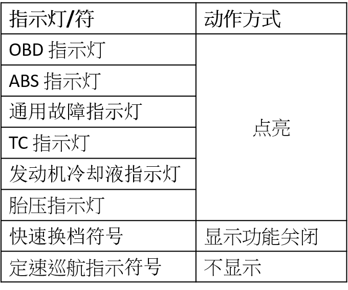 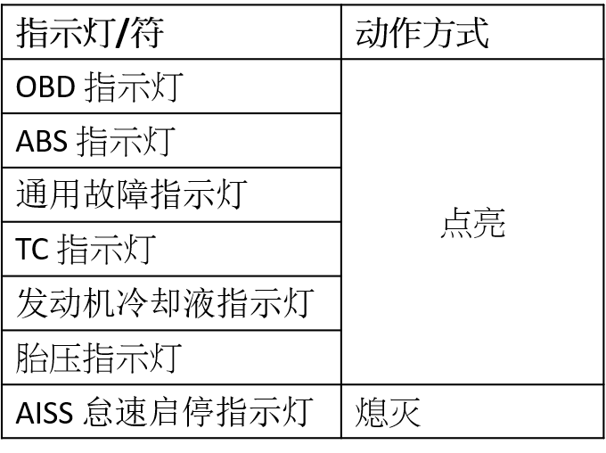

（适用于仪表所有CAN消息控制的指示灯）

</blockquote>
<ul>
<li>
其它LCD内的显示内容：仪表承制方提出建议方案后，专项讨论确定。
</li>
</ul></td>
</tr>
</tbody>
</table>

<!-- AGENT_SECTION id="S102" type="communication" title="UDS 诊断功能" keywords="诊断" -->
#### UDS 诊断功能

<table>
<colgroup>
<col style="width: 100%" />
</colgroup>
<tbody>
<tr class="odd">
<td>
由UDS诊断服务执行生产和售后服务功能: R/W
DID服务，如图号、生产制造信息、设计版本等

功能要求：

1、诊断并记录仪表、整车相关的故障，故障代码清除。

2、写入生产相关信息

3、其他要求，请参考

《HES D H0804 UDS 诊断需求规范-rev6》

4.支持以下故障侦测和记录故障代码功能:

(1)网络节点丢失侦测: 侦测电喷ECU、ABS、智能钥匙ECU、TPMS ECU、BCM

(2)网络故障Bus OFF侦测。

(3)系统电压异常侦测。

(4)内部自身系统判定异常，如:
EEPROM、Flash、控制器内部电路异常等故障。
</td>
</tr>
</tbody>
</table>

<!-- AGENT_SECTION id="S103" type="section" title="控制器同步休眠唤醒" keywords="" -->
#### 控制器同步休眠唤醒

<table>
<colgroup>
<col style="width: 100%" />
</colgroup>
<tbody>
<tr class="odd">
<td>
支持OSEK网络管理，直接网络管理节点:
仪表、智能钥匙控制器，用于同步休眠唤醒、智能钥

匙应急模式输入密码关联控制。
</td>
</tr>
</tbody>
</table>

<!-- AGENT_SECTION id="S104" type="communication" title="Bootloader软件升级功能" keywords="Bootloader" -->
#### Bootloader软件升级功能

<table>
<colgroup>
<col style="width: 100%" />
</colgroup>
<tbody>
<tr class="odd">
<td>
1、更新仪表软件 ，必须搭载以下更新软件功能:

<ol type="1">
<li>
CAN Bus FBL，针对MCU嵌入式FW
</li>
<li>
UI
</li>
<li>
可透过UDS R/W DID修正内存的数据(将定义在诊断调查问券内)
，但是具体内容和范围需要双方商定。
</li>
<li>
BT/WiFi软件、协议站更新
</li>
<li>
通过TBOX或者诊断仪CAN方式升级MCU程序；
</li>
<li>
<del>支持USB升级MCU程序和SOC程序（包括UI）</del>
</li>
</ol>

2、其他要求，请参考

<ul>
<li>
《HES D H0800 Bootloader Requirement Specification
总线程序刷写更新需求规范-rev2》
</li>
<li>
大长江通信协议依循ISO 14229-1, 15765-2, 15765-3, 15031-3, 15031-6
UDS服务命令
</li>
</ul></td>
</tr>
</tbody>
</table>

<!-- AGENT_SECTION id="S105" type="section" title="无线通讯" keywords="" -->
### 无线通讯

<!-- AGENT_SECTION id="S106" type="communication" title="蓝牙BT" keywords="蓝牙" -->
#### 蓝牙BT

<table>
<colgroup>
<col style="width: 100%" />
</colgroup>
<tbody>
<tr class="odd">
<td>
IGN OFF后关闭模块，降低功耗，硬件预留未来可升级IGN
OFF期间使用的架构

尽量以承制方现有App和SDK快速开发，并确保以下内容:

<ul>
<li>
手机熄屏后保证连结。
</li>
<li>
熄屏后不会杀掉App。
</li>
<li>
手机品牌兼容性：中国销售以华为、小米、VIVO、OPPO为主，国外销售依销售国家再商谈。
</li>
<li>
采用双蓝牙模块方案解决兼容性问题。
</li>
<li>
建议选用WiFi+BT二合一模块(例如BW121/RG440)
连手机（支持经典蓝牙和BLE蓝牙），仪表BT音频模块(例如BT936B/QA960)连接耳机或者头盔。支持双头盔间对讲模式。
</li>
<li>
建议采用有大量量产实绩的厂家BT模块，或国内主流品牌和实绩出货量也可以。
</li>
<li>
能够提供手机兼容列表。
</li>
<li>
具备整车蓝牙标定能力。
</li>
</ul></td>
</tr>
</tbody>
</table>

<!-- AGENT_SECTION id="S107" type="communication" title="WiFi" keywords="WiFi" -->
#### WiFi

<table>
<colgroup>
<col style="width: 100%" />
</colgroup>
<tbody>
<tr class="odd">
<td>
1. 地图导航 、WiFi投屏，可全地图或摩托车导航模式。

2. 市场主流厂家现有平台功能(选项功能，非必要): 类似Android Auto/
Apple Carplay/ 中国物联网

Carplay。

推荐采用亿联(国内2R百度地图，海外Mapbox）版本，在国内二轮行业各大主机厂有大量量产实绩。

3.菜单内绑定手机二维码画面。

菜单内绑定手机二维码画面，通常是投屏界面才需显示二维码，通过手机扫描仪表二维码互联激活和自动实现WiFi连接(P2P方式)，有无感连接选项。苹果和安卓手机自适应，不需要手动选择手机类型和切换。

4.使用地图导航期间支持上一页蓝牙耳机语音提示路况、距离..等

5. IGN OFF后关闭模块，降低功耗。

6.需要保证屏幕上不会受手机旋转画面影响，骑乘导航过程仪表画面不旋转，保持稳定。

建议选择亿联后台地图导航方式，仪表显示的导航地图不受手机旋转影响，会始终保持一种地图显示方式。只有旋转手机镜像投屏方式，仪表显示的内容才受手机旋转画面的影响。

7.导航地图来源：中国销售地区推荐地图：推荐百度；

国外销售地区推荐地图：推荐Mapbox地图：

<ul>
<li>
建议采用有大量量产实绩的厂家WiFi模块，或国内主流品牌和实绩出货量也可以。
</li>
</ul>

8.能够提供手机兼容列表。
</td>
</tr>
</tbody>
</table>

<!-- AGENT_SECTION id="S108" type="communication" title="OTA升级功能" keywords="OTA" -->
#### OTA升级功能

<table>
<colgroup>
<col style="width: 100%" />
</colgroup>
<tbody>
<tr class="odd">
<td><ol type="1">
<li>
支持WiFi升级，可以通过手机App和仪表建立WiFi连接（STA方式），再通过App升级MCU程序和SOC程序。
</li>
<li>
如果主机厂自有App支持程序升级功能，则MCU程序和SOC程序可以放在主机厂服务器后台，由手机App从服务器后台下载到本地再实现对仪表的程序升级，从而实现OTA升级。
</li>
<li>
如果主机厂自有App在开发过程中暂不支持程序升级功能，仪表承制方需提供临时版本的升级程序App，用于更新MCU和SOC程序。
</li>
<li>
仪表的WiFi投屏二维码下方需显示热点信息和连接密码，用户在按此设置连接热点后，在App选择升级车辆选项，进行软件升级。
</li>
<li>
遵循：“2 DCJ豪爵 手机App &amp; 仪表 OTA升级协议”
</li>
</ol></td>
</tr>
</tbody>
</table>

<!-- AGENT_SECTION id="S109" type="section" title="App" keywords="" -->
## App

<table>
<colgroup>
<col style="width: 11%" />
<col style="width: 88%" />
</colgroup>
<thead>
<tr class="header">
<th colspan="2"></th>
</tr>
<tr class="odd">
<th>项目</th>
<th>式样</th>
</tr>
</thead>
<tbody>
<tr class="odd">
<td>显示内容</td>
<td>
<mark>手机App←→仪表</mark>

遵循 “1-1 附录 手机App和仪表 显示信息”
</td>
</tr>
<tr class="even">
<td>显示方式</td>
<td><ul>
<li>
TFT屏内显示、手机App内显示
</li>
<li>
显示/切换动画：按照效果图
</li>
</ul></td>
</tr>
<tr class="odd">
<td>交互方式</td>
<td><blockquote>

遵循 “1 DCJ豪爵 手机App &amp; 仪表 BLE数据协议”

</blockquote></td>
</tr>
<tr class="even">
<td>备注</td>
<td></td>
</tr>
</tbody>
</table>

<!-- AGENT_SECTION id="S110" type="section" title="其它：" keywords="" -->
## 其它：

<table>
<colgroup>
<col style="width: 100%" />
</colgroup>
<tbody>
<tr class="odd">
<td>
请承制方提供以下文件:

<ol type="1">
<li>
开发日程，含设计、测试、模具、检治具、试验、生产开发周期，先提供A表即可；
</li>
<li>
关键零部件清单、LCD分辨率、技术方案、关键制程方案(例如:贴合、咬花):
必须提供；
</li>
<li>
BT/WiFi模块、天线、App、地图建议合作第三方: 必须提供；
</li>
<li>
量产最终报价待我司依双方商定功能、外观商定完毕后再重新报价。
</li>
</ol></td>
</tr>
</tbody>
</table>
